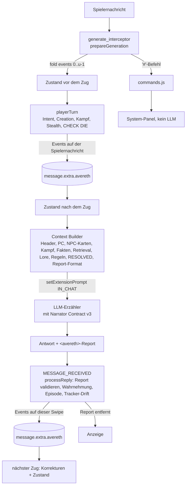

# Avereth: Architekturentscheidung

**Kurzfassung:** Die bisherige Architektur war „alles ist Prompt“: WorldInfo-Engines, Character Description und der Host-Tracker als Zustand. Sie wurde von Grund auf neu bewertet.

Ergebnis ist eine **Hybrid-Architektur (Variante B)**:
- Eine deterministische **Avereth Engine** als SillyTavern-Extension besitzt Regeln, Zufall, Zustand und Figurenwissen. Sie ist in reinem JavaScript geschrieben, hat keine Abhängigkeiten und liegt unter `src/`.
- Das Sprachmodell erzählt, interpretiert Absicht und schlägt neue Erzählfakten vor. Diese laufen durch eine Validierung, bevor sie Kanon werden.
- **Behalten** wurden die Inhalte (Core, Content, Lore, System, First Message) und die Verhaltensregeln der Character Description.
- **Ersetzt** wurde die technische Umsetzung.

## 1. Leitlinie

„Die bisherigen Inhalte sind wertvoll. Die technische Struktur darf vollständig verändert werden.“

Daraus folgt:
- Inhalte (Regeln, Lore, Klassen, Monster, Figuren) bleiben **wörtlich** erhalten. Tests prüfen das.
- Datenmodelle, Speicherung, Ablauf und Prompt-Aufbau sind neu entworfen.

## 2. Anforderungen

Abgeleitet aus Phase 1, den Inhalten und Testrun-v1:

| # | Anforderung | Beleg |
|---|---|---|
| R1 | Exakte Mechanik, **echter Zufall**, vollständige Kampf-Zustandsmaschine | Testrun: „say 44“, DefeatXP fehlt, keine Zugreihenfolge |
| R2 | Kanonischer Zustand jenseits des Kontextfensters: PC, Inventar, Coin, Skills, Quests, NPCs, Orte, Fraktionen, Weltfakten, Beziehungen, Zeit | Testrun: Snapshot verloren, Coin-Feld fehlt |
| R3 | Getrennte Epistemik: Weltwahrheit, Figurenwissen, Überzeugung, Erinnerung, Erzählung. NPCs sind nicht allwissend. | Testrun: „boy“-Leck |
| R4 | Langzeit-Episodengedächtnis mit Retrieval | lange Kampagnen, Wiedersehen nach Wochen |
| R5 | Kontext-Ökonomie: nur Relevantes, keine lexikalischen Fehltreffer | Testrun: #3/#4 auf Host-Text, START mit 30 fremden Aktionen |
| R6 | Host-Unabhängigkeit: Megumin optional, keine Formatvorgaben | Nutzerprinzip aus Phase 1 |
| R7 | Spieler-Agency | CD-Regeln wirken nachweislich |
| R8 | Modellunabhängigkeit, tolerantes Parsen | GLM über Custom-Endpoint, JSON-Schema-Support unklar |
| R9 | Konsistenz bei Swipe, Regenerate, Delete und Edit | SillyTavern-Alltag |
| R10 | Audit, Debugging, Retcon | Würfel und Rechenwege müssen prüfbar sein |
| R11 | Quellen zuerst: Daten aus einer Quelle, Schemas, Tests | Phase-1-Prinzip |
| R12 | Latenz: keine Pflicht-Zusatzaufrufe ans LLM | Testrun: 37–165 s pro Zug |
| R13 | Kein Overengineering: kein Server, keine Datenbank, keine Abhängigkeiten | Einzelnutzer, SillyTavern |
| R14 | Content-Lücken schließen, nicht improvisieren lassen | Trapper-Profil improvisiert, Ambush ohne Zustand |

## 3. Recherche

Primärquellen, soweit erreichbar. arXiv und einige Doku-Seiten waren durch die Netzwerkrichtlinie gesperrt. Dort stützt sich die Bewertung auf Suchzusammenfassungen und öffentliche Repositories.

| System / Arbeit | Kernidee | Übernommen | Nicht übernommen |
|---|---|---|---|
| **SillyTavern** (Quellcode: `script.js`, `extensions.js`, `st-context.js`, `events.js`; Doku „Writing Extensions“) | `generate_interceptor`, `setExtensionPrompt`, Events; `message.extra` wird pro Swipe kopiert (`syncMesToSwipe`/`syncSwipeToMes`) | Engine als Extension; Events pro Nachricht in `message.extra.avereth` (swipe-sicher); Injektion per Extension-Prompt | Speicherung in WorldInfo-Einträgen |
| **Generative Agents** (Park et al. 2023, arXiv 2304.03442; `joonspk-research/generative_agents`, `retrieve.py`) | Memory-Stream pro Agent, Retrieval = Recency + Importance + Relevance | Gedächtnis pro Figur mit Zeugen; Scoring aus Recency, Importance, Relevanz | Embeddings als Pflicht (Namen und Orte sind exakte Schlüssel; Vektor-Hook optional) |
| **MemGPT / Letta** (arXiv 2310.08560) | Hauptkontext, Recall- und Archivspeicher; das LLM verwaltet sein Gedächtnis per Funktionsaufruf | Trennung „immer im Kontext“ und „abrufbar“ | Gedächtnisverwaltung durch das LLM (Aufrufkosten, Unzuverlässigkeit) |
| **LangGraph Memory**, **LlamaIndex Memory** | Kurzzeit (Thread-State) und Langzeit-Store; Memory-Blöcke mit Prioritäten unter Token-Limit | priorisierte Sektionen unter Budget | Framework-Abhängigkeit, Python-Server |
| **Graphiti / Zep** (arXiv 2501.13956) | temporaler Wissensgraph; Fakten mit Gültigkeitsfenster; ungültig machen statt löschen | Fakten mit `since`/`until`; Historie bleibt; Graph aus Fakten und Relationen | Graph-DB (Neo4j), LLM-basierte Widerspruchserkennung |
| **Mem0** | Extraktion, Entity-Linking, hybrides Retrieval (semantisch, BM25, Entität) | hybrides Scoring mit BM25 und Entitäten | Cloud/Vector-DB |
| „Verbatim Chunks Beat Extracted Artifacts“ (arXiv 2601.00821) | Wörtliche Textstücke schlagen reine LLM-Extraktion | Episoden-Einträge mit dem wörtlichen Spielertext ergänzen die strukturierten Fakten | reine Extraktion |
| **SillyTavern World Info** (Quellcode `world-info.js`: `checkWorldInfo`, `WorldInfoBuffer`; Doku-Repo `SillyTavern-Docs`) | Schlüssel-Aktivierung über die letzten n Nachrichten; Order, Rekursion, hartes Budget (der erste Überlauf beendet die Liste); Extension-Prompts mit `scan` werden mitdurchsucht | beschreibende Welt-Lore als Character Lore der Erzähler-Karte; Lore-Bridge (Realm und Stadt, Position NONE, `scan`); Trigger-Audit gegen die echten Testruns ([LOREBOOK.md](LOREBOOK.md)) | Regeln und Zustand per Schlüsselwort; Rekursion |
| **AI Dungeon** (Memory System, Story Cards), **NovelAI** (Lorebook) | Auto-Zusammenfassung, Memory Bank; Keyword-Karten mit Budget | Budgetierung pro Sektion | reine Keyword-Aktivierung (siehe Testrun-Fehltreffer) |
| **Inworld**, **Convai** | Figurenwissen persönlich oder allgemein; Knowledge Bank pro Figur; Narrative Design als Zustandsmaschine | Wissenskarten pro NPC; Quests und Threads als Zustand | proprietäre Plattform |
| **Talemate** | mehrere Agenten, World-State-Manager, Zeitverfolgung | Zeit und Weltzustand als Daten | mehrere LLM-Aufrufe pro Zug |
| **Talk of the Town** (Ryan et al., Game AI Pro 3, Kap. 37) | Überzeugungen aus Beobachtung, Bericht und Irrtum; Überzeugungsfacetten mit Vorgänger | Wissen mit Quelle (`witnessed`, `told:X`, `rumor`, `inferred`) und Vorgänger; falsche Überzeugungen als Claims | vollständige Simulation von Vergessen und Verbreitung |
| **TimeChara** (arXiv 2405.18027), **FANToM** (arXiv 2310.15421) | LLMs verletzen Wissensgrenzen und Theory of Mind systematisch | explizite Wissensgrenzen im Prompt statt Vertrauen auf das Modell | – |
| **FIREBALL** (arXiv 2305.01528), **RPGBench** (arXiv 2502.00595), PANGeA (arXiv 2404.19721), „Can LLM Agents Stick to the Script?“ (arXiv 2608.08160) | Mit echtem Spielzustand sind LLM-Züge besser; ohne ihn ist die Mechanik unverifizierbar; Erzähler widersprechen Fakten | Zustand plus Validierung; harte Fakten | – |
| **Lost in the Middle** (arXiv 2307.03172), **Context Rot** (Chroma 2025), Anthropic „Effective context engineering for AI agents“ | Leistung sinkt mit Länge und Mittelposition; kleinste Menge hochrelevanter Token; Retrieval zur richtigen Zeit | kompakter Block; RESOLVED zuletzt; Regeltexte nur situativ; #system mit Absatz-Retrieval | – |
| **Event Sourcing** (Fowler; Azure Architecture Center) | Append-only-Events, Zustand durch Replay, Snapshots | Zustand = fold(Events); Reducer würfelt nie | eigener Event-Store |
| ST-Umfeld: MVU/MagVarUpdate (Tavern Helper), MultihogDnDFramework, SillyNPC, SimTracker, Megumin Suite | Variablen pro Nachricht; LLM schreibt Updates; vorab gewürfelte Würfel; Hintergrund-Extraktion | Zustand pro Nachricht; vorab festgelegter Würfel (CHECK DIE); zweiter Extraktionspass als spätere Option | vom LLM geschriebene Zustandsänderungen ohne Validierung; Drittabhängigkeiten |

## 4. Speicheroptionen

| Option | Bewertung für Avereth |
|---|---|
| JSON-Dateien (Content) | **ja**: statischer Inhalt, versionierbar, per Schema prüfbar |
| JSONL / Event-Log | **ja**: Events pro Nachricht im Chat; SillyTavern speichert den Chat ohnehin als JSONL. Swipe-, Lösch- und Edit-Semantik gibt es dadurch gratis. |
| SQLite / relational | nein: nicht im Browser-Kontext von SillyTavern, braucht Server oder WASM. Kein Nutzen bei Einzelnutzer-Mengen: 16.000 Events falten in etwa 30–50 ms, der Kontextaufbau braucht etwa 70–120 ms (gemessen, Test `large history`). |
| Graph-Datenbank | nein als Infrastruktur; **ja als Modell**: Fakten (s, p, o) und Relationen sind ein kleiner temporaler Graph im Zustand |
| Vektor-Datenbank | nicht nötig: Retrieval-Schlüssel sind Namen, Orte, Quests und Beziehungen. BM25 deckt freie Formulierungen ab. `rank()` hat einen `semantic`-Hook für Embeddings. |
| **Gewählt: Hybrid** | Content als JSON, Kampagne als Event-Log pro Nachricht, Zustand als In-Memory-Fold, Retrieval über strukturierte Signale plus BM25 |

## 5. Varianten und Trade-offs

- **A – WorldInfo-only, weiter optimiert:** die bisherige Linie mit besseren Schlüsseln, kleineren Engines und strengerem Tracker.
- **B – Hybrid:** deterministische Engine als ST-Extension, dazu LLM-Erzähler, validierter Fakten-Report und Kontext-Builder. **Gewählt.**
- **B-lite:** MVU/Tavern Helper. Das LLM schreibt Variablen-Updates, EJS-Templates wählen Inhalte, Zod-Schema.
- **C – Externer Dienst:** Server mit Datenbank und Agenten (Erzähler, Regelagent, Extraktor), angebunden als Proxy.
- **D – Tool-Calling:** Das LLM ruft während der Generierung Engine-Tools auf (`roll`, `attack` …), über den ToolManager von SillyTavern.

| Kriterium | A | **B** | B-lite | C | D |
|---|---|---|---|---|---|
| Konsistenz (Regeln, Zustand) | niedrig: Testrun-Fehler strukturell | **hoch**: Code plus Validierung | mittel: LLM schreibt Zustand | hoch | mittel: LLM entscheidet, **ob** es aufruft |
| Langzeitgedächtnis | niedrig: nur Kontextfenster und letzter Tracker | **hoch**: Event-Log plus Retrieval | mittel: Variablen, kein Retrieval | hoch | mittel |
| Skalierbarkeit (1.000+ Züge) | niedrig | **hoch**: Fold linear, Kontext budgetiert | mittel | hoch | mittel |
| Tokenverbrauch pro Zug | hoch: 5,6–9k Avereth-Anteil | **niedrig**: Contract ~4,0k + Block ~1,0–1,3k | mittel | mittel | mittel bis hoch (Tool-Schemas, Runden) |
| Retrieval-Qualität | niedrig: lexikalisch, Fehltreffer | **hoch**: zustandsgesteuert plus kuratierte Schlüssel | niedrig | hoch | – |
| Wartbarkeit | mittel: 124k Zeichen Prompt-Regeln | **hoch**: Daten mit Schema, Code mit 140 Tests | mittel | niedrig: Betrieb | mittel |
| Erweiterbarkeit | niedrig: jede Regel kostet Prompt | **hoch**: Daten und Code | mittel | hoch | mittel |
| Debugging | niedrig: Reasoning lesen | **hoch**: #audit, Event-Export, deterministische Replays | mittel | mittel | mittel |
| Komplexität | niedrig | **mittel**: etwa 4.000 Zeilen JS, keine Abhängigkeiten | mittel: zwei Fremd-Extensions | hoch | mittel |
| Robustheit in langen Kampagnen | niedrig: Single Point of Failure Tracker | **hoch**: Replay, Invarianten, Swipe-Sicherheit | mittel | hoch | niedrig bis mittel |
| Modellunabhängigkeit | mittel | **hoch**: nur Text rein, tolerantes JSON raus | mittel | hoch | niedrig: Tool-Support je Endpoint |
| Latenz | 1 Aufruf | **1 Aufruf** | 1 Aufruf | 2–3 Aufrufe | 2+ Runden |

**Warum nicht A:** Die Testrun-Fehler sind strukturell, nicht redaktionell. Würfel, Persistenz und Prozedurtreue lassen sich nicht herbeiprompten.

**Warum nicht B-lite:**
- Bewährtes Muster, aber das LLM schreibt die Zustandsänderungen selbst, also genau die fehleranfällige Stelle.
- Zwei Drittabhängigkeiten.
- Kein Würfel-, Kampf- und Wissensmodell.

**Warum nicht C:**
- Server und Betrieb sind überdimensioniert für einen Einzelnutzer.
- Ein Proxy sieht Swipes, Edits und Deletes nicht.
- 2–3 LLM-Aufrufe pro Zug bei ohnehin 37–165 s Latenz.
- Die Integration in SillyTavern und Megumin ginge verloren.

**Warum nicht D:**
- Tool-Calling hängt vom Endpoint ab; beim GLM-Custom-Endpoint ist es unklar.
- Mehrere Runden kosten Latenz.
- Vor allem entscheidet wieder das LLM, **ob** es die Regel anwendet. Genau das ist im Testrun gescheitert.

## 6. Entscheidung

**Variante B.** Aufteilung der Verantwortung:

| Aufgabe | Wer | Warum |
|---|---|---|
| Absicht erkennen (Angriff, Skill, Ziel, Bewegung, Schleichen, Befehl) | Engine (Regex und Zustand), 40/40 Angriffs- und 34/34 Nicht-Angriffs-Formulierungen aus dem v1.24-Korpus | deterministisch, testbar; Fragen und zitierte Drohungen sind keine Festlegung (Core #23) |
| Regeln, Würfel, Kampf, XP, Level, Coin, Munition | Engine | Testrun: LLM würfelt nicht und überspringt Schritte |
| Menschliche NPC-Profile, Monsterprofile | Engine (Vorlagen und Anker), einmal gesperrt | Testrun: improvisiertes Profil |
| Wissen, Erinnerung, Identität der NPCs | Engine-Modell; der Narrator schlägt Änderungen vor | Wissensgrenzen per Konstruktion |
| Erzählung, Dialog, Weltreaktion | LLM | seine Stärke |
| Neue Figuren, Orte, Fakten, Beziehungen, Quests | LLM schlägt per `<avereth>`-Report vor, die Engine validiert | Erzählung erzeugt Welt, aber nicht ungeprüft |
| Nicht-Kampf-Checks | LLM entscheidet den Check-Gate (Core #7), die Engine liefert den **CHECK DIE** und prüft die Rechnung | Core überlässt die Situationsbewertung dem Narrator; der Wurf bleibt Engine-Sache |

## 7. Überblick und Datenfluss



**Komponenten** (`src/`):

| Modul | Aufgabe |
|---|---|
| `state.js` | Reducer: Zustand = fold(Events); würfelt nie; unbekannte Events werfen einen Fehler |
| `rng.js` | zählerbasierter Zufall `uniform(seed, n)`: dieselbe Eingabe ergibt dieselben Würfe; Regenerieren würfelt nicht neu |
| `content.js`, `derived.js`, `creation.js`, `npcgen.js`, `progression.js`, `economy.js` | Regeln und Inhalte |
| `combat.js` | Initiative, Zugschleife, Treffer, Crit, Schadenskette (Core #11), Reichweiten, Munition, Effekte, NPC-Verhalten, Kampfende |
| `checks.js` | Checks (Core #7/#8), Schleichen gegen Wahrnehmung |
| `intent.js` | Absicht aus der Spielernachricht |
| `knowledge.js` | Fakten mit Gültigkeit, Wissen, Claims, Erinnerungen, Identität |
| `delta.js` | Fakten-Report parsen und validieren |
| `retrieval.js`, `context.js` | Scoring, Packen, Engine-Block |
| `commands.js` | #-Befehle |
| `validate.js` | Invarianten, JSON-Schema |
| `engine.js` | Fassade |
| `host.js` | SillyTavern-Chat-Adapter |

## 8. Trennung von Weltwahrheit, Wissen, Überzeugung, Erinnerung und Erzählung

| Ebene | Speicher | Wer sieht es |
|---|---|---|
| **Weltwahrheit** | `facts` {s, p, o, since, until, visibility, hard}; `entities` (Status, Profil) | Erzähler (ESTABLISHED FACTS, RELEVANT); NPCs **nicht** |
| **Figurenwissen** | `knowledge[who][factId]` mit Haltung `knows`/`suspects` und Quelle | nur die jeweilige NPC-Karte |
| **Überzeugung** | `claims` (können falsch sein) plus `knowledge` mit Haltung `believes` | NPC-Karte, markiert „actually FALSE“ |
| **Erinnerung** | `memories` mit `who`, `witnesses`, `seen` (wer Alaric dabei sah) und `{pc}`-Platzhalter. Zeugen sind die Beteiligten (`who`), vom Erzähler genannte (`witnesses`) oder bei `public` alle Anwesenden, die nicht `unaware` sind. **Anwesend ist nicht wahrnehmend**, auch bei Kampftod und Kampferinnerung. Nach einem Ortswechsel (`place`) bleibt nur in der Szene, wen der Report dort platziert; alle anderen bleiben zurück (Testrun 2: ein Trapper auf LONG; Testrun 3: Fuhrmann und Registrarin „folgten“ in einen Keller und bezeugten dort einen Kampf). | nur Zeugen; Formulierung je Betrachter („someone unseen“, „the stranger“, „Alaric“) |
| **Erzählung** | der Chattext selbst | wird nie als Wahrheit gelesen, nur über validierte Reports |

Folgen:
- Ein NPC kennt Alarics Namen nur, wenn er ihn gesagt bekam, per Selbstvorstellung oder als `learn` mit Quelle.
- Er kennt sein Aussehen nur, wenn er ihn unverdeckt sah (Wahrnehmung am Zugende).
- Geheimnisse verbreiten sich nur durch Erzählen oder Beobachten, nicht als Gerücht.
- Lernen kann die Weltwahrheit nie ändern. Nur `witnessed` durch einen Anwesenden legt einen neuen Fakt an. Gehörtes (`told`, `rumor`, `public`) ohne bekannten Fakt wird ein **Claim** mit Wahrheit `unknown` (oder `false`, wenn es einem funktionalen Fakt widerspricht); die Figur glaubt oder vermutet ihn.
- Weltänderungen machen altes Wissen „OUTDATED“, statt es zu löschen.

## 9. Event-System

Alle 42 Event-Typen sind in `schemas/event.schema.json` und [DATENMODELL.md](DATENMODELL.md) beschrieben. Grundsätze:
- Append-only pro Nachricht; Zustand = fold.
- Der Reducer würfelt nie; Würfe stehen in den Events (`rng_to`).
- Ein Swipe hat eigene Events.
- Ein Delete entfernt die Events der gelöschten Nachricht.
- Eine editierte Antwort behält ihre Fakten (Tippfehler, Umformulierung). **Retcon:** Enthält der editierte Text einen neuen `<avereth>`-Block, wird die Antwort neu validiert und ihre Events ersetzt (`{}` = keine Fakten). Das gilt nur für die neueste Antwort: Spätere Züge wurden gegen ihre Fakten aufgelöst und werden nicht neu abgespielt. Bei älteren Antworten bleiben die Fakten, und die Extension verlangt, erst die späteren Nachrichten zu löschen.
- Ein Replay ist deterministisch: Test „fold(event log) === live state“.

## 10. Retrieval und Context Builder

**Score eines Kandidaten** (Erinnerung, Fakt, Quest, Thread):

```
3·Entität + 1,5·Ort + 1,5·Quest + 0,5·0,99^Alter + 2·Wichtigkeit + 2·BM25 + 1·Beziehung
```
(+ optional semantisch)

**Aufbau des Engine-Blocks** (Sektionen mit Priorität, gepackt unter Budget, Standard 1.400 Token):

| Priorität | Sektionen |
|---|---|
| 0 (immer) | Header (Zeit, Ort, Realm, Modus, Ortsstatus, Setting-Zeile), PC-Zeilen, Creation, Kampf, gepinnte harte Fakten, **RESOLVED** |
| 1 | NPC-Karten, Korrekturen |
| 2 | RELEVANT (Retrieval, 25 % Budget, ohne die letzten 4 Züge, die ohnehin im Chat stehen) |
| 3 | Lore (aktueller Realm plus kuratierte Schlüsselphrasen, 20 %); entfällt, wenn an der Erzähler-Karte ein Lorebook verknüpft ist |
| eigenes Kontingent | situative Regeltexte (800 Token), Report-Format |

**Reihenfolge im Prompt:** Header → PC → NPCs → Kampf → Fakten → RELEVANT → Lore → Regeln → Korrekturen → **RESOLVED** → Report-Format. Das Bindende steht am Ende, direkt vor der Generierung („Lost in the Middle“).

**Kampfstille** (Testrun 4): Solange ein Kampf läuft, sagt der Kampfblock „nobody talks“, und die Schlusszeile der aufgelösten Schritte wiederholt es. Beides übersteuert die Dialog-Eröffnung des Presets. Enthält eine Kampfantwort trotzdem wörtliche Rede, nennt der nächste Block das als Korrektur. Mechanische Ausnahme: ein Kämpfer mit Intent `surrender`/`parley`.

**Welt-Lore** ([LOREBOOK.md](LOREBOOK.md)):
- **Beschreibende Lore** (Realms, Städte, Gesellschaft, Gilde, Generierungsgerüste) liegt im SillyTavern-Lorebook `lorebook/`, als Character Lore der Erzähler-Karte.
- **Die Engine behält** in `lore.json` nur den strukturellen Index (Orte und Realms mit ID, Name, Art, Realm) und die 19 Texte als Rückfall ohne Lorebook.
- **Lore-Bridge:** Vor jeder Generierung setzt die Extension Realm und Stadt als Extension-Prompt mit Position NONE und `scan = true`. SillyTavern fügt ihn nie ein, World Info durchsucht ihn aber. Die Einträge von Realm und Stadt sind so in jedem Zug aktiv, auch ohne Tracker-Box. Engine-Zustand geht bewusst nicht mit.
- **Vorrang:** Engine-Block und Erzählervertrag gehen dem Lorebook vor. Kein Eintrag beansprucht veränderlichen Zustand.

## 11. Strukturierter Output und Validierungsschicht

Der `<avereth>`-Report ist absichtlich tolerant:
- JSON mit Code-Fences, typografischen Anführungszeichen, abschließenden Kommas und Schlüsseln ohne Anführungszeichen wird repariert.
- `generateRaw` mit `jsonSchema` wäre möglich. Die Unterstützung beim Custom-Endpoint ist aber unklar, deshalb ist das kein Muss.

Jede Ablehnung wird mit Grund protokolliert und im nächsten Zug als Korrektur gemeldet.

**Spieler-Hoheit (PLAYER OWNERSHIP).** Freiwillige Änderungen an Alaric brauchen die Entscheidung des Spielers in der aktuellen Nachricht. `authorization(input)` in `intent.js` liest daraus `travel`, `move`, `pay`, `give`, `accept`, `conceal` und `rest`. Fragen autorisieren nichts; wörtliche Rede schon („Deal, I'll do it.“).

| Report-Teil | braucht |
|---|---|
| `location` / `place` | `travel` / `move`, oder `forced_by` (ein anwesender NPC: Festnahme, Verschleppung); im Kampf besitzt die Engine die Position |
| Items oder Coin **von** Alaric | `give` / `pay`, oder `taken_by` (anwesender NPC: Diebstahl, Beschlagnahme) |
| Quest `active` | `accept` in der Nachricht; nimmt die Nachricht Quests **beim Namen**, nur diese. Ein späterer Report darf eine Quest aktiv setzen, die eine Spielernachricht seit dem Angebot beim Namen genommen hat (Testrun 4: Antwort ohne Report). Sonst als `offered` melden. |
| `time` > 2 h außerhalb des Kampfs | `rest` oder `travel` |
| NPC verliert Alaric (`aware` → `unaware`) | `conceal` (erklärte Heimlichkeit) |

Welt- und NPC-Handlungen (NPC gibt Alaric etwas, NPC geht, Wetter) brauchen keine Zustimmung. **Kampf** beginnt nur durch Alarics Angriff oder durch NPCs, die sich per `combat` (Objekt oder Liste) auf einen Angriff **auf Alaric** festlegen; Haltung, Spezies oder Gruppenzugehörigkeit ziehen niemanden automatisch hinein. Kämpfe zwischen NPCs werden erzählt, nicht aufgelöst (ein anderes Ziel wird abgelehnt, nie auf Alaric umgelenkt). Eine Festlegung legt den Kampf noch mit der meldenden Antwort fest (Core #26: Profile, Initiative, Reihenfolge; der Spieler sieht sie vor seiner Aktion); die Züge laufen mit der nächsten Spielernachricht (Core #23/#24). Im Kampf entscheidet jede NPC nach eigenem Zustand (Core #27): Angegriffen zu werden provoziert auch ohne Treffer, und ein Angriff seit ihrem letzten Zug hebt einen erzählten passiven Intent (`hold`/`parley`/`take_cover`) auf. Das gespiegelte „holds“ hatte in Testrun 2 eine NPC drei Runden eingefroren.

| Fehlerklasse aus dem Auftrag | Wo verhindert |
|---|---|
| ungültige Stats | HP, XP, Level, Stats, Skills, Schaden und Würfe sind engine-owned; Report-Schlüssel dafür werden abgelehnt; `validateState` prüft Grenzen |
| doppelte Items / Figuren | Inventar als Menge pro Item-ID; bekannte Figuren werden per Name global erkannt, per Deskriptor („guard“) nur, wenn sie anwesend oder am aktuellen Ort sind |
| widersprüchliche Positionen | eine Position pro Entität (`scene.positions`); im Kampf besitzt die Engine die Bänder |
| ungültige Skills | nur bekannte Skill-IDs; Intent ordnet Namen bekannten Skills zu; unbekannte Skills werden gemeldet, nicht ausgeführt |
| falsche Queststatus | kein Abschluss ohne Angebot; abgeschlossen/gescheitert ist final; Quest-XP gesperrt bei Angebot und einmalig |
| fehlende Referenzen | Resolver lehnt unbekannte Referenzen ab; der Reducer wirft bei unbekannten Entitäten/Relationen; `validateState` prüft Wissensreferenzen |
| ungültige Ressourcen | Coin nur ganzzahlig und nie negativ; `recover` nie im Kampf und nie über Maximum; Kosten und Munition vor dem Wurf geprüft |
| widersprüchlicher Weltzustand | funktionale Prädikate (Status, Ort, Herrscher …) haben einen aktuellen Wert; harte Fakten (tot, zerstört) kippen nur mit `because`; Tote kehren nicht per Report zurück (Wiederbelebung braucht eine Mechanik, Core #14); Lernen darf Wahrheit nicht widersprechen |
| Tracker-Drift in der Erzählung | `trackerDrift` vergleicht Zahlen in der Antwort (Init, HP, STA, MP, XP, Pfeile, Coin) mit der Engine und meldet Korrekturen |

## 12. Grenzen und Risiken

- **Die Absichtserkennung ist regelbasiert.** Sehr ungewöhnliche Formulierungen landen als „narrative“. Folge: kein Kampf. Der Spieler formuliert klarer oder nutzt Skill-Namen. Der Korpus-Test sichert die bekannten Muster.
- **Der CHECK DIE ist vor dem Check sichtbar.** Das LLM könnte die Entscheidung, ob gewürfelt wird, vom Wert abhängig machen. Gegenmittel: Check-Gate-Regel im Contract, Audit per `#audit`. Die Alternativen (zweiter Aufruf, Tool-Calling) kosten Latenz. Tool-Calling verschiebt zudem nur die Frage, *ob* gewürfelt wird, zum LLM. Nach dem Live-Test ist ein „Pending Check“ die nächste Stufe: Das LLM meldet den Check, die Engine würfelt im nächsten Zug.
- **Zustimmung wird pro Kategorie geprüft**, nicht pro Gegenstand, Betrag, Quest oder Ziel. Nach „I buy bread“ ginge auch eine falsche Zahlung durch. `recover` für Alaric und Empfangenes (Items/Coin an Alaric) sind nicht zustimmungspflichtig. Bewusst vor Testrun 2 nicht verschärft: Das Risiko von Fehlablehnungen ist ohne echte Daten nicht abschätzbar. Messen per Event-Log-Export (siehe [REVIEW_CHATGPT.md](REVIEW_CHATGPT.md)).
- **NPC↔NPC-Distanz ist abgeleitet** (|Band A − Band B| relativ zu Alaric). Für den PC-zentrierten Kampf reicht das. Für Verbündete, Beschwörungen oder Mehrparteienkämpfe braucht es später eine echte Geometrie.
- **Lange Logs:** 1.000 Züge (≈ 5.200 Events) werden in etwa 20 ms gefaltet; der Kontextbau braucht etwa 100 ms. Snapshots/Checkpoints sind erst bei deutlich längeren Kampagnen nötig.
- **Die Report-Qualität hängt vom Modell ab.** Fehlt der Report, verliert die Welt nur neue Erzählfakten. Mechanik und Wissen bleiben korrekt. Der nächste Zug erhält eine Korrektur. Option für später: ein Extraktionspass per `generateRaw` mit JSON-Schema.
- **Vorgeschlagene Inhalte** (als PROPOSED markiert, zur Autorenbestätigung):
  - menschliche NPC-Vorlagen;
  - Detection-Default für Kreaturen;
  - Difficulty-Skala;
  - NPC-Verhalten nach Temperament und „nicht feindlich, unverletzt → Deckung“;
  - Basic Attack nach Waffenfamilie, wenn die Waffe nicht zur Klasse passt (z. B. Ranger mit Handaxt → Warrior Basic Attack);
  - Klasse eines Abenteurer-NPCs aus genannter Waffe oder Klassenwort („archer“ = Ranger).
- **Nicht modelliert** (Regeltexte bleiben abrufbar):
  - Proficiency-Fortschritt (PP), Skill-Lernen, Klassen-Evolution, Domains, Elemente und Resistenzen;
  - Statuseffekte mit Dauer über den eigenen Zug hinaus;
  - Loot-Instanzen mit individuellen Werten.

  Erweiterungspunkte siehe [MIGRATION.md](MIGRATION.md) und den Abschlussbericht.
