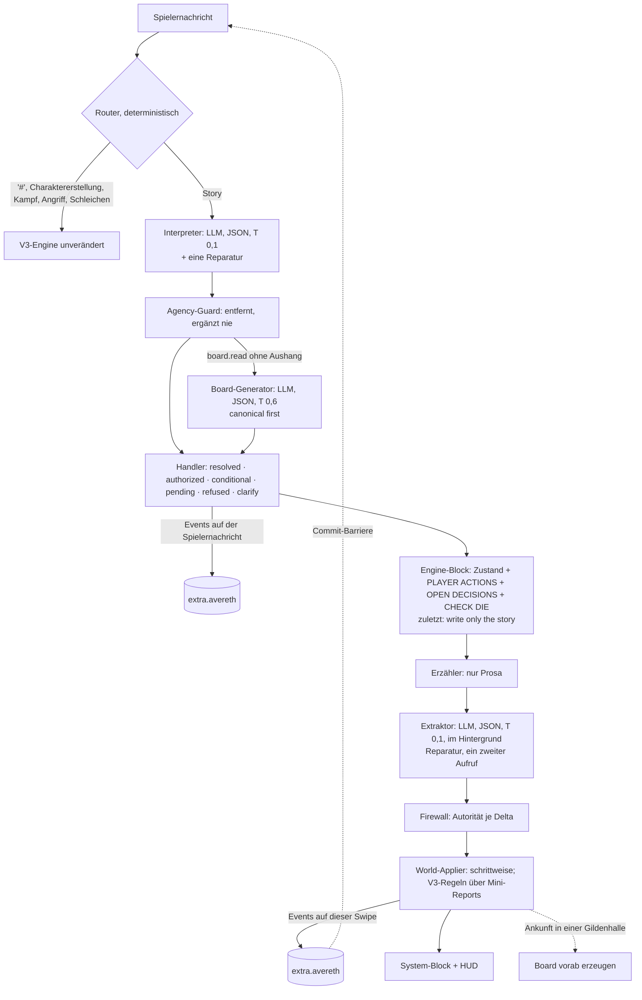
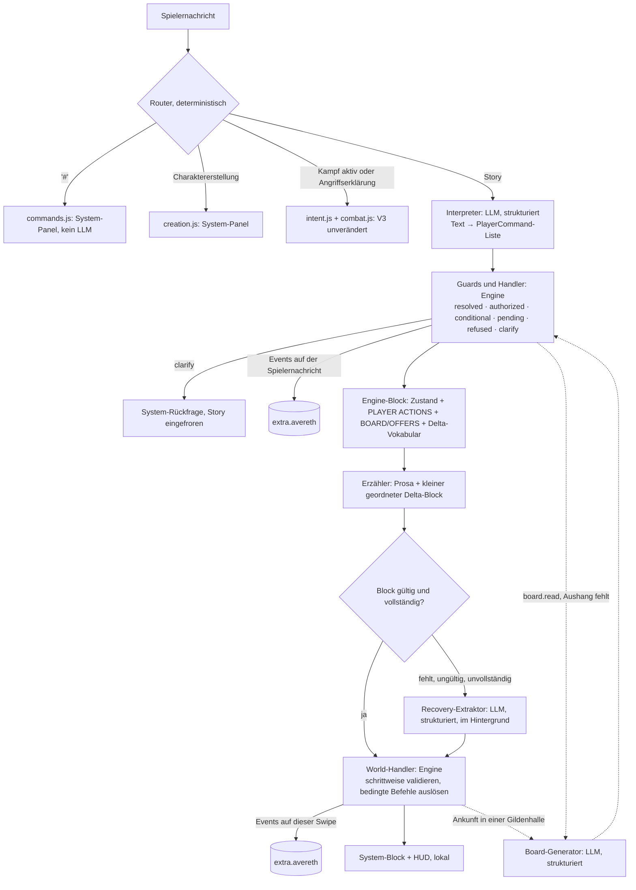

# Runtime V4 / Engine 4.0: Plan zur gemeinsamen Review (Revision 3)

**Status:** **Revision 3 (28.09.2026): umgesetzt als Engine 4.0.0**, Branch `claude/happy-wright-1a4y19`. Was P0 entschieden hat, was wie umgesetzt ist, wo die Umsetzung abweicht und welche Gates offen sind: Abschnitt [R3](#r3-revision-3-stand-nach-p0-und-umsetzung-40). Der erste Live-Test (28.09.2026, 04:27) und seine Korrekturen: [R3.9](#r39-erster-live-test-28092026-befunde-und-korrekturen). Die Abschnitte 0–16 sind die Revisionen 2 und 2.1 (Plan, für P0 freigegeben am 27.09.2026) und bleiben als Historie stehen.
- **Revision 2** nach dem externen Review von ChatGPT auf Revision 1 (Commit `52ed696`). Review: [CHATGPT_REVIEW_RUNTIME_V4_PLAN.md](CHATGPT_REVIEW_RUNTIME_V4_PLAN.md). Was sich ändert: Abschnitt [R](#r-revision-2-was-sich-gegenüber-revision-1-ändert).
- **Revision 2.1**, Bedingung der Freigabe: Offizielle Gildenaushänge sind *canonical first, prose second*. Scheitert der Board-Generator, gibt es keinen Erzähler-Rückfall mehr (D3, §3.4, §6.4).
- **P0 (Spikes):** Werkzeuge und Anleitung in [P0_SPIKES.md](P0_SPIKES.md). Was P0 am Plan präzisiert hat (Befehle `drop`/`use`, Erwartungsfeld `priced`, Anwesenheit bei Ankunft), steht dort in §8 und ist hier in §4.1, §5.3 und §6.2 nachgetragen; die Messwerte mit dem echten Provider stehen aus.

**Grundlage:**
- der Live-Lauf vom 27.09.2026, 07:10, auf 3.1.7 byte-gleich reproduziert ([TESTRUN_V12.md](TESTRUN_V12.md));
- ein Audit aller Quellen auf dem Stand `main` 13d88d0:
  - Content (`content/*.json`, Erzählervertrag v3), `schemas/*.schema.json`, Lorebook v0.12 (alle 67 Einträge);
  - alle `src/*.js`, `index.js`;
  - die Doku ARCHITEKTUR, DATENMODELL, RUNTIME_V3, MIGRATION, LOREBOOK und REVIEW_V3.

**Leitsätze:**
- *LLM interprets and narrates. Engine validates and commits.*
- *So viel Determinismus wie sinnvoll, so wenig LLM-Aufrufe wie möglich, LLMs nur für echtes Sprachverständnis und kreative Welterzeugung.*

## Inhalt

- R3. [Revision 3: Stand nach P0 und Umsetzung 4.0](#r3-revision-3-stand-nach-p0-und-umsetzung-40)
- R. [Revision 2](#r-revision-2-was-sich-gegenüber-revision-1-ändert)
- 0. [Kurzfassung](#0-kurzfassung)
- 1. [Root Causes](#1-root-causes)
- 2. [Leitsätze, Kriterien, KEEP](#2-leitsätze-kriterien-keep)
- 3. [Architektur](#3-architektur)
- 4. [Command-Schicht (A, B)](#4-command-schicht-a-b)
- 5. [World Deltas: Inline-Block und Recovery (B, G, L)](#5-world-deltas-inline-block-und-recovery-b-g-l)
- 6. [Domänenmodelle (C–K, O)](#6-domänenmodelle-ck-o)
- 7. [Ownership-Grenzen](#7-ownership-grenzen)
- 8. [Migration und Versionierung](#8-migration-und-versionierung)
- 9. [Latenz und Token: Variante A und B](#9-latenz-und-token-variante-a-und-b)
- 10. [Risiken](#10-risiken)
- 11. [Teststrategie](#11-teststrategie)
- 12. [Dateien: neu, ersetzt, generiert, entfällt](#12-dateien-neu-ersetzt-generiert-entfällt)
- 13. [Bewusst nicht umgesetzt](#13-bewusst-nicht-umgesetzt)
- 14. [Mechanik-Support-Matrix (N)](#14-mechanik-support-matrix-n)
- 15. [Content- und Lore-Review](#15-content--und-lore-review)
- 16. [Phasen und Entscheidungen](#16-phasen-und-entscheidungen)

---

## R3. Revision 3: Stand nach P0 und Umsetzung 4.0

**Stand 28.09.2026, Branch `claude/happy-wright-1a4y19`, Engine 4.0.0.** Revision 3 hält fest, was P0 entschieden hat, was davon wie umgesetzt ist und wo die Umsetzung vom Plan abweicht. Die Abschnitte 0–16 bleiben als Historie der Revisionen 2 und 2.1 stehen; wo R3 einen Abschnitt ersetzt, steht dort ein Verweis. Messwerte: [P0_BERICHT.md](P0_BERICHT.md). Einrichtung und erster Live-Test: [LIVETEST_V4.md](LIVETEST_V4.md).

### R3.1 Entscheidungen nach P0

| # | Entscheidung | Beleg |
|---|---|---|
| S0 | **Reines JSON per Anweisung**, lokaler Validator, eine Reparatur mit Fehlerliste; Reasoning wie konfiguriert (low). Kein `json_schema`: Der Provider nimmt es an, erzwingt es aber nicht. | P0 §3: 30/30 gültig, p50 4,8 s |
| D2 | **= A.** Der Erzähler schreibt nur Prosa; der Extraktor liest jede Antwort danach. B verfehlte die Regel §5.6 deutlich. | P0 §4: A 100 % gültig und vollständig, Semantik 87,4 %; B-Block 43,9 % gültig und vollständig, Semantik 67,3 %; A auch günstiger (9.911 gegen 10.570 Token je Zug) |
| Agency | **Agency-Guard** hinter dem Interpreter (R3.3): deterministisch, entfernt nur. | P0 §10: Negativ-Präzision 93,1 % → 100 % (optimistisch, am Korpus entworfen); ungesehener Prüfsatz 2, erster Lauf: 89 % der Fehlbefehle abgefangen, 97 % der richtigen erhalten |
| Autorität | **Domänen-/Autoritäts-Firewall** zwischen Extraktor und Welt (R3.4). | P0 §11: verbotene Deltas A 7 → 1, B 8 → 0 (nach der Namens-Kanonisierung), kritische Deltas unverändert (58/58, 27/27) |
| S3 | Das Domänenmodell trägt. Es ist das Golden-Fixture des Produkts. | S3 36/36; Produkt: `tests/v4/golden_v12.test.js` mit E1–E12 und X1–X6 |
| Runtime | **Pro Kampagne** (`campaign.started.d.runtime`); neue Kampagnen laufen in V4 (Einstellung „Runtime for new campaigns“), laufende V3-Kampagnen bleiben V3. **Keine Upcaster** (Abweichung von §8, R3.6). | – |
| D1, D3–D13 | unverändert entschieden und umgesetzt, D6 (Pending Check) weiter 4.1 | §16 |

### R3.2 Ablauf eines Zuges in 4.0 (ersetzt §3.1)



**Die drei LLM-Aufrufe der Engine** laufen bei der Quelle Custom über SillyTavern (`/api/backends/chat-completions/generate`, derselbe Weg wie die P0-Werkzeuge): Die Engine sieht den Schlüssel nie, die Include-Body-Parameter gelten mit. Bei jeder anderen Quelle nimmt sie `generateRaw` mit der Temperatur des Presets (nicht gemessen). SillyTavern 1.19 bietet `ChatCompletionService` im Kontext; ein quellenunabhängiger Weg mit eigener Temperatur ist damit möglich, aber nicht live geprüft und deshalb nicht Teil von 4.0.

**Speicherung pro Nachricht (ersetzt §3.3), Record v3:**
- Spielernachricht: `input_hash`, `route` (`v4`|`v3`), `interp` {version, ms, failed, repaired, commands}, `board` {branch, rank, ms, failed, listings}, `events` (Befehle, Auflösungen, Domain-Events, `outcome.recorded`).
- Antwort (pro Swipe): `text_hash`, `extraction` {status `pending`|`applied`|`failed`|`late`, version, ms, repaired, deltas, missing, raw, board `pending`|`booked`|`failed`}, `events`, `rejected` (Regel und Grund je verworfener Delta), `system`, `corrections`, `panel`, `hud`.

### R3.3 Befehlsschicht: Agency-Guard (neu, ergänzt §4)

- **Vokabular** `content/commands.json` (cmd-0.2): 19 Befehle wie §4.1; `attempt` bleibt 4.1.
- **Agency-Guard** (`src/v4/agency.js`) nach jeder Interpretation:
  - Evidenz: Das `quote` jedes Befehls muss in der Nachricht stehen und eine Handlung oder Festlegung Alarics sein, keine Frage, kein Rückblick, kein Plan, kein Zweck („I'm here to register“), keine Verneinung, keine Handlung oder Rede Dritter.
    - „In der Nachricht“ heißt wörtlich oder **verankert**: alle Wörter des Zitats in ihrer Reihenfolge in einem Fenster, das höchstens einige Wörter länger ist als das Zitat (höchstens 2 oder ein Viertel der Zitatlänge).
    - Der Interpreter lässt Wörter aus: „i say and push 2 silver …“ zitiert als „i push 2 silver …“ (Live-Test 28.09., R3.9).
    - Alle weiteren Prüfungen lesen die Wörter der Nachricht in diesem Fenster, nicht das Zitat.
    - Fremde oder verstreute Wörter verankern nichts (`no_evidence`).
  - Zustand: Besitz beim Geben/Ablegen, Abgabe eines im selben Satz genommenen Vertrags, laufende Registrierung, `guild.register` eines Mitglieds („*i sign the card*“ nach der Zahlung, R3.9).
  - Entfernte Befehle zeigt der System-Block als `NOT A DECISION`.
- **Registrierung und Zahlung in einer Nachricht:** in beiden Reihenfolgen genau eine Zahlung der Canon-Gebühr und `resolved` (§4.1).

### R3.4 Autoritätsmatrix und Firewall (neu, ergänzt §5 und §7)

| Autorität | darf | Beispiele |
|---|---|---|
| `player_command` (Interpreter → Guard → Handler) | Alarics Entscheidungen | gehen, zahlen, kaufen mit Zustimmung, annehmen, abgeben, registrieren, nehmen, geben, ablegen, benutzen |
| `engine_resolution` | alles, was Regeln bucht | Gebühr und Mitgliedschaft, Vertragszettel, Beweisprüfung, Auszahlung und XP, Zeitdeckel, Kampf |
| `board_generator` | offizielle Aushänge | fünf Listings je Brett und Tag, kanonisch, bevor sie gezeigt werden |
| `narrator_delta` (Extraktor liest die Prosa) | die Welt um Alaric | Personen, Orte unter bekannten Eltern, Fakten, Wissen, Haltung, Erinnerung, Gegenstände in der Welt, Angebote mit Preisen, private Aufträge, vergangene Zeit, Ankunft nach seinem `go`, Überschreitungen |

**Firewall** (`src/v4/firewall.js`) verwirft je Delta mit Regel und Grund, bevor etwas gebucht wird:

| Regel | verwirft |
|---|---|
| `guild_canon_price` | ein Angebot der Gilde für ihre Gebühren oder Dokumente (Registrierung, Plakette), zu welchem Preis auch immer: Das ist Canon der Engine, kein gewöhnliches Angebot |
| `guild_payout` | eine Zahlung der Gilde außerhalb einer Abgabe und die Belohnung eines Gildenvertrags von jemand anderem als der Gilde (mit Korrektur) |
| `engine_booked` | was die Engine in diesem Zug selbst übergeben hat (Plakette, Vertragszettel) oder was Alaric schon hält |
| `pc_inventory` | Besitzänderungen Alarics ohne seinen Befehl: neu nur nach `take` oder Sammeln, weg nur über `give`, `drop`, `sell`, `use` |
| `guild_listing` | offizielle Gildenverträge aus der Prosa statt vom Board-Generator |
| `guild_completion` | den Abschluss eines Gildenvertrags ohne Abgabe am Schalter, auch als abgehaktes Ziel („deliver … to the Guild“) |
| `domain_fact` | Fakten über Zustand, der eigene Deltas hat (Ort, Anwesenheit, Absicht, Gildenrang) |
| `engine_owned_fact` | Fakten über Alarics Besitz, Stand, Coin und Fortschritt, auch einen Rang („Alaric: F-Rank“) |
| `guild_canon` | Fakten, die die Mechanik der Gilde festlegen (seit dem Live-Test 28.09., R3.9): Gebühren und was die Registrierung verlangt, Auszahlungen, Rang zu Beginn oder eines Mitglieds (auch auf Alarics Karte oder Plakette), welche Verträge ein Rang nehmen darf, Beförderung. Eine Korrektur gibt es nur bei Widerspruch zum Kanon: ein Power-Rang-Buchstabe als Gildenrang, ein anderer Startrang als Novice, eine andere Gebühr als 20 cp. Halle, Personen, Bräuche, Zölle, Preise gewöhnlicher Dinge, ein Bonus des Auftraggebers und der Rang anderer Leute bleiben Fakten der Geschichte |
| `no_go` | eine Ankunft Alarics ohne sein `go` oder Zwang; Suchen, Sammeln und Botengänge erlauben Bewegung |

Was die Firewall nicht prüft (Zeitdeckel, Ortsbaum, Anwesenheit, Gegenpartei eines Kaufs), prüft der World-Applier beim schrittweisen Anwenden; `expected.taken_anyway` und ein Verkauf ohne vereinbarten Preis werden dort zu Overreach. Vokabular `content/deltas.json` **delta-0.4**: 29 Delta-Typen wie delta-0.2.
- delta-0.3 brachte `expected.sell` {sold, price_cp}.
- delta-0.4 (Live-Test 28.09., R3.9) ändert nur Regeln:
  - Der Extraktor (`extract-4.1`) liest auch die **Spielernachricht** (PLAYER MESSAGE, vor PLAYER ACTIONS).
  - Was sie Alaric selbst sagen oder tun lässt (Worte, Geste, Unterschrift), ist nie Overreach.
  - Eine Zahlung, ein Kauf, ein Aufheben, eine Annahme, eine Abgabe, eine Registrierung oder eine Reise, die die Antwort zeigt, die PLAYER ACTIONS nicht buchen und die der Katalog nicht schon als erledigt zeigt, bleibt Overreach, auch wenn der Spieler sie schrieb.
  - Einen Namen, den Alaric nennt, lernen die, die ihn laut Antwort hören (`learn` pc name).

### R3.5 Barriere und Fehlerpolitik (ersetzt §3.4)

| Stelle | Retry | endgültig |
|---|---|---|
| Interpreter | eine Reparatur mit Fehlerliste | `NOTHING TO BOOK`, System-Block `INTERPRETER FAILED`; nicht gecacht: Regenerate fragt neu |
| Agency-Guard | – | entfernt nur; `NOT A DECISION` |
| Board-Generator | ein Retry | keine Listings, „invent none“, kein Erzähler-Rückfall (D3). Nicht gecacht: Regenerate oder Swipe fragt erneut, mit derselben Interpretation und denselben Würfeln. Nach Ankunft in einer Halle vorab im Hintergrund; ein Fehlschlag dort wird nur vermerkt |
| Extraktor | je Aufruf eine Reparatur, dann ein zweiter Aufruf | `extract.failed`, `WORLD NOT RECORDED`, Korrektur im nächsten Zug; nichts gebucht |
| **Commit-Barriere** | – | Die nächste normale Nachricht wartet auf Extraktion und Board der letzten Antwort, höchstens 90 s (P0: Extraktion p50 22,3 s, p90 35,4 s). Danach ist die Antwort `late`: eine sichtbare Lücke mit Korrektur; eine spätere Antwort des Extraktors wird verworfen |
| LLM-Aufruf | – | Zeitlimit 120 s |

**Swipe:** eine neue Antwort mit eigener Extraktion; Befehle, Auflösungen und Würfel der Spielernachricht bleiben. **Bearbeitete Antwort:** behält, was ihre Extraktion gebucht hat (kein Retcon über Tags in V4). **Neu laden oder Chat wechseln:** Eine unterbrochene Extraktion läuft wieder an.

### R3.6 Umfang von 4.0 und Abweichungen vom Plan

**Umgesetzt wie geplant:** §4.1 (alle 19 Befehle), §5 (Deltas, Erwartungsfelder, Overreach, eine Quelle für Prompt, Schema und Validator), §6.1–6.7 (Orte mit Gildenhallen als feste Knoten, Präsenz, Quest-Aggregat, Gilde mit Brett und Beförderung, Objekte, Angebote und Dienste, Tätigkeiten mit Zeitdeckel), §7, Vertrag v4, Preset V4, Lorebook v0.13 (§15, fünf laufzeitneutrale Sätze).

**Bewusst anders als geplant:**
- **Keine Upcaster (§8):** Eine Kampagne behält ihre Runtime; V3-Chats laufen unverändert mit der V3-Engine weiter. Grund: Der V3-Pfad bleibt byte-gleich und live bewährt; ein Wechsel mitten in der Kampagne müsste Quest-, Orts- und Besitzstand aus Reports rekonstruieren, die das nie sauber trugen (P0/S2). Ein Wechsel ist ein neuer Chat.
- **Kein Event-Schema v2 mit `v`:** Die Versionierung tragen `STATE_VERSION` 3, Record v3 und die Versionen von Interpreter (`interp-4.0`), Extraktor (`extract-4.1` seit dem Live-Test 28.09.; `extract-4.0` davor) und Vokabularen in jedem Record.
- **Strukturierter Output:** kein `json_schema` (S0).

**Grundlegend in 4.0, ausbaufähig:**
- `sell`: bedingt mit Mindestpreis oder offen; kein direkter Verkauf gegen ein vorhandenes Kaufangebot.
- `equip`/`unequip`: nur Vorlagen-Gegenstände.
- **Quest-XP für private Aufträge fehlt in 4.0** (V3 vergab sie). Ihr verborgenes Level kam in V3 aus dem Report des Erzählers; in V4 trägt die Prosa keines (Lore: „never show a Recommended Level“), und `quest.offer` hat kein Level-Feld. **Offene Entscheidung:** Entweder leitet die Engine ein Level ab (eine PROPOSED-Regel in `rules.json`, z. B. Alarics Level, Typ `minor`), oder der Board-Generator-Weg wird für private Arbeit genutzt, oder der Extraktor schätzt eines (eine Vokabularänderung mit Nachmessung). Gildenverträge sind nicht betroffen: Ihr Level setzt der Board-Generator.

**Bei der Umsetzung gefunden und behoben** (je mit Regressionstest, der ohne den Fix fehlschlägt):

| Commit | Fehler |
|---|---|
| `671ee98` | IDs von Fakten aus mehreren Deltas einer Antwort kollidierten; „Guild clerk“ als Beruf wurde als Verweis auf den Schreiber gelesen; kurze Wörter („bed“) zählten beim Zuordnen von Wunsch und Angebot nicht |
| `a6aa155` | SillyTavern 1.19 sendet `MESSAGE_RECEIVED` für die Begrüßung; dieser Weg startete jede neue Kampagne als V3 |
| `4e51f70` | `sell` fragte den Extraktor nur „did it happen“; ein Verkauf ließ sich nie buchen (delta-0.3) |
| `d6ba4f2` | ein gescheitertes Brett wurde gecacht; Regenerate fragte nicht neu (§3.4, D3) |
| `a603b54` | „Register me, here are the 2 silver“: widersprüchliche PLAYER ACTIONS; in umgekehrter Reihenfolge eine gewöhnliche Zahlung an den Schreiber statt der Gebühr |

### R3.7 Teststand und Freigabe-Gates (ersetzt §11.6 und den Status von §11.7)

| Gate (§11.7, §16) | Stand |
|---|---|
| alle Tests grün | **392/392** (`npm test`; 383 vor den Korrekturen des Live-Tests, R3.9) |
| Golden-V4-Test: alle 12 Erwartungen | **erfüllt** im Pfad A, am Produkt über den echten Host-Pfad (E1–E12, X1–X6, Endzustand) |
| Cluster-Regressionen P0 | **erfüllt** (`tests/v4/clusters.test.js`) |
| Barriere, Fehler, Swipe, Edit, Reload, Kampf in V4 | **erfüllt** (`tests/v4/runtime.test.js`) |
| Vokabular ↔ Code | **erfüllt** (`tests/v4/coverage.test.js`) |
| Kampf byte-gleich, Alt-Fixtures falten | **erfüllt**: alle Testrun-Regressionen V1–V11 unverändert grün; Kampf in einer V4-Kampagne über die V3-Engine |
| Smokes | Browser (V3 + V4) **OK**; echtes SillyTavern 1.19 mit Mock-Provider: V4 **17/17**, V3 **21/21** |
| Interpreter live: Negativ-Präzision ≥ 98 %, Recall ≥ 90 %, p50 ≤ 6 s | **offen**: P0 roh 93,1 % / 94,2 % / 3,7 s; mit Guard offline 100 % (optimistisch) und auf ungesehenen Fällen 89 % abgefangen. Nachmessung live: [LIVETEST_V4.md §3](LIVETEST_V4.md#3-nachmessung-s1s2-optional-vor-dem-spiel) |
| Deltas live ≥ 95 % gültig und vollständig | P0: A 100 %; **Produktpfad (Extraktor + Firewall) live offen** |
| Live-Spieltest mit dem echten Modell | **erster Lauf 28.09.2026** (GLM-5.3-Flash, vier Story-Züge, absichtlich früh beendet): vier Fehler, behoben (R3.9). **Kurzer Retest offen**: [LIVETEST_V4.md §5](LIVETEST_V4.md#5-kurzer-retest-nach-dem-ersten-live-test-28092026) |
| Tag `v3.1.7` vor dem Merge | Schritt des Eigentümers beim Merge nach `main` |

### R3.8 Dateien (ergänzt §12)

- **Neu:** `src/v4/` (agency, catalog, commands, domain, extract, firewall, guild, interpret, json, runtime, schema, turn, world; ≈ 3.000 Zeilen), `content/commands.json`, `content/deltas.json`, `content/narrator/Avereth_Narrator_Contract_v4.txt`, `presets/Avereth Narrator V4.json`, `lorebook/Avereth_World_Lore_v0.13.json` (ersetzt v0.12), `tests/v4/` (mit `live_0928.json` und `live_0928.test.js`, R3.9), `tests/testrun_v12/gold_v4.json`, `tests/eval/`, `tools/p0/`, `tools/st_live/run_v4.mjs`, `docs/P0_BERICHT.md`, `docs/LIVETEST_V4.md`.
- **Geändert:** `src/state.js` (Zustand v3, V4-Domänen), `src/engine.js` (Kampagnenstart mit Runtime; Wahrnehmung, Episode und Kampfbeginn als gemeinsame Bausteine), `src/host.js`, `src/context.js` (PLAYER ACTIONS, Prosa-Zeile), `src/display.js` (WORLD-Zeilen), `src/validate.js` (V4-Invarianten), `src/delta.js` (ID-Tag je Delta), `index.js` (Runtime, LLM-Weg, Barriere), `content/rules.json` (`guild`, `time`), `content/manifest.json` 4.0.0.
- **Unverändert:** Kampf (`combat.js`), Charaktererstellung, `#`-Befehle, Schleichen, V3-Report-Pfad.

### R3.9 Erster Live-Test (28.09.2026): Befunde und Korrekturen

**Lauf:** SillyTavern 1.19, GLM-5.3-Flash, Lumenford. Ablauf:
- Begrüßung und Erstellung (Warrior, Heavy Slash + Charge);
- vier Story-Züge: in die Stadt und zur Gilde (zwei Swipes), „Hello. I'm here to register“, „My name is Alaric Red *i say and push 2 silver over the counter as i pay the fee*“, „*i sign the card*“;
- absichtlich früh beendet.

Die Artefakte (Chat, Event-Log, Request-Log) wurden Zug für Zug verglichen. Der Lauf ist mit den aufgezeichneten Antworten des Modells als Regressionstest nachgespielt: `tests/v4/live_0928.json` enthält nur Chattexte und Modellantworten, keine Requests. Dazu `tests/v4/live_0928.test.js`.

| # | Befund (externer Review) | Prüfung am Beleg | Schicht | Korrektur (klein) |
|---|---|---|---|---|
| 1 | Zahlung vom Guard als `no_evidence` verworfen | **bestätigt.** Der Interpreter erkannte `offer.accept offer.registration` richtig. Sein Zitat ließ „say and“ aus; der Guard verlangte das Zitat buchstabengenau. Folge: keine Buchung; die erzählte Zahlung wurde Overreach und nicht angewandt, Coin blieb 50 | Agency-Guard | Evidenz verankert statt buchstabengenau (R3.3). S1 unverändert: alle 236 aufgezeichneten Zitate standen wörtlich in der Nachricht, Negativ-Präzision 100 %, Recall 94,2 %, Prüfsätze gleich |
| 2 | „F-Rank to start, for everyone“ wird Kanon | **bestätigt, drei Schichten.** (a) Die Zeile REGISTERS nannte dem Erzähler keinen Gildenrang; im Blick standen nur „Rank: F“ (Begrüßung) und „Power Rank F“ (Engine-Block). (b) Der Extraktor meldete die Worte der Schreiberin als Fakten (Regel 5 verlangt das für Gebühr und Lohn). (c) Die Firewall ließ Fakten über die Mechanik der Gilde durch. Der Fakt „new Guild members start at F-Rank“ stand in den Erzähler-Requests der beiden folgenden Züge unter RELEVANT | Erzählerkontext, Firewall | REGISTERS und PAYS nennen Gildenrang Novice und Power Rank als getrennte Skalen (`rankCanon`). Regel `guild_canon` (R3.4) mit Korrektur nur bei Widerspruch; `engine_owned_fact` auch für Alarics Rang |
| 3 | „*i sign the card*“ als Overreach | **bestätigt, Ursache zweistufig.** Der Extraktor sah die Spielernachricht nicht. Weil die Zahlung (1) fehlte, stand in PLAYER ACTIONS noch „stop there: he has not agreed to pay“ | Extraktor, Folge von 1 | Der Extraktor liest die Spielernachricht; Regel: eigenes Tun ist nie Overreach, nicht gebuchte Festlegungen bleiben es (delta-0.4). `guild.register` eines Mitglieds entfernt der Guard (`redundant`); der Erzähler bekommt „NOTHING TO BOOK“ statt einer Ablehnung. Kein neuer Befehl für Gesten |
| 4 | Schreiberin lernt den Namen nicht | **bestätigt, andere Ursache als vermutet.** `selfIntro` lässt nur Angesprochene oder den einzigen Zuhörer den Namen lernen. Der dösende Bogenschütze machte zwei Zuhörer; angesprochen war niemand mit Namen. Der Extraktor sah die Nachricht mit dem Namen nicht (3) | World/Knowledge-Apply, Extraktor | Die Registrierung schreibt den Namen ins Register: Anwesendes Gildenpersonal am Schalter (clerk, registrar, receptionist, desk) lernt ihn. Dazu die `learn`-Regel des Extraktors (delta-0.4) |
| 5 | Swipe mit erfundenem Stadtzoll | **teilweise.** Die Autorität hielt: Coin blieb 50. Ein Delta senkt Coin nur als Zwang (`coerce`: Strafe oder Beschlagnahme durch eine anwesende Obrigkeit, Raub durch einen Feindseligen, immer mit Grund und sichtbarer Zeile); der Extraktor meldete keinen, gespeichert wurde nur der Zoll als Fakt der Stadt. Es fehlte ein Overreach-Hinweis für „The coins left the pouch“. Die erfundene Gebühr „a silver and a thumbprint“ desselben Swipes war ein Fakt | Firewall (Hinweis: Extraktor) | Keine neue Architektur. Die Gebühr verwirft jetzt `guild_canon` mit Korrektur. Die Overreach-Regel von delta-0.4 nennt Zahlungen ausdrücklich. Test: Swipe 0 lässt Coin bei 50 |

**Nicht geändert:** Event-Sourcing, kanonischer Zustand, HUD, Erzähler (nur Prosa), Extraktor nach der Antwort, Commit-Barriere, Board canonical first, V3-Kampf, -Erstellung, `#` und Schleichen, Kampagnentrennung.

**Firewall auf den P0-Antworten** (`tools/p0/rescore.mjs`), vorher → nachher:
- verbotene Deltas 7 → 1 und kritische 58 → 58: unverändert;
- zusätzlich verworfen: 3 → 17. Die 14 neuen sind `guild_canon`, alle Gold-Klasse „weder noch“: Gebühr, Startrang, Rechte, Auszahlungsort, Anmeldung;
- der Golden-Pfad V12 verwirft eine Tatsache: die erfundene „desk-clerk waiver“ (t2).

**Grenzen:**
- Ob der Extraktor mit der Spielernachricht die Unterschrift nicht mehr als Overreach meldet und den Namen als `learn` meldet, entscheidet das Modell. Das zeigt erst der Retest; der Test prüft, was der Extraktor bekommt.
- Deterministisch sind: die Verankerung, die Redundanz des Mitglieds, der Gildenkanon, das Namenswissen bei der Registrierung und der Schutz der Münzen.

### R3.10 Integration 4.1 (30.09.2026)

Das ChatGPT-Experiment 4.0.1–4.0.9 und der Live-Lauf vom 30.09. (4.0.8) sind geprüft und eingebaut: Build 4.1.0 auf `claude/v4-integration-2026-09-30`. Was übernommen, überarbeitet, ersetzt oder verworfen wurde, die zusätzlichen Befunde, Restrisiken und der nächste Live-Test: [INTEGRATION_4_1.md](INTEGRATION_4_1.md). Grundsätzlich neu gegenüber Rev. 3: das Brett entsteht beim ersten Lesen; Verträge sind nach der Geschichte bereit (`quest.ready`), Auszahlung und XP bleiben bei der Engine; Begleiter kommen mit `arrive.with`, Namen mit `person.named`; XP-Konstanten 12/15. Build 4.1.1 (Nachprüfung von 4.1.0, [INTEGRATION_4_1.md §8](INTEGRATION_4_1.md#8-nachprüfung-von-410-und-korrekturen-411)): Geld aus der Geschichte nur als Übergabe einer anwesenden Person oder nach eigenem Nehmen und nie doppelt; ein Mengenmodell für Kauf und Verkauf (`src/v4/trade.js`); eine Auftragsreise ist erst nach ihrem gespeicherten Beginn fortsetzbar (`quest.journey`); Jagdziele nach der genannten Art. Build 4.1.2 (Live-Lauf 30.09. 14:56, [INTEGRATION_4_1.md §9](INTEGRATION_4_1.md#9-live-lauf-30092026-1456-build-411-und-korrekturen-412)): die Engine zählt die Tötungen eines DEFEAT-Ziels, weniger ist nur mit einer erzählten Alternative bereit; ein zurückkehrendes Tier behält seine ID; „zur Gilde“ ist die Halle, auch aus der Wildnis; Aushänge zeigen eine Aufgabe (`task`); Jagdaufträge ohne örtliche Unterschrift; die natürlichen Schritte einer gebuchten Handlung sind kein Overreach. Build 4.1.3 (Nachprüfung von 4.1.2, [INTEGRATION_4_1.md §10](INTEGRATION_4_1.md#10-nachprüfung-von-412-und-korrekturen-413)): eine Bereitschaftsprüfung (`contractReady`) für jeden Abschlussweg, auch den Nachweis im Inventar; eine Jagd ist nur reine Tötungsarbeit, gemischte Aufträge behalten ihre Nachweise; mit „*I shout*“ zählen eigene Taten im Präsens außerhalb der Sternchen weiter.

---

## R. Revision 2: was sich gegenüber Revision 1 ändert

| # | Review-Punkt | Änderung | Wo |
|---|---|---|---|
| 1 | D2 neu bewerten | **Bevorzugt Variante B:** Der Erzähler schreibt Prosa plus einen kleinen, geordneten Delta-Block. Ein universeller Recovery-Extraktor läuft nur, wenn der Block fehlt, ungültig oder unvollständig ist; er ersetzt REPORT-, ATTACKERS- und PLACE-Nachforderung. Variante A (immer Extraktion) bleibt Vergleich in S2. D2 wird erst nach S2 festgelegt. | §0, §3, §5, §9, §16 |
| 2 | KEEP | HUD, Event-Log und Export, Audit, swipe-sichere Events und bedingte Recovery sind ausdrücklich beibehalten | §2.1 |
| 3 | Gildenhalle | Registrierung, Beförderung, Brett, Vertragsannahme und Abgabe verlangen den Aufenthalt **in einer Gildenhalle**, nicht nur in der Siedlung | §4.1, §6.1, §6.3, §6.4 |
| 4 | D6 Pending Check | kein 4.0-Gate. In 4.0 bleiben CHECK DIE und ein typisiertes `check`-Delta; Pending Check ist vorbereitet und folgt in 4.1 | §6.8, §16 |
| 5 | D7 | **Canon:** Registrierungsgebühr 2 Silber = 20 cp (`rules.guild.registration_fee_cp`); Zahlung braucht weiter die Zustimmung des Spielers | §6.4, §15 |
| 6 | D9–D11 | 20 % bleibt PROPOSED und datengetrieben; unterstützte Ränge je Filiale konfigurierbar (Defaults PROPOSED); Payout-Bänder nur als weiche Leitlinie und Warnung | §6.4, §15 |
| 7 | Structured Output | Die Erzähler-Antwort bleibt Prosa + Block, ohne `response_format`. `json_schema` gilt nur für Interpreter, Recovery-Extraktor und Board-Generator (falls S0 es trägt) | §4.3, §5.6 |
| 8 | Latenz/Token | Rechnung für beide D2-Varianten | §9 |
| 9 | P0 | vier Spikes S0–S3; S2 als A/B-Vergleich; S3 als Domänen-Prototyp des V12-Pfads | §16 |

**Meine Bewertung des Reviews:** Ich übernehme alle Punkte. Vier Ergänzungen:

1. **D2 braucht ein Entscheidungskriterium.**
   - Token: B bleibt günstiger, solange die Recovery-Quote unter ≈ 80–85 % liegt (§9).
   - Latenz: A gibt die Antwort früher frei (kein Block); B zeigt den Weltzustand früher, weil kein Hintergrundaufruf nötig ist.
   - Qualität ist offen: Der heutige, große Report fehlte in 37,5 % (07:10) bzw. 67 % (Test 5) der Antworten.
   - Vorschlag für S2: **B, wenn der Block in ≥ 80 % der Antworten gültig und vollständig ist und seine semantische Genauigkeit höchstens 5 Prozentpunkte unter A liegt; sonst A.**
2. **A und B unterscheiden sich nur in zwei Schaltern:**
   - Fordert der Engine-Block einen Delta-Block an?
   - Läuft der Extraktor immer oder nur bei Bedarf?

   Komponenten, Schema und Validator sind identisch. Die Entscheidung bleibt damit auch nach 4.0 billig umkehrbar.
3. **Die Gildenhalle muss ein deterministischer Knoten sein.**
   - Sonst hinge die Gildenregel wieder an einem Namen, den der Erzähler wählt.
   - Die Engine führt für jede Filial-Siedlung einen festen Knoten `loc.<siedlung>.guild_hall`; „back to the Guild“ löst darauf auf (§6.1).
4. **Wenn Pending Check nach 4.1 geht, braucht 4.0 ein typisiertes `check`-Delta.** Sonst fiele der heutige CHECK-DIE-Weg (Report-Schlüssel `check`) mit dem alten Report weg (§6.8).

---

## 0. Kurzfassung

**Rechtfertigt der Stand eine Runtime V4? Ja.** Drei Gründe:

1. **Die zehn Befunde haben strukturelle Ursachen.**
   - Sie gehen auf neun Ursachen zurück (§1, RC1–RC9; RC10 betrifft den Check-Würfel, Punkt O).
   - Sechs davon sind strukturell: drei unabhängige Bedeutungsquellen, der Report als End-Snapshot, Existenz gleich Präsenz, fehlende Domänenobjekte, Drift zwischen Prompt, Schema und Validator, ein Zwangs-Bypass.
   - Keine davon lässt sich lokal patchen, ohne die Divergenz zwischen Regex, Erzähler und Validator weiter zu vergrößern.
2. **Die Behebung überschreitet die Versionsgrenzen.** Sie ändert Event-Typen, das Zustandslayout, den Nachrichten-Record, den Ablauf pro Zug und den Erzählervertrag. Das ist Engine 4.0, kein 3.1.8.
3. **Die Patch-Strategie ist ausgereizt.**
   - 3.1.5 bis 3.1.7 waren drei Iterationen allein an der Abgabe-Formulierung.
   - `intent.js` hat 18 Regex-Konstanten.
   - Der Lauf zeigt dieselbe Klasse an vier weiteren Verben: register, whole day, carry back, looking for an inn.

**Kern:**
- Der Spieler entscheidet. Ein kleiner, strukturierter LLM-Aufruf übersetzt seine Nachricht einmal in typisierte Befehle.
- Die Engine prüft und bucht.
- Der Erzähler erzählt das Gebuchte und hängt einen kleinen, geordneten Block mit den äußeren Weltänderungen an.
- Die Engine prüft diesen Block lokal, Schritt für Schritt. Nur wenn er fehlt oder unbrauchbar ist, läuft ein Recovery-Extraktor.

```
PLAYER TEXT → Interpreter (LLM, JSON) → PlayerCommand[] → Guards (Engine) → resolved/authorized/conditional/pending/refused
  → Engine-Block (PLAYER ACTIONS) → Erzähler (Prosa + kleiner geordneter Delta-Block)
  → lokaler Validator ──(fehlt/ungültig/unvollständig)──→ Recovery-Extraktor (LLM, JSON)
  → World Deltas (geordnet) → Domain Events → fold() → Canonical State → HUD (lokal)
```

**Bleibt (KEEP, §2.1):**
- Event Sourcing, Canonical State;
- lokales HUD, Event-Log und Export, Audit, swipe-sichere Events;
- bedingte Recovery;
- Kampf V3 byte-gleich, Charaktererstellung, `#`-Befehle, Schleichen;
- NPC-Karten, Retrieval, Lorebook-Aufteilung.

**Neu:**
- Befehlsschicht;
- geordnete, typisierte Weltänderungen;
- Orts-Hierarchie mit echter Gildenhalle;
- Präsenz getrennt von Existenz;
- Quest-Aggregat;
- Gilde (Aushänge, Mitgliedschaft, abgeleitete Beförderung);
- Objekte und Ressourcen;
- Angebote, Transaktionen, typisierter Zwang;
- Aktivitäten mit Zeitdeckel.

**Vorbereitet für 4.1:** Pending Check.

**Kosten** (Schätzung, §9):
- Der Interpreter ist ein neuer Pflichtaufruf vor jedem Story-Zug (+4 bis 9 s bis zum ersten Wort).
- Variante B: Der Block ist so groß wie heute der Report; Recovery nur bei Bedarf. Das sind ≈ +15 bis +31 % Token je nach Recovery-Quote (10–67 %).
- Variante A (Vergleich): ≈ +25 bis +48 % Token, dafür eine kürzere Antwort.

**Nicht belegt:**
- ob der Provider `json_schema` einhält (kein API-Schlüssel in dieser Umgebung);
- wie zuverlässig der kleine Block ist.

→ S0 und S2 zuerst, als Go/No-Go.

---

## 1. Root Causes

| RC | Ursache | Befunde | Warum kein Patch |
|---|---|---|---|
| **RC1** | **Drei Bedeutungsquellen.** Die Spielerabsicht wird per Regex in Kategorien gelesen: `authorization()` liefert Booleans für travel, move, pay, give, accept, conceal, rest und turnIn. Der Erzähler liest dieselbe Nachricht anders; `delta.js` prüft mit eigenen Heuristiken. Die Kategorien sind an kein Ziel, keinen Betrag und keine Quest gebunden. | 4, 7, 9, 10; 3.1.5–3.1.7 | Falsch negativ bei jeder neuen Formulierung („register“, „the whole day“, „carry it back“). Falsch positiv bei jeder Kategorie („I buy bread“ erlaubt jede Zahlung, ARCHITEKTUR §12). Jede neue Formulierung braucht ein neues Muster. |
| **RC2** | **Report = End-Snapshot.** Ein Objekt mit Schlüsseln, validiert gegen den Endzustand der Antwort. | 5 | Reihenfolge lässt sich aus Schlüsseln nicht rekonstruieren. |
| **RC3** | **Existenz ⇒ Präsenz.** `new` erzeugt `entity.created` und immer `scene.entered`; die Wahrnehmung am Zugende gilt für alle Anwesenden. | 3 | Präsenz ist Nebeneffekt der Erschaffung, kein eigener Zustand. |
| **RC4** | **Keine Domänenobjekte für das mechanisch Relevante.** Aushang, Ressourcen, Beweise, Dienste und Absichten landen als `facts`; Items gibt es nur als Bestand eines Charakterbogens. | 1, 8, 10, A2, A3, A7, A9 | Fakten sind Sätze, keine Bestände: nicht zählbar, nicht übertragbar, nicht prüfbar. |
| **RC5** | **Das Format existiert dreimal:** als Prosa in `narrator.json`, als Doku in `report.schema.json` (zur Laufzeit ungenutzt) und handgeschrieben in `delta.js`. Dazu ein großes Schema mit nur optionalen Schlüsseln. | 1, 2, A8 | Drei Quellen driften. „Optional“ kann Vollständigkeit nicht ausdrücken. |
| **RC6** | **Zwangs-Bypass `taken_by`/`forced_by`.** Jeder im selben Report eingeführte NPC ist gültig, und die Report-Instruktion lehrt den Bypass („else name the NPC in taken_by/forced_by“). | 10 | Der Bypass ist die dokumentierte Antwort auf fehlende Autorisierung. |
| **RC7** | **Ein großer Report trägt alles**: Spielerentscheidungen, Aushang, Quests, Welt. Er fehlt in 37,5 % der Antworten (Test 5: 10 von 15). Drei Sonder-Nachforderungen: REPORT, ATTACKERS, PLACE. | A6, mittelbar 1 | Die Prompt-Formulierung änderte nachweislich nichts (Test 5, `host.js`-Kommentar). V4 verkleinert den Block (ohne Spielerentscheidungen, Aushang und Quests), macht das Nötige zu Pflichtfeldern (`expected`) und vereinheitlicht die Recovery. |
| **RC8** | **Ort = Top-Level-Entity + freier `place`-String**, ohne Eltern. | 6, 9 | Ohne Hierarchie ist „zurück in die Stadt“ eine Reise in eine andere Location, und „in der Gilde“ ist nur „in der Stadt“. |
| **RC9** | **Zeit über Verbkategorien.** Mehr als 120 min nur mit rest oder travel. | 7, A4 | Tätigkeiten sind offen: sammeln, arbeiten, üben, recherchieren … |
| **RC10** | **CHECK DIE vorab sichtbar.** Das Check-Gate liegt beim Erzähler, der den Würfel schon kennt. | (O) | Der Wert kann beeinflussen, *ob* und *wie* geprüft wird (ARCHITEKTUR §12). V4.0 bereitet Pending Check vor, 4.1 setzt ihn um. |

---

## 2. Leitsätze, Kriterien, KEEP

**Grundsatz:** *Engine owns consequences, not creativity.*

**Die Engine besitzt etwas genau dann, wenn es:**
- persistenten Zustand verändert;
- Zahlen oder Ressourcen verändert;
- Fortschritt, Belohnung oder Eignung bestimmt;
- Spieler-Agency betrifft;
- Besitz verändert;
- Ort, Präsenz oder Identität verändert;
- Wissen verändert;
- bei Swipe und Regenerate reproduzierbar sein muss;
- oder spätere Mechanik davon abhängt.

**Drei Regeln für V4:**
1. **Spielerentscheidungen entstehen nur aus PlayerCommands**, nie aus einer Erzähler-Antwort. Weder Delta-Block noch Recovery können eine Spielerentscheidung erzeugen oder erweitern; sie melden nur, wie weit eine *autorisierte* Handlung in der Welt kam.
2. **Weltänderungen entstehen nur aus typisierten World Deltas.** Wo ein Domänenmodell existiert (Quest, Objekt, Angebot, Ort, Mitgliedschaft), sind freie Fakten dafür gesperrt.
3. **Alles mechanisch Relevante hat genau ein Zuhause und genau eine Schema-Quelle.** Prompt-Text, Blockformat, JSON-Schema, Validator und Tests werden daraus erzeugt.

**Generische Primitive statt Funktionen pro Handlung:**
- Es gibt kein `gatherMarshmint()`, `washClothes()`, `repairWidowFence()` oder `escortMillerCart()`.
- Stattdessen gibt es wenige Primitive: `activity`, Objekt, Angebot, Transaktion, Quest-Ziel mit Beweis, Ortswechsel, Kampf.

### 2.1 KEEP: was V4 ausdrücklich beibehält

| Prinzip | Heute | In V4 |
|---|---|---|
| Event Sourcing | Zustand = fold(Events pro Nachricht) | unverändert; neue Events additiv und versioniert |
| Canonical State | nur aus Events, nie direkt gespeichert | unverändert |
| **HUD** | lokal aus dem Canonical State gerendert, nie im Prompt, keine LLM-Kosten, jederzeit neu erzeugbar | unverändert. Neue Domänen (Quest-Ziele, Objekte, Gildenrang) erscheinen dort als Ansicht. **Kein LLM-Tracker, kein LLM-Charakterbogen** |
| **Event-Log und Export** | `extra.avereth` pro Nachricht; „Export event log“ | unverändert; Befehle, Deltas und Recovery sind im Export enthalten |
| **Audit** | `#audit`, `#log`, `#combat`, System-Block | erweitert um Befehle, Deltas, Overreach und Zwang |
| **Swipe-Sicherheit** | Events pro Swipe (`text_hash`), Spielerzug einmal pro Eingabe (`input_hash`) | unverändert; Interpretation am Spieler-Record, Deltas pro Swipe |
| **Bedingte Recovery** | Zusatzaufruf nur bei fehlendem oder unbrauchbarem Report | Grundsatz bleibt (Variante B): *ein* universeller Recovery-Extraktor statt drei Sonderwegen |
| Kampf V3 | deterministisch | unverändert; nur Adapter, wo neue Infrastruktur es zwingend verlangt. Gate: byte-gleiche Kampf-Events |
| Deterministische Pfade | `#`, Charaktererstellung, Kampf, Schleichen | unverändert, ohne Interpreter |
| Prompt-Projektion | Verlaufsfenster; alte Tracker-Blöcke und `<avereth>` aus Anzeige und Verlauf | unverändert; der V4-Block wird genauso entfernt |
| Lorebook-Aufteilung | beschreibende Lore im ST-Lorebook, Engine-Index in `lore.json` | unverändert (v0.13 passt Texte an, §15) |
| NPC-Karten, Retrieval, Wissensmodell | | unverändert; Wissen wird schrittweise gebucht |
| **Ein Provider genügt** | ein Verbindungsprofil | Ein eigenes Profil für Interpreter oder Recovery ist optional (D5); nichts setzt mehrere Provider voraus |

---

## 3. Architektur

### 3.1 Ablauf eines Zuges (Variante B)

> **Rev. 3:** D2 = A. Der Ablauf in 4.0 steht in [R3.2](#r32-ablauf-eines-zuges-in-40-ersetzt-31); Variante B ist nicht umgesetzt.



**Variante A (Vergleich in S2):**
- Der Erzähler schreibt keinen Block.
- Der Extraktor läuft nach jeder Antwort.
- Alles andere ist identisch (§5.6).

### 3.2 Rollen der LLM-Aufrufe

| Rolle | Wann | Eingabe | Ausgabe | Blockiert den Spieler? |
|---|---|---|---|---|
| **Interpreter** | vor der Erzählung, nur bei Story-Zügen | Spielertext, Katalog (§4.2), Befehlsvokabular | `{commands: [...]}` | ja |
| **Erzähler** | wie heute | Engine-Block (mit PLAYER ACTIONS und Delta-Vokabular), Vertrag v4, Lorebook | Prosa + `<avereth>{expected, deltas}</avereth>` (B) bzw. nur Prosa (A) | ja (Streaming; der Block wird beim Streamen ausgeblendet wie heute der Report) |
| **Recovery-Extraktor** | B: nur wenn der Block fehlt, ungültig oder unvollständig ist. A: nach jeder Antwort | Spielertext, PLAYER ACTIONS, Antwort, Katalog, Delta-Vokabular, Fehlerliste des Validators | `{expected, deltas}` | nein: läuft beim Lesen; der nächste Zug wartet höchstens darauf |
| **Board-Generator** | erster Blick auf ein Brett pro Tag und Rang | Filiale, Rang, fehlende Anzahl, Bestand, Regeln, Quest-Gerüst | `{listings: [...]}` | nur wenn nicht vorab erzeugt (§6.4) |

**Deterministisch bleiben:**
- `#`-Befehle und die Charaktererstellung;
- Kampfhandlungen im aktiven Kampf und Angriffserklärungen außerhalb (Korpus-gesichert);
- Schleichen: Check und Autorisierung von `concealed`.

**Das ist kein Tool-Calling** (Variante D in ARCHITEKTUR §5). Der Interpreter wird *immer* aufgerufen; das LLM entscheidet nicht, *ob* eine Regel greift.

**Technische Voraussetzung, im Quellcode geprüft (ST 1.19):** `generateRaw` ruft keine Generate-Interceptors auf; `runGenerationInterceptors` läuft nur in `Generate()`. Der Interpreter-Aufruf ist damit im Interceptor rekursionsfrei.

### 3.3 Speicherung pro Nachricht (Record v3)

> **Rev. 3:** Die Felder in 4.0 (`interp`, `board`, `extraction`) stehen in [R3.2](#r32-ablauf-eines-zuges-in-40-ersetzt-31).

```jsonc
// Spielernachricht
"avereth": {
  "v": 3, "input_hash": "…",
  "interp": { "version": "cmd-1", "source": "json_schema|json|failed", "ms": 5400, "retries": 0,
              "commands": [ /* Interpreter-Antwort, validiert */ ] },
  "events": [ "turn.begun", "cmd.interpreted", "cmd.resolved …", "Domain-Events …", "outcome.recorded" ],
  "command": null            // '#'-Befehle wie bisher
}
// Erzählerantwort (pro Swipe)
"avereth": {
  "v": 3, "text_hash": "…",
  "deltas": { "version": "delta-1", "source": "inline|recovery|none", "raw": { /* Block oder Recovery-Antwort, für Audit und Replay */ } },
  "recovery": { "reason": "missing|invalid|incomplete", "ms": 11800, "retries": 0 },   // nur wenn sie lief
  "events": [ "World-Events in Delta-Reihenfolge …", "cmd.completed …", "deltas.applied" ],
  "rejected": [], "corrections": [], "panel": "…", "hud": "…"
}
```

**Swipe und Regenerate:**
- Die Interpretation hängt an der Spielernachricht (Schlüssel `input_hash` + Interpreter-Version).
- Jeder Swipe der Antwort sieht deshalb dieselben Befehle, dieselben Auflösungen und dieselben Würfe.
- Block und Recovery gehören zur jeweiligen Swipe.
- Eine bearbeitete Spielernachricht wird neu interpretiert.

### 3.4 Fehlerverhalten

> **Rev. 3:** ersetzt durch [R3.5](#r35-barriere-und-fehlerpolitik-ersetzt-34) (ohne Delta-Block, mit Commit-Barriere).

| Stelle | Retry | Wenn sie endgültig scheitert |
|---|---|---|
| Interpreter | einmal: mit Fehlerliste; im Modus `json_schema` beim zweiten Mal ohne Schema | `cmd.interpreted {failed}`: keine Spielerhandlung gebucht. Der Erzähler bekommt „nothing Alaric decided could be read; narrate only what changes nothing about him“. Der System-Block sagt „INTERPRETER FAILED — Regenerate versucht es erneut“. Ein Fehlschlag wird nicht gecacht. |
| Delta-Block (B) | – | fehlt, ungültig oder unvollständig → Recovery-Extraktor, mit der Fehlerliste des Validators |
| Recovery-Extraktor | einmal | `deltas.failed`: keine Weltänderung gebucht. Der System-Block meldet es; der nächste Zug bekommt eine Korrektur (wie heute bei fehlendem Report). |
| Board-Generator | einmal | **Kein Erzähler-Rückfall** (D3, §6.4). Bestehende kanonische Listings bleiben sichtbar. Werden neue gebraucht, zeigt der System-Block `BOARD GENERATION FAILED`. Der Erzähler bekommt „no new official contracts can be shown; invent none“. Regenerate versucht es erneut; ein Fehlschlag wird nicht gecacht. |

**Kein Regex-Rückfall für Spielerentscheidungen (D1):**
- Eine zweite Bedeutungsquelle „nur für Notfälle“ wäre genau RC1.
- Sichtbarer Fehler plus Regenerate ist ehrlicher.

---

## 4. Command-Schicht (A, B)

### 4.1 Vokabular

Kleine, generische Menge. Jede Quest-, Handels- oder Tätigkeitsart ist ein *Argument*, keine eigene Klasse.

**„In der Gildenhalle“** heißt: `scene.at` ist der Knoten `loc.<siedlung>.guild_hall` einer Filiale oder liegt darunter (§6.1). Steht in derselben Nachricht vorher ein `go` zu einer Gildenhalle, wird der Gildenbefehl `conditional` auf die Ankunft dort.

| Befehl | Argumente | Guard (Engine) | Ergebnis |
|---|---|---|---|
| `go` | `to`: Orts-Ref oder `{new: Name}` | nicht im Kampf; Ziel ≠ hier | `authorized` (die Ankunft meldet der Delta-Block) |
| `activity` | `kind` ∈ rest, sleep, wait, work, train, study, craft, search, gather, errand; `what?`; `minutes?`; `until?` ∈ done, noon, evening, end_of_day, night, dawn, morning | nicht im Kampf | `authorized` mit Zeitdeckel (§6.7) |
| `take` | `object`: Objekt-Ref oder `{new: Text}`; `qty?`; `from?` | Objekt liegt hier oder wird angeboten; ein NPC-Besitz ist kein `take` | `resolved` (bekanntes Objekt) oder `authorized` (der Block legt es an) |
| `give` | `object`, `qty?`, `to` | Alaric hält es; Empfänger anwesend | `resolved` |
| `drop` *(P0)* | `object`, `qty?` | Alaric hält es | `resolved`: liegt danach am Ort („leave the heads on the floor“, V11) |
| `use` *(P0)* | `object`, `qty?` | Alaric hält es; verbrauchbar | `resolved`: Trank, Ration, Öl verbraucht |
| `pay` | `to`, `amount_cp?`, `for?` | Empfänger anwesend; Betrag aus dem Befehl, einem offenen Angebot oder einer Canon-Gebühr; Coin reicht | `resolved` oder `pending` (Betrag unbekannt) |
| `buy` | `what`, `from?`, `qty?`, `max_cp?`, `any_price?` | offenes Angebot mit Preis → Kauf; sonst Deckel oder `any_price` speichern | `resolved`, `conditional` (Deckel) oder `pending` |
| `sell` | `object`, `qty?`, `to?`, `min_cp?` | Alaric hält es | `resolved` (Angebot vorhanden) oder `pending` |
| `offer.accept` / `offer.decline` | `offer`, `lines?` | Angebot offen; Anbieter anwesend; Coin reicht | `resolved` |
| `quest.accept` | `quest` | **Listing:** in der Gildenhalle der Filiale, deren Brett es trägt; Mitglied; Listing-Rang ≤ eigener Gildenrang; Listing frei. **Privat:** Geber anwesend oder erreichbar; Status `offered` | `resolved`; nach `go` zur Halle `conditional` |
| `quest.turn_in` | `quest` | Gildenvertrag aktiv; **in einer Gildenhalle** (jede Filiale, UID 34); Beweise (§6.3) | in der Halle `resolved` oder `refused` (Beweis fehlt); nach `go` zur Halle `conditional` auf die Ankunft; sonst `refused` („not at a Guild hall“) |
| `quest.abandon` | `quest` | aktiv | `resolved` |
| `guild.register` | – | in einer Gildenhalle; nicht Mitglied | mit Zahlungszustimmung in derselben Nachricht `resolved` (−20 cp); sonst `pending`: Die Gebühr (Canon 20 cp) wird offene Entscheidung (§6.4) |
| `guild.promote` | – | in einer Gildenhalle; Mitglied; Eignung abgeleitet (§6.4) | `resolved` oder `refused` |
| `board.read` | `rank?` | in einer Gildenhalle | `resolved`: Listings im Block; fehlt der Aushang, Generator |
| `equip` / `unequip` | `object`, `slot?` | Alaric hält es; Slot passt | `resolved` |
| `attempt` *(4.1, reserviert)* | `action`, `stat`, `against?`, `against_stat?`, `difficulty?`, `mods?` | Check-Gate plausibel; Werte vorhanden | 4.1: `resolved`, die Engine würfelt (§6.8) |

**Pflichtfelder jedes Befehls:**
- `seq`: Reihenfolge in der Nachricht;
- `quote`: die Textstelle, auf die er sich stützt. Der System-Block zeigt sie („verstanden: *register the Herb Run Quest* → Annahme Herb Run“).

**Nichts erzeugen:**
- Fragen („Could I take the escort?“);
- Gedanken und Überlegungen („*maybe I should register*“);
- Hypothesen („if I paid, would …“);
- Pläne für später („tomorrow I'll go to the mill“);
- Rückblicke auf Früheres („I paid him yesterday“). Die eigene Handlung, im Präteritum erzählt, *ist* dagegen eine Handlung;
- vom Spieler geschriebene NPC-Handlungen, zitierte Rede Dritter;
- Verneinungen („I don't pay“).

**Bedingte Sätze werden Argumente:**
- „I take the room if it's under 5 copper“ → `buy {max_cp: 5}`.
- „anything under 10 copper is fine“ → `max_cp: 10`.
- „I don't care what it costs“ → `any_price: true`.

### 4.2 Interpreter-Aufruf

**Prompt:**
- **Kopf:** „Übersetze die Nachricht des Spielers in Engine-Befehle; du entscheidest keine Ergebnisse.“
- **Vokabular:** aus `content/commands.json` generiert.
- **Regeln:** Modus (Handlung oder Festlegung vs. Frage oder Gedanke), Reihenfolge, Referenzen nur aus dem Katalog oder als `{new: …}`.
- **Katalog.**
- **Spielernachricht.**

**Katalog** (von der Engine gebaut, Budget ≈ 600 Token; bei großen Kampagnen nach Relevanz gepackt wie RELEVANT heute):

| Teil | Inhalt |
|---|---|
| HERE | Ortspfad (Veyrhold › Redmarch › Adventurers' Guild hall); Anwesende mit ID, Label und Rolle |
| PLACES | Elternort, bekannte Kinder, Geschwister; die Gildenhalle der Siedlung (fester Knoten); bekannte Siedlungen im Realm |
| QUESTS | aktive und angebotene Quests (ID, Titel, Geber); in der Gildenhalle die sichtbaren Listings (ID, Titel, Rang, Payout) |
| OFFERS | offene Angebote (ID, Anbieter, Posten mit Preis), auch die Canon-Gebühr einer laufenden Registrierung |
| OBJECTS | was Alaric hält (ID, Name, Menge, Einheit); quest-relevante Objekte hier |
| OPEN DECISIONS | `pending`-Befehle aus dem letzten Zug |

**Beispiel** (Lauf 07:10, Nachricht 17: „i start carrying it all back to the guild to turn it in and the Quest with it“, Alaric in den Reedbeds):

```json
{"commands": [
  {"seq": 1, "type": "take", "object": "obj.t8.marshmint", "quote": "carrying it all"},
  {"seq": 2, "type": "go", "to": "loc.redmarch.guild_hall", "quote": "back to the guild"},
  {"seq": 3, "type": "quest.turn_in", "quest": "quest.herb_run_marshmint", "quote": "to turn it in and the Quest with it"}
]}
```

**Cache:**
- Das Ergebnis wird an der Spielernachricht gespeichert, Schlüssel `input_hash` + Interpreter-Version (wie `playerTurn` heute).
- Swipes kosten keinen neuen Aufruf.
- Läuft noch eine Recovery der vorigen Antwort, wartet der Interpreter darauf, wie die Report-Nachforderung heute (`REPORT_WAIT_MS`). Der Katalog enthält so die aktuelle Welt.

### 4.3 Strukturierter Output und Rückfall

> **Rev. 3:** S0 entschied Weg C: reines JSON per Anweisung, lokaler Validator, eine Reparatur ([R3.1](#r31-entscheidungen-nach-p0)).

| Aufruf | Weg | Bedingung |
|---|---|---|
| Interpreter, Recovery-Extraktor, Board-Generator | **A: `json_schema`**: `generateRaw({systemPrompt, prompt, jsonSchema: {name, value}})`; ST reicht es bei der Quelle Custom als `response_format` weiter | nur wenn S0 zeigt, dass der Provider es einhält |
| dieselben | **B: eigenes Profil**: `ConnectionManagerRequestService.sendRequest(profileId, messages, maxTokens, {…}, overridePayload)` mit anderem Modell, Reasoning aus, `response_format` im Override | optional (D5); nie Pflicht |
| dieselben | **C: Rückfall**: kleines JSON per Anweisung → `tolerantJson` → lokaler Validator (`validate.js`) → bei Fehlern ein Retry mit der Fehlerliste | immer verfügbar |
| **Erzähler** | **kein `response_format`**: Die Antwort ist Prosa plus Block. Das Blockformat wird aus demselben Schema erzeugt, der Block lokal geparst (`tolerantJson`) und validiert | immer |

**Schema-Dialekt:** nur, was `validate.js` prüft *und* strikte `json_schema`-Provider akzeptieren:
- `type`, `properties`, `required`, `additionalProperties: false`, `enum`, `const`, `anyOf`, `items`, `$ref`;
- kein `oneOf`, kein `if/then`.

### 4.4 Auflösungs-Stati

| Status | Bedeutung | Anweisung an den Erzähler |
|---|---|---|
| `resolved` | Die Engine hat die Folgen jetzt gebucht (Coin, Quest-Status, Objekt, Wissen der Zeugen) | genau so erzählen |
| `authorized` | Erlaubnis für Weltänderungen eines Typs in dieser Antwort, mit Ziel und Deckel (Ankunft, Zeit, neues Objekt aus Sammeln) | den Versuch erzählen; wo er endet, entscheidet die Geschichte |
| `conditional` | Die Engine hat das Ergebnis vorab berechnet; gebucht wird es, wenn die Bedingung in dieser Antwort eintritt (Ankunft in der Gildenhalle → Abgabe) | „wenn er die Halle erreicht: …“ |
| `pending` | Braucht erst Weltinformation oder eine Zustimmung (Preis, Gebühr). Der Befehl wird als OPEN DECISION in den nächsten Zug getragen und verfällt beim Szenenwechsel | anbieten, Preis nennen, **anhalten** |
| `refused` | Guard verletzt | das Scheitern in der Welt erzählen (Grund steht dabei) |
| `clarify` | Referenz mehrdeutig (zwei aktive Verträge, „the quest“) | kein Erzähleraufruf: System-Rückfrage wie die Zielfrage im Kampf (`targetQuestion`) |

**Übernahme der 3.1.6/3.1.7-Regeln:**
- Die Gildenregel bleibt inhaltlich erhalten und wird strenger: Abgabe nur durch den Spieler, jetzt *in einer Gildenhalle* statt irgendwo in der Stadt; die Engine zahlt.
- „Unbenannt nur bei genau einem aktiven Vertrag“ wird zu Referenzauflösung plus `clarify`, statt stiller Ablehnung.

### 4.5 Engine-Block: PLAYER ACTIONS und Delta-Anweisung

> **Rev. 3:** PLAYER ACTIONS wie hier; die Delta-Anweisung entfällt (D2 = A). Der Block endet mit „write only the story“.

Beide stehen am Ende des Blocks, also am bindenden Platz (Lost in the Middle). Beispiel für Nachricht 17:

```
PLAYER ACTIONS (the engine resolved Alaric's message; narrate exactly these, in this order; he decides nothing else):
1. TAKES — the marshmint (1 basket) along.
2. GOES — back to the Adventurers' Guild hall in Redmarch.
3. TURNS IN, when he reaches the Guild hall — "Herb Run — Marshmint": the desk checks 1 basket of marshmint
   (required: 1 basket) → accepted; the Guild pays 4 silver. If the reply does not reach the hall, nothing is turned in.

WORLD DELTAS (after the story, one <avereth>{"expected":{…},"deltas":[…]}</avereth>; only what this reply established,
in the order it happens):
expected — answer every key: "2": {"arrived": true|false, "at": place}
deltas — use only: time{minutes} · arrive{at} · person.new{ref,name|null,role,desc,present} · enter/leave{who} ·
  fact{s,p,o} · learn{who,s,p,o,how} · object.new{name,kind,qty,unit,holder} · offer{seller,lines} · overreach{kind,what} · …
```

Beispiel für Nachricht 19 (Gasthaus; Herb Run wurde in Antwort 18 abgegeben):

```
PLAYER ACTIONS (…):
1. NOTHING TO DO — "Herb Run — Marshmint" is already turned in.
2. GOES — through Redmarch, looking for an inn.
OPEN DECISION — Alaric wants a room, a bath and laundry; no price is known. Let the innkeeper name the prices,
then stop: he has not agreed to pay.
```

---

## 5. World Deltas: Inline-Block und Recovery (B, G, L)

> **Rev. 3:** D2 = A: kein Inline-Block; der Extraktor liest jede Antwort. Vokabular, schrittweise Anwendung, Erwartungsfelder und Overreach gelten wie beschrieben; dazu die Firewall ([R3.4](#r34-autoritätsmatrix-und-firewall-neu-ergänzt-5-und-7)).

### 5.1 Vokabular

Block und Recovery melden nur **äußere** Weltänderungen, in der Reihenfolge der Erzählung, im selben Format. Kein Delta kann eine Entscheidung Alarics ausdrücken.

| Gruppe | Delta | Kernfelder | Guard |
|---|---|---|---|
| Zeit, Ort | `time` | `minutes` | pro Zug ≤ 120 min ohne Aktivität, sonst im Deckel der autorisierten Aktivität oder Reise (§6.7) |
| | `arrive` | `at`: Orts-Ref oder `{new: {name, kind, parent}}` | nur mit `go`-Autorisierung oder nach `forced` |
| | `location.new` | `name`, `kind`, `parent` | Elternort existiert; ein Name unter demselben Eltern wird wiederverwendet; Gildenhallen legt nur die Engine an |
| Personen, Szene | `person.new` | `ref`, `name\|null` (nur Eigenname), `role`, `desc[]`, `traits?`, `present` (Pflicht), `at?`, `band?` | `present: false` → keine Szene, keine Wahrnehmung |
| | `creature.new` | wie oben + `species` | Körperbau-Anker (wie heute) |
| | `enter`, `leave`, `position`, `aware`, `concealed` | wie heute | gegen den Zustand *zu diesem Schritt* |
| Epistemik | `fact` | `s`, `p`, `o`, `because?`, `secret?` | **gesperrt** für Prädikate mit Domäne: takes, carries, has, holds, lacks, price, guild_rank, located, intent … |
| | `learn`, `believe`, `attitude`, `memory` | wie heute | Anwesenheit, Zeugen und Wahrnehmung zum Schritt |
| Objekte | `object.new` | `name`, `kind` (resource, item, document, trophy), `qty`, `unit?`, `holder` (Ort oder Person), `for_quest?` | Halter Alaric nur mit `take`- oder `gather`-Autorisierung, sonst liegt es am Ort |
| | `object.move` | `object`, `qty?`, `to` | von Alaric **nie**; zu Alaric nur als Gabe eines NPC oder mit `take`; vom Ort zu Alaric nur mit `take` |
| | `object.mark` | `object`, `mark` (z. B. „signed by the waystation master“) | Objekt existiert; der Zeichnende ist anwesend |
| Handel, Zwang | `offer` | `seller`, `lines[{what, kind: goods\|service, service?, qty, unit?, price_cp}]` | Anbieter anwesend; Preise ganzzahlig in Kupfer; nie für die Registrierungsgebühr (Canon) |
| | `coin.gift` | `from`, `cp`, `why` | nie die Gilden-Auszahlung eines Vertrags (die zahlt die Engine) |
| | `coerce` | `kind` ∈ theft, robbery, confiscation, fine; `by`; `coin_cp?` oder `object?`; `because` | §6.6: nie vom Gegenüber eines Handels dieses Zuges |
| | `forced` | `by`, `kind` ∈ arrest, abduction, carried_off; `to?`; `because` | Täter anwesend; Grund Pflicht |
| Quests | `quest.offer` | `title`, `giver`, `level`, `type`, `reward?`, `objectives[]`, `proof[]`, `desired_end_state?`, `schedule?` | nur private Arbeit; Gildenverträge kommen vom Brett |
| | `quest.detail` | `quest`, `add_objective?`, `add_proof?`, `schedule?` | vom Geber oder Schalter; Bestehendes wird nie geändert |
| | `quest.progress` | `quest`, `objective`, `status` | Information; bei Gildenverträgen entscheidet der Beweis |
| | `quest.close` | `quest`, `status` ∈ completed, failed; `by` | privat: der Geber. Gildenverträge nur `failed` (unmöglich geworden) |
| | `listing.gone` | `listing`, `why` ∈ taken_by_other, withdrawn | Welt-Ereignis am Brett (UID 66) |
| Kampf | `hostile` | `by[]` | wie `combat` heute (Core #23) |
| | `intent` | `who`, `intent` | wie heute |
| Checks | `check` *(4.0)* | `what`, `stat`, `actor`, `opposition`, `actor_mods?`, `opp_mods?`, `success` | wie heute: nur mit dem CHECK DIE dieses Zuges; die Engine rechnet nach und behält ihr Ergebnis |
| | `check.request` *(4.1, reserviert)* | `what`, `actor`, `stat`, `against\|difficulty` | Pending Check für den nächsten Zug (§6.8) |
| Sonst | `recover` | `who`, `hp?`, `mp?`, `sta?` | Alaric nur mit rest oder sleep oder einem Dienst lodging oder healing |
| | `thread` | `text`, `kind`, `status` | wie heute |
| Audit | `overreach` | `kind` (payment, purchase, travel, accept, take, guild_listing …), `what` | kein Zustand: Korrektur und System-Zeile (§5.4). `guild_listing`: Die Antwort zeigte einen offiziellen Gildenvertrag, den das Brett nicht hat |

**`seq` ist Pflicht:** Block und Recovery nummerieren in Erzählreihenfolge.

**Referenzen:**
- Bekannte Dinge per ID aus dem Katalog bzw. den NPC-Karten. Im Block löst der Validator Namen auf wie heute der Resolver; in der Recovery (Modus `json_schema`) als Enum.
- Neues nur als `{new: …}`, bei Orten mit einer Ebene verschachtelter Eltern.

### 5.2 Schrittweise Anwendung (G)

```
work = clone(state after player turn)
for d in deltas (nach seq):
    r = handler[d.type](d, work, turnAuth, content)   // prüft gegen den Zustand zu diesem Schritt
    events += r.events; work = apply(work, r.events)
    fire conditional commands whose condition d erfüllt hat (z. B. arrive guild_hall → quest.turn_in)
perception/episode per Schritt (nicht am Zugende)
```

**Befund 5 im neuen Ablauf:**
- Die Annahme (Befehl 1) wird *vor* der Erzählung in der Gildenhalle gebucht.
- Zeugen, also Anwesende, die Alaric wahrnehmen, erhalten das Wissen zu diesem Zeitpunkt aus der Engine selbst. Ein `learn` im Block ist nicht nötig.
- Die Reise (Befehl 2) folgt danach.

### 5.3 Erwartungsfelder (Vollständigkeit)

**Das Prinzip:**
- „Block syntaktisch vorhanden“ reicht nicht (Befund 1).
- Für jeden Befehl mit Status `authorized`, `conditional` oder `pending` erzeugt die Engine ein **Pflichtfeld** in `expected`, geschlüsselt nach `seq`. Der Engine-Block nennt es ausdrücklich (§4.5).
- Der Erzähler beantwortet es im Block.

| Befehl | Pflichtfeld |
|---|---|
| `go` | `{arrived: bool, at: ref\|new\|null}` |
| `activity` | `{minutes: int, done: bool}` |
| `take` (neues Objekt) | `{taken: bool, qty?}` |
| `buy` / `pay` (pending) | `{priced: bool}`: hat jemand einen Preis genannt? Die Preise selbst stehen im `offer`-Delta (P0) |
| Gildenbefehl (conditional) | beantwortet über `go.arrived` mit `at` = Gildenhalle |

**Fehlt eine Antwort:**
1. lokal „unvollständig“;
2. Recovery-Extraktor mit den fehlenden Feldern;
3. bleibt es offen: Die Handlung gilt als nicht verwirklicht, mit sichtbarer Korrektur.

**Aushänge:** Befund 1 kann nicht mehr auftreten, weil die Listings vor der Erzählung kanonisch sind (§6.4).

### 5.4 Overreach

- Erzählt die Antwort eine Entscheidung Alarics, die nicht unter PLAYER ACTIONS steht („he pays the innkeeper seven copper“), meldet der Block bzw. die Recovery `overreach`.
- Der Zustand bleibt unverändert.
- Der System-Block zeigt „NOT APPLIED — the reply had Alaric pay 7 cp; he had not agreed“.
- Der nächste Engine-Block bekommt eine Korrektur. Der Spieler kann swipen.
- Unabhängig davon lehnt der Validator jedes Delta ab, das eine fehlende Autorisierung bräuchte (wie heute).

### 5.5 Eine Quelle für Prompt, Schema und Validator (L, M)

| Quelle | Erzeugt |
|---|---|
| `content/commands.json` (Befehle: Beschreibung, Argumente, Beispiele ±) | Interpreter-Vokabeltext, JSON-Schema (mit Katalog-Enums), Validator, Tests |
| `content/deltas.json` (Deltas: Beschreibung, Felder, Beispiele) | **Blockanweisung im Engine-Block** (situative Teilmenge pro Zug, aus Befehlen und Zustand statt aus Regex über Prosa: `ITEM_RE`, `QUEST_RE` und `REST_RE` in `context.js` entfallen), Recovery-Prompt und -Schema, Validator, Tests, Doku-Fragmente |
| `schemas/event.schema.json` v2 (diskriminierte Payloads: `anyOf` über `{t: const X, d: $ref X}`) | Event-Prüfung in Tests und optional zur Laufzeit (Debug-Modus) |

**Test:** Jeder Eintrag hat Beschreibung, Schema, Handler und Beispiele. Ein Delta ohne Handler oder ein Handler ohne Eintrag lässt den Test scheitern. Damit ist Befund 2 konstruktiv ausgeschlossen.

### 5.6 Variante A und B

| | Variante A | **Variante B (bevorzugt)** |
|---|---|---|
| Erzähler | nur Prosa | Prosa + kleiner Block `{expected, deltas}` |
| Extraktor | nach jeder Antwort | nur bei fehlend, ungültig oder unvollständig (Recovery) |
| Schalter | `narratorBlock: off`, `extract: always` | `narratorBlock: on`, `extract: on_failure` |
| Stärken | gleichbleibende Qualität; kürzere Antwort; Erzähler entlastet | weniger Token, Aufrufe und Rate-Limit-Last; Weltzustand und HUD sofort mit der Antwort; bewährtes Prinzip „Recovery nur bei Bedarf“ |
| Schwächen | ≈ +0,5 bis 2,0k Token je Zug gegenüber B (je nach Recovery-Quote, §9); Weltzustand erst 9–19 s nach der Antwort | Blockqualität hängt am Erzählmodell (der große Report fehlte in 37,5–67 %); Antwort länger |
| Structured Output | Extraktor kann `json_schema` nutzen | Block: Format aus dem Schema, lokal geparst und validiert. Recovery kann `json_schema` nutzen |

**Entscheidungsregel für S2 (Vorschlag):**
- **B**, wenn der Block in ≥ 80 % der Antworten gültig und vollständig ist *und* seine semantische Genauigkeit höchstens 5 Prozentpunkte unter A liegt.
- Sonst **A**.
- Weil nur zwei Schalter verschieden sind, lässt sich die Wahl auch nach 4.0 noch drehen.

---

## 6. Domänenmodelle (C–K, O)

### 6.1 Orte (H)

```jsonc
"locations": {
  "realm.veyrhold":            { "kind": "realm" },
  "loc.redmarch":              { "name": "Redmarch", "kind": "settlement", "sub": "city", "parent": "realm.veyrhold" },
  "loc.redmarch.guild_hall":   { "name": "Adventurers' Guild hall", "kind": "site", "parent": "loc.redmarch", "tags": ["guild_hall"] },
  "loc.redmarch.mill_leat":    { "name": "eastern mill leat", "kind": "site", "parent": "loc.redmarch" },
  "loc.redmarch.reedbeds":     { "name": "reedbeds", "kind": "site", "parent": "loc.redmarch.mill_leat" },
  "loc.redmarch.coopers_lane": { "name": "lane behind the cooper's yard", "kind": "site", "parent": "loc.redmarch" },
  "loc.redmarch.marsh_bell":   { "name": "Marsh Bell", "kind": "interior", "parent": "loc.redmarch.coopers_lane", "tags": ["inn"] }
}
"scene": { "at": "loc.redmarch.marsh_bell", /* Siedlung und Realm werden über die Eltern abgeleitet */ }
```

**Arten und erlaubte Eltern:**

| Art | Erlaubte Eltern |
|---|---|
| realm | – |
| region, wilderness | realm, region |
| settlement | realm, region |
| district | settlement |
| site | settlement, district, region, wilderness, site |
| interior | site, district, settlement |

**Regeln:**
- keine Koordinaten, kein Pathfinding;
- ein neuer Ort braucht einen existierenden Elternort;
- ein gleicher Name unter demselben Elternort ist derselbe Ort.

**Reise oder lokal:**
- Liegt der tiefste gemeinsame Vorfahr in derselben Siedlung, ist der Weg lokal.
- Sonst ist es eine Reise (Zeitplausibilität §6.7).

**Gildenhalle, ein deterministischer Knoten:**
- Jede Siedlung, die eine Filiale hat, bekommt von der Engine einen festen Knoten `loc.<siedlung>.guild_hall` (Art site, Tag `guild_hall`, Name „Adventurers' Guild hall“).
  - Eine Filiale haben per Default alle Siedlungen mit `sub` ∈ `rules.guild.branch_kinds` (city, capital).
  - Content kann das je Ort überschreiben (§15).
- Der Knoten entsteht, sobald die Siedlung bekannt ist. Der Katalog nennt ihn unter PLACES; der Erzähler beschreibt ihn frei.
- Gildenhallen legt nur die Engine an; `location.new` mit Tag `guild_hall` wird abgelehnt.
- **Gildenbefehle gelten nur in der Halle:** `scene.at` ist dieser Knoten oder liegt darunter. Ein eigenes Interior „front desk“ ist möglich, aber nicht nötig.
- Warum fest: Sonst hinge die Gildenregel wieder an einem Namen, den der Erzähler wählt. „Irgendwo in Redmarch“ genügt nicht mehr; das war nur nötig, solange es keine Ortsstruktur gab (3.1.5).

**Content:**
- `lore.json` bekommt `parent`, die normalisierte Art und je Ort optional `guild_branch` und `supported_ranks`.
- Realms werden Knoten; die 14 Städte, Hauptstädte und Sitze werden Siedlungen mit `sub`.
- Der Startort („public roadside verge outside the city“) wird ein site-Knoten unter der Siedlung.

### 6.2 Entität ≠ Präsenz (F)

| Begriff | Speicher | Entsteht durch |
|---|---|---|
| Existenz | `entities[id]` | `person.new`, `creature.new`, Content |
| Aufenthalt | `entities[id].at` (Ortsknoten oder unbekannt) | `person.new.at`, Bewegungen |
| Präsenz | `scene.present` | `person.new {present: true}`, `enter`. Eine Ankunft leert die Szene; wer am neuen Ort da ist, meldet der Block (P0/S3: sonst stünde Kulisse bei der Rückkehr wieder im Raum) |
| Begegnung | Erinnerung „first saw“ und `knowledge f.pc.appearance` | erste **Ko-Präsenz mit Wahrnehmung zu diesem Schritt** |

**Beispiele aus dem Lauf:**
- Ossler: `person.new {present: false, at: "Harrow's mill yard"}` → existiert, nicht da, nicht getroffen.
- Identität: `name` ist nur ein Eigenname oder `null`, `role` ist die Funktion. „Guild Clerk“ wird `role: "Guild clerk", name: null` (A1).

### 6.3 Quest-Aggregat (C)

```jsonc
"quest.herb_run_marshmint": {
  "title": "Herb Run — Marshmint", "kind": "guild_contract",               // guild_contract | private
  "source": { "board": "loc.redmarch.guild_hall", "listed": { "turn": 5, "minute": 570 } },   // private: { "giver": "npc.…" }
  "client": "Redmarch apothecaries", "rank": "Novice",
  "level": 1, "qtype": "minor",                                             // versteckte XP-Basis (Core #25), nie in der Prosa
  "payout": { "cp": 40, "by": "guild" }, "bonus": null,                     // eine feste Auszahlung; Client-Bonus separat (UID 34 Punkt 5)
  "desired_end_state": "a full basket of marshmint at the Guild",
  "objectives": [ { "id": "o1", "verb": "GATHER", "what": "marshmint", "qty": 1, "unit": "basket", "where": "loc.redmarch.reedbeds", "status": "open" } ],
  "proof": [ { "id": "p1", "kind": "object", "what": "marshmint", "qty": 1, "unit": "basket", "consume": true } ],
  "schedule": { "starts_at": null, "deadline": null },                      // Miller's Run: starts_at = Tag 2, erstes Licht
  "status": "active", "taker": "pc",
  "history": [ { "turn": 5, "status": "listed" }, { "turn": 7, "status": "active", "at": "loc.redmarch.guild_hall", "witnesses": ["npc.guild_clerk"] } ],
  "narrative": { "cause": "…", "motive": "…" }                              // Metadaten, nicht validiert
}
```

**Statusmaschinen:**
- **Gildenvertrag:** `listed` → `active` (in der Gildenhalle angenommen) → `completed` (in einer Gildenhalle mit Beweis abgegeben) | `failed` | `abandoned` | `expired`.
- **Vom Brett verschwunden:** `listed` → `taken_by_other` | `withdrawn`.
- **Privat:** `offered` → `active` → `completed` | `failed` | `abandoned` (Abschluss durch den Geber).

**Aktionsgrammatik aus UID 28** als Verben der Ziele: GO, FIND, TALK, GET/GATHER, GIVE/DELIVER, USE/REPAIR, DEFEND/ESCORT, ATTACK/DEFEAT.
- Keine vorgeschriebenen Zweige.
- Ursache und Motiv bleiben Metadaten.
- Die Ziele sind informativ; bei Gildenverträgen entscheidet der Beweis.

**Abgabe:**
- Alaric steht in einer Gildenhalle, oder er erreicht sie in derselben Antwort (`conditional`).
- Die Engine prüft die Beweise:

| Art | Prüfung | Folge |
|---|---|---|
| `object` | Alaric hält ≥ Menge in derselben Einheit | wird bei `consume` an die Gilde abgegeben |
| `mark` | ein Dokument in Alarics Besitz trägt die Marke (Miller's Run: „signed by the waystation master“ auf der Gildenplakette) | bleibt bei ihm, erhält „stamped“ |

**Folgen der Abgabe:**
- Erfüllt: Abgabe, Auszahlung, Quest-XP, Vertragszähler.
- Nicht erfüllt: `refused` mit Grund („the basket isn't full“); die Quest bleibt aktiv.
- Altquests ohne Beweisliste (Migration) nimmt die Halle wie in 3.1.7 an.

**Feld-Hoheit:**

| Feld | Wer setzt es |
|---|---|
| Rang, Level, Typ, Payout, Ziele, Beweise, Termine | Generator (Listing) oder Block bzw. Recovery (`quest.offer`, privat); danach gesperrt, nur ergänzbar durch `quest.detail` |
| Status, Taker, Historie, XP | Engine |

### 6.4 Gilde: Registrierung, Aushänge, Beförderung (D, E)

```jsonc
"guild": {
  "membership": { "rank": "Novice", "since": { "turn": 5 }, "branch": "loc.redmarch" },   // nur Alaric
  "boards": { "loc.redmarch": { "day": 1, "ranks": { "Novice": ["quest.millers_run_escort", "…"] } } }
}
```

**Registrierung.** Canon, Entscheidung vom 27.09.2026: Die reguläre Gebühr beträgt **2 Silber = 20 cp**.
- Sie steht in `rules.guild.registration_fee_cp = 20` und gilt an jeder Filiale. Abweichende Filialen kann Content später ausdrücklich festlegen.
- **Ablauf:** `guild.register` in einer Gildenhalle.
  - Stimmt dieselbe Nachricht der Zahlung zu („I register and pay the fee“): `resolved`. Es folgen −20 cp und `guild.registered` mit Rang Novice. Der Kristall liest den Power Rank aus Level und Rangband (Engine; F bei Level 1–14). Die Plakette wird ein Dokument-Objekt.
  - Sonst `pending`: Die Engine legt das Angebot selbst an (Gebühr aus `rules.json`, kein erzählter Preis). Der Clerk nennt sie, der Erzähler hält an. Die nächste Zustimmung („I pay the 2 silver“) bucht.
  - Im Lauf 07:10 ist genau das die Folge Nachricht 7 → 9.
- Die Registrierung ist ein Verfahren, keine Quest (Canon UID 34 Punkt 6). Für Altchats liest ein Upcaster den Fakt `guild_rank` in die Mitgliedschaft ein.

**Aushang (UID 66):**
- **Mechanismus (Canon):** Pro Filiale und unterstütztem Rang gibt es mindestens 5 Verträge. Erzeugt wird nur für die Ränge, auf die Alaric schaut: sein Rang, dazu höchstens ein Blick auf den nächsten.
- **Unterstützte Ränge sind konfigurierbar** (D10):
  - Jede Filiale kann `supported_ranks` deklarieren (Content, überschreibbar).
  - Für automatisch angenommene Filialen gelten Laufzeit-Defaults (PROPOSED, `rules.json`): Stadt Novice bis Veteran, Hauptstadt Novice bis Elite, höhere Ränge übers Netz.
  - Das ist kein Weltgesetz.
- **Ablauf:**
  - Bei `board.read` in der Halle, oder vorab bei Ankunft dort, sieht die Engine die fehlenden Plätze.
  - Der **Board-Generator** erzeugt nur diese Listings (Schema: Quest-Aggregat ohne Status).
  - Die Engine validiert und bucht sie. Hart geprüft werden:
    - Rang-Enum;
    - Level im Rangband;
    - Payout ganzzahlig ≥ 0;
    - 1–4 Ziele, ≥ 1 Beweis.
  - Danach folgen `quest.created` (`listed`) und `board.refreshed`.
- **Payout-Bänder (D11) sind nur weiche Leitlinie:**
  - Richtwerte je Rang stehen in der Generator-Anweisung.
  - Ein Payout außerhalb erzeugt eine Warnung in `#audit` und dient als Testheuristik; das Listing wird **nicht** abgelehnt. Es gibt kein Wirtschaftsmodell, und Entfernung, Gefahr, Auftraggeber und Region verschieben den Preis.
  - Einmal gebucht, ist der Payout unveränderlich.
- **Canonical first, prose second (hart).** Offizielle Gildenverträge entstehen nur aus dem Board-Generator, validiert und gebucht, *bevor* der Erzähler das Brett beschreibt. Der Erzähler rendert nur diese kanonischen Listings (BOARD im Engine-Block, ≈ 40 Token je Listing).
  - Kein Delta-Typ kann ein offizielles Listing anlegen. `quest.offer` mit Gilde als Geber oder mit Quest-Rang wird abgelehnt.
  - Zeigt eine Antwort trotzdem einen Vertrag, den das Brett nicht hat, meldet der Block bzw. die Recovery `overreach {kind: guild_listing}`. Das ergibt Korrektur und System-Zeile, aber keinen Zustand.
- **Wenn der Generator nach einem Retry scheitert:**
  - Der Erzähler erfindet keine neuen offiziellen Listings.
  - Bereits kanonische Listings bleiben sichtbar und nehmbar.
  - Werden neue gebraucht (Lücken, neuer Tag, erster Blick), zeigt der System-Block `BOARD GENERATION FAILED`. Der Engine-Block sagt dem Erzähler: „no new official contracts can be shown right now; invent none“.
  - Regenerate oder ein erneutes `board.read` versucht es wieder; ein Fehlschlag wird nicht gecacht.
  - Es gibt **keinen Erzähler-first-Rückfall** mit nachträglicher Kanonisierung. Er würde genau die V12-Klasse zurückbringen: sichtbarer offizieller Vertrag ≠ kanonischer Vertrag.
- **Private und Welt-Quests sind davon nicht betroffen.** Sie dürfen weiter in der Erzählung entstehen und über `quest.offer` kanonisiert werden. Die harte Regel gilt nur für offizielle Gildenaushänge, weil sie bewusst engine-gestützter Dauerzustand sind.
- **Stabilität:** Gesehene Listings bleiben, bis sie genommen, erledigt, abgelaufen oder zurückgezogen sind. Der Tageswechsel ist kein Neuwurf.
  - Beim ersten Blick eines neuen Tages entfernt die Engine Erledigtes.
  - **Andere Abenteurer nehmen Arbeit** (D9). Der Mechanismus ist Canon (UID 66). Die Wahrscheinlichkeit ist datengetrieben: `rules.guild.board.taken_by_others_pct_per_day`, PROPOSED 20, gilt ab Tag 2 je Listing und wird per Engine-Würfel entschieden. Das Lorebook nennt keine Zahl.
  - Erzählte Fälle kommen per `listing.gone` (Weasel-Auftrag im Lauf).
  - Danach füllt der Generator nur die Lücken.
- **Latenz:** Der erste Blick kostet einen Generator-Aufruf (§9). Er läuft im Hintergrund, sobald eine Ankunft in einer Gildenhalle gebucht ist (im Lauf: Antwort 6; das Brett erst in Nachricht 9). Nur wenn Ankunft und Blick in derselben Nachricht stehen, blockiert er.
- **Stehende Arbeit** („a dozen slips … standing sort“) ist Kulisse, kein kanonischer Vertrag.

**Beförderung (UID 65), abgeleitet, nie gespeichert:**

```
eligible(ziel) = PowerRank(pc) ≥ Mindest-PowerRank(ziel)
                 AND count(quests: kind = guild_contract, status = completed, rank = membership.rank) ≥ 5
```

- Anzeige in `#quests`/`#guild`: „Guild Rank Novice · 1/5 Novice contracts · Power Rank F (Proven needs E) → not eligible“.
- Die Beförderung bleibt ein Verfahren: `guild.promote` in einer Gildenhalle. Die Engine prüft die Eignung und bucht `guild.promoted`; der Erzähler erzählt die Prüfung.
- Einstufungsprüfung für Späteinsteiger und Ausnahmebeförderung: nicht in 4.0 (§13).

### 6.5 Objekte und Ressourcen (I)

```jsonc
"objects": {
  "obj.t8.marshmint":   { "name": "marshmint", "kind": "resource", "stack": true, "qty": 1, "unit": "basket",
                          "holder": { "loc": "loc.redmarch.reedbeds" }, "for_quests": ["quest.herb_run_marshmint"],
                          "source": { "turn": 8, "how": "gathered" } },
  "obj.t5.guild_plate": { "name": "Guild registration plate", "kind": "document", "stack": false,
                          "holder": { "entity": "pc" }, "marks": [ { "text": "Novice stamp", "by": "npc.guild_clerk" } ] }
}
```

**Stapel und Instanzen:**
- **Stapel** (Ressourcen, Munition, Verbrauchsgüter): Identität = Name bzw. Template + Einheit + Halter. Gleiche Stapel verschmelzen beim Übertragen.
- **Instanzen** (Gear, Dokumente, Schlüssel, benannte Trophäen): eigene ID, Marken, Zustand. Erbeutetes Gear ist dieselbe Instanz mit denselben Werten (Core #20).
- **Halter:** eine Entität *oder* ein Ort. Beute liegt am Körper oder Ort, bis jemand sie nimmt (Core #20, UID 44: keine Auto-Aufnahme).

**Fakten ersetzen keinen physischen Zustand:**
- „Alaric gathered a pile of marshmint“ darf eine erzählerische Notiz sein.
- Sobald etwas transportiert, abgegeben, verkauft, als Beweis benutzt, verloren oder gestohlen werden kann, ist es ein Objekt.

**Getrackt wird nur, was:**
- Ziel oder Beweis einer Quest ist;
- mit Wert den Besitzer wechselt (Kauf, Verkauf, Beute, Gabe);
- Gear oder Verbrauchsgut Alarics ist;
- oder was Alaric ausdrücklich aufnimmt.

Kulisse wie das Brett oder der Kristall wird nicht getrackt.

**Einheiten (D8):**
- Eine Ressource, die eine aktive Quest verlangt, wird in der Einheit der Quest gezählt. Der Engine-Block nennt die Einheit.
- Die Engine rechnet keine Einheiten um: keine Stängel, Gramm, Bündel oder Volumen.
- Traglast und Behälter gibt es nicht (§13).

**Sammelerträge (D12):**
- Der Spieler autorisiert die Tätigkeit (`activity gather … until evening`).
- Wie erfolgreich sie war, erzählt der Erzähler; der Block meldet `object.new`.
- Die Engine prüft nur: Aktivität autorisiert, Ressource passt, Zeit im Deckel. Danach ist das Objekt persistent.

**Kampf-Kompatibilität:**
- `sheet.inventory` (Template-ID → Menge) bleibt als **abgeleitete Sicht**, gepflegt vom Reducer.
- `combat.js` liest Munition weiter daraus.
- Seine `item.changed`-Events bleiben unverändert. Das ist die Voraussetzung dafür, dass Kampf-Replays byte-gleich bleiben.

### 6.6 Angebote, Dienste, Transaktionen, Zwang (J)

```jsonc
"offers": { "offer.t10.1": { "seller": "npc.marsh_bell_innkeeper", "at": "loc.redmarch.marsh_bell", "status": "open",
  "lines": [ { "id": "l1", "what": "room for the night", "kind": "service", "service": "lodging", "price_cp": 4 },
             { "id": "l2", "what": "hot bath", "kind": "service", "service": "bath", "price_cp": 2 },
             { "id": "l3", "what": "laundry", "kind": "service", "service": "laundry", "price_cp": 1 } ] } }
```

**Handel:**
- Angebote entstehen aus der Welt (`offer`-Delta) oder aus Canon (Registrierungsgebühr). Die Annahme kommt aus einem Befehl (`offer.accept`, `buy`, `pay`).
- Die Engine prüft das Coin und bucht `transaction.completed` + `coin.changed` sowie Ware (`object.*`) oder Dienst (`service.granted`).
- Ein einmal genannter Preis bleibt (Core #22: „preserve the exact price already established“). Ein neuer Preis braucht ein neues Angebot mit Grund.

**Unbekannter Preis (D4):**
- „I look for an inn to sleep, bathe and wash my clothes“ bucht **nichts**. Der Innkeeper nennt Zimmer 4, Bad 2 und Wäsche 1 cp; der Erzähler hält an.
- Erst „I'll take all three“ führt zu `offer.accept` → Coin-Prüfung → −7 cp → Dienste.
- Ausnahmen nur mit vorheriger Spielerzustimmung: `max_cp` oder `any_price` (§4.1).

**Dienste:**
- `lodging` erlaubt `sleep` an diesem Ort und `recover`.
- `healing` erlaubt `recover`.
- `bath`, `laundry` und `meal` sind reine Erzählung, ohne Zustand.
- `training` ist ein Haken für Fortschritt später.
- `guild_registration` löst die Registrierung aus.

**Zwang als eigener, typisierter Weltfall** (ersetzt `taken_by`/`forced_by`). `coerce` wird nur angenommen, wenn gilt:
1. Der Täter ist *zu diesem Schritt* anwesend.
2. Der Täter ist **nicht** Gegenüber eines Handels dieses Zuges oder eines offenen Angebots. Ein Verkauf ist nie eine Beschlagnahme.
3. Die Art passt:
   - `confiscation` und `fine` nur durch eine Autoritätsrolle (Wache, Beamter; Template oder `occupation`);
   - `robbery` nur durch einen feindseligen NPC oder im Kontext einer Kapitulation;
   - `theft` durch einen Taschendieb. Den Wahrnehmungswurf würfelt die Engine ab 4.1 als Pending Check.
4. Ein `because` ist angegeben.
5. Die Änderung erscheint als eigene Zeile im System-Block.

**Aus dem Prompt verschwindet** „else name the NPC in taken_by/forced_by“ (Befund 10).

### 6.7 Aktivitäten und Zeit (K)

| Autorisierung | Zeitdeckel für `time` in dieser Antwort |
|---|---|
| keine | 120 min (heute im Code, künftig `rules.json`) |
| `activity` mit `minutes` | `minutes` × 1,25 |
| `activity` mit `until` | bis zur Uhrzeit: noon 12:00, evening 18:00, end_of_day 20:00, night 22:00, dawn 06:00, morning 08:00 (PROPOSED); `done`: 12 h |
| `go`, lokal (dieselbe Siedlung) | wie ohne Aktivität: 120 min |
| `go`, Reise (andere Siedlung oder Wildnis) | wie heute höchstens 7 Tage; die Dauer schätzt der Erzähler |
| `sleep` mit lodging | bis `until`, Standard morning |

**Beispiel aus dem Lauf:** Nachricht 15 „the whole day“ → `activity {kind: gather, what: marshmint, until: end_of_day}` bei 10:40 → Deckel 560 min → `time: 300` wird angenommen.

**Weitere Regeln:**
- `recover` für Alaric ist an rest, sleep, lodging oder healing gebunden.
- Das Aktivitäten-Log (kind, what, Minuten) ist der Haken für Übung und Lernen später (§6.9).

### 6.8 Checks (O): 4.0 unverändert, Pending Check in 4.1

**4.0:**
- Der heutige Weg bleibt:
  - CHECK DIE im Block;
  - der Erzähler entscheidet das Check-Gate;
  - ein genutzter Check kommt als typisiertes `check`-Delta (bisher Report-Schlüssel `check`);
  - die Engine rechnet nach und behält ihr Ergebnis.
- Schleichen bleibt deterministisch (`checks.js`).
- **Vorbereitet, ohne Emitter:**
  - Befehl `attempt`, Delta `check.request`;
  - Events `check.requested` und `check.resolved`;
  - Zustand `pending.checks`;
  - Reducer mit Tests.
- Die Architektur verbaut Pending Check nicht.

**4.1, Pending Check:**
- **Vom Spieler ausgelöst:**
  - Aus `attempt` prüft die Engine das Check-Gate:
    - Stat gültig;
    - Gegenwert vom Gegner (Menschen: Stat; Kreaturen: `rules.checks.creature_detection`, PROPOSED) oder benannte Schwierigkeit (`rules.checks.difficulty_scores`, PROPOSED);
    - Modifikatoren nur ±10/20/35 %.
  - Sie würfelt **vor** der Erzählung (Core #7, #9); das Ergebnis steht in PLAYER ACTIONS.
- **Von der Welt ausgelöst:**
  - Ein NPC belügt Alaric, ein Taschendieb greift zu: Der Erzähler hält am unsicheren Moment an.
  - Block oder Recovery melden `check.request`.
  - Die Engine würfelt zu Beginn des nächsten Zuges.
- Der CHECK DIE entfällt; der Erzähler sieht keinen W100 mehr, bevor feststeht, dass geprüft wird.

**Release:** 4.0 hängt nicht davon ab. Bleibt P5 bei der Umsetzung klein und risikoarm, darf er früher kommen.

### 6.9 Vorbereitet, nicht aktiv (N)

Damit spätere Mechanik keinen zweiten Umbau braucht, bekommen diese Strukturen in 4.0 Zustandsfelder, Event-Namen und Reducer mit Tests, aber **keinen Emitter**:

| Struktur | Zustand | Reservierte Events | Aktiv ab |
|---|---|---|---|
| Pending Check (Core #7, #9) | `pending.checks[]` | `check.requested`, `check.resolved` | 4.1 |
| persistente Statuseffekte (Core #13) | `entities[x].effects[]` {name, source, magnitude, duration (bis Minute oder Züge), periodic, stacking} | `effect.applied`, `effect.expired` | später |
| Verletzungen (Core #14) | `entities[x].injuries[]` | `injury.added`, `injury.treated` | später |
| Skill-Fortschritt (Core #5, Content #6) | `sheet.skills[id] = {prof, pp}` + `learning[id]` | `skill.progress`, `skill.promoted`; `skill.learned` existiert | nach der Content-Lücke (§15: 30/35 Skills ohne Complexity und Tags) |
| Klassen-Evolution (Core #4, Content #10) | `sheet.class_history[]` | `class.evolved` | später |
| Domain (Core #19) | `sheet.domain` | `domain.unlocked`, `domain.toggled` | später |
| Elemente, Resistenzen, Umwelt-Tags (Core #11, #16) | `tags[]` an Orten und Objekten; Resistenzen am Profil | über `fact`/`object.mark` | später |
| Erkennung, Taxierung (Core #17) | Wissen mit Quelle `appraisal` | – | später |
| Beute-Materialien (Core #20) | Objekte mit `source.how = looted` | `object.new` | 4.0 (Grundform); Material-Profile fehlen im Content |

---

## 7. Ownership-Grenzen

**E** = entscheidet/bucht · **V** = schlägt vor (validiert) · **R** = rendert/erzählt · **—** = nie

„Block/Recovery“: der Delta-Block des Erzählers bzw. der Recovery-Extraktor (gleiches Format, gleiche Prüfung).

| Gegenstand | Spieler | Interpreter | Engine | Erzähler | Block/Recovery | Generator | Content/Lore |
|---|---|---|---|---|---|---|---|
| Alarics Entscheidungen (gehen, nehmen, zahlen, kaufen, annehmen, abgeben, tätig sein, ausrüsten) | **E** | V (übersetzt) | prüft, bucht | R | — | — | Regeln |
| Ergebnisse dieser Entscheidungen (Coin, Status, Zeugen) | — | — | **E** | R | — | — | Regeln |
| Weltreaktionen (NPC-Handlungen, Ankünfte, Wetter, Feindseligkeit) | — | — | prüft | erfindet | V | — | Gerüste |
| Preise und Angebote | — | — | prüft, hält fest (Canon-Gebühren selbst) | erfindet | V | — | Canon-Gebühr |
| neue Orte, Personen | — | — | prüft (Eltern, Duplikate); Gildenhallen nur Engine | erfindet | V | — | Index |
| Präsenz, Begegnung, Wissen aus Beobachtung | — | — | **E** (schrittweise) | R | V (enter/leave/learn) | — | – |
| Aushang-Listings | — | — | prüft, bucht, erneuert | R (nur kanonische) | V (`listing.gone`) | erfindet (V) | UID 25–31, 66 |
| Quest-Felder (Rang, Level, Typ, Payout, Ziele, Beweise) | — | — | prüft, sperrt | R | V (privat) | V (Gilde) | Regeln |
| Quest-Status, XP, Auszahlung, Vertragszähler | — | — | **E** | R | V (nur private Abschlüsse, Fehlschlag) | — | Core #25, UID 34 |
| Beförderungs-Eignung | — | — | **E** (abgeleitet) | R | — | — | UID 65 |
| Objekte (Bestand, Halter, Marken) | über Befehle | V | **E** | R | V (Welt) | — | Templates |
| Coin | über Befehle | V | **E** | R | V (Gaben, Zwang) | — | Core #22 |
| Zeit | über Aktivität | V | **E** (Deckel) | schlägt vor | V (`time`) | — | – |
| Würfe, Checks, Kampf | Kampfbefehle | — (4.1: V `attempt`) | **E** | R; 4.0: nutzt den CHECK DIE | V (`check`, `hostile`) | — | Core |
| Prosa, Dialog, Kultur, lokale Details | — | — | — | **E** | — | — | Lorebook |

---

## 8. Migration und Versionierung

> **Rev. 3:** Upcaster sind nicht gebaut: Eine Kampagne behält ihre Runtime, V3-Chats bleiben V3 ([R3.6](#r36-umfang-von-40-und-abweichungen-vom-plan)).

**Versionen:**

| Element | 3.1.7 | 4.0 |
|---|---|---|
| Engine | 3.1.7 | **4.0.0** (Runtime V4) |
| Event-Schema | 1 (implizit) | **2**: Umschlag `{t, d, v?}`; fehlt `v`, gilt 1 |
| Zustand (`STATE_VERSION`) | 2 | **3** (Felder aus §6) |
| Nachrichten-Record (`RECORD_VERSION`) | 2 | **3** (`interp`, `deltas`, `recovery`) |
| Content-Pack | 3.0.0 | **4.0.0** (neue Dateien, `lore.json`-Eltern, `rules.guild`) |
| Erzählervertrag | v3 (3.3) | **v4** |
| Lorebook | v0.12 | **v0.13** (§15) |

**Grundsätze:**
- Alte Events werden nie umgeschrieben, gespeicherte Chats nie verändert. Neue Events kommen additiv und versioniert hinzu.
- Jeder 3.x-Event-Typ faltet weiter. Dafür sorgen **Upcaster** in `applyEvent`: Sie bilden alte Formen beim Falten auf den neuen Zustand ab.

| Altes Event | Faltung in 4.0 |
|---|---|
| `quest.set` | Quest-Aggregat: `kind` aus `rank` (Rang → Gildenvertrag); Payout aus `reward` (`postedCoin`); Ziele und Beweise leer (Abgabe ohne Beweisprüfung, markiert „legacy“); `held` wird ignoriert |
| `scene.moved {location, place}` | `scene.at` = Location; `place` bleibt Anzeigename (ohne Knoten) |
| `entity.created` mit kind `location` | Ortsknoten, Eltern = Realm (aus `realm`), Art `site` |
| `item.changed` | Stapel beim Halter + Inventar-Sicht |
| `fact.asserted pc guild_rank` | Mitgliedschaft, falls keine existiert |
| `coin.changed`, Kampf-Events, `check.recorded`, `report.*` | unverändert |

**Weiterspielen:**
- **3.x-Chat → Reducer und Upcaster → nächster Zug V4-nativ.** Laufende 3.x-Chats spielen weiter; Unbekanntes bleibt unbekannt.
- **Downgrade wird ausdrücklich nicht unterstützt.** Ein 4.0-Chat enthält Events, die 3.x-Reducer ablehnen (`applyEvent` wirft bei unbekannten Typen).
- Vor der Freigabe von 4.0 wird 3.1.7 als Tag `v3.1.7` festgehalten. Vor dem Umstieg empfiehlt die Doku den Event-Export.

---

## 9. Latenz und Token: Variante A und B

> **Rev. 3:** gemessen in P0 ([P0_BERICHT.md §4](P0_BERICHT.md#4-s2-world-deltas-a-gegen-b)): A 9.911 Token je Zug, blockierend p50 26,6 s, Extraktion im Hintergrund p50 22,3 s.

**Basis 3.1.7** (Lauf 07:10, [TESTRUN_V12 §6](TESTRUN_V12.md#6-latenz-und-token-anfrage-log-und-chat-zeitstempel)):

| Größe | Wert |
|---|---|
| Erzählerzug | Ø 7.636 Prompt- und Ø 573 Output-Token, Ø 35,4 s |
| Inline-Report | 5 von 8 Antworten, ≈ 116–236 Token (Ø ≈ 175); Mittel über alle Züge ≈ 109 Token ≈ 6 s |
| Nachforderung | in 37,5 % der Züge; 1,6–2,2k Prompt-Token, 223–270 Output-Token, 12–14 s |
| Output-Tempo | ≈ 0,054 s je Output-Token inklusive Prefill (≈ 18–19 Token/s) |
| Provider-Caching | keins (`cached_tokens: 0`) |
| Summe je Zug | ≈ 9,0k Token, 1,4 LLM-Aufrufe |

**Bausteine V4:**

| Baustein | Token | Zeit |
|---|---|---|
| Interpreter (beide Varianten) | 1,3–2,2k (Prompt 1,2–2,0k, Output 60–160) | +4–9 s vor dem ersten Wort; 2–5 s mit schnellem Profil ohne Reasoning |
| PLAYER ACTIONS im Erzähler-Prompt | +0,1–0,2k | – |
| Delta-Vokabular im Erzähler-Prompt (nur B) | 0,3–0,5k, ersetzt die heutige Report-Anweisung (≈ 0,5k) | – |
| Delta-Block in der Antwort (nur B) | ≈ 100–230 Output-Token, so groß wie heute der Report | +5–12 s am Ende der Antwort; beim Streamen ausgeblendet |
| Extraktion bzw. Recovery | 2,2–3,4k (Prompt 2,0–3,0k, Output 150–350) | 9–19 s im Hintergrund |

**Je Story-Zug**, gerundet. `r` = Anteil der Züge mit Recovery:

| Variante | Token je Zug | gegenüber 3.1.7 | LLM-Aufrufe | Antwort vollständig (Ø) | Weltzustand im HUD |
|---|---|---|---|---|---|
| 3.1.7 (gemessen) | ≈ 9,0k | – | 1,4 | 35 s | mit der Antwort; bei fehlendem Report +12–14 s |
| **A** (immer Extraktion) | ≈ 11,3–13,4k (Mitte ≈ 12,3k) | +25 bis +48 % | 3 | ≈ 34–39 s | **9–19 s nach** der Antwort, jeden Zug |
| **B**, r = 10 % | ≈ 10,3k | ≈ +15 % | 2,1 | ≈ 41–46 s | mit der Antwort; in 10 % +9–19 s |
| **B**, r = 37,5 % (wie der Report heute) | ≈ 11,1k | ≈ +23 % | 2,4 | ≈ 39–44 s | mit der Antwort; in 37,5 % +9–19 s |
| **B**, r = 67 % (wie Test 5) | ≈ 11,8k | ≈ +31 % | 2,7 | ≈ 36–41 s | mit der Antwort; in 67 % +9–19 s |

**Lesart:**
- **Token:** B ist günstiger als A, solange r unter ≈ 80–85 % liegt (Break-even der Mittelwerte).
- **Antwort vollständig:**
  - A ist bei jeder Recovery-Quote schneller, weil der Block entfällt: ≈ 8 s bei r = 10 %, ≈ 5 s bei 37,5 %, ≈ 3 s bei 67 %.
  - Mit Streaming sieht der Spieler die Prosa in beiden Varianten gleich früh; der Block läuft danach unsichtbar.
- **Weltzustand:** B zeigt Neues (Ankunft, neue Personen, Angebote) mit der Antwort. A zeigt es erst nach der Extraktion. In beiden sind die Folgen *seiner* Befehle schon vor der Erzählung gebucht, etwa Coin, Annahme oder Registrierung.
- **Rate-Limits:** A braucht drei Aufrufe pro Zug, B etwa zwei.

**Hebel für beide:**
1. optional ein eigenes Verbindungsprofil für Interpreter und Recovery (D5);
2. Reasoning aus für diese Aufrufe (`overridePayload`);
3. situative Schemas und Katalogbudget;
4. `#`, Erstellung und Kampf ohne Interpreter;
5. Recovery beim Lesen;
6. Aushänge vorab erzeugen;
7. Cache pro Nachricht, Swipes ohne neuen Interpreter-Aufruf.

**Board-Generator:**
- Aufwand: 1,5–2,5k Prompt, 400–700 Output, 22–38 s.
- Häufigkeit: höchstens einmal je Filiale, Tag und Rang.
- Meist im Hintergrund nach der Ankunft in der Gildenhalle.

**Alle Werte** sind aus dem Lauf hochgerechnet. S0 misst die Aufrufzeiten, S2 misst `r` und die Blockgröße.

---

## 10. Risiken

| Risiko | Wirkung | Gegenmaßnahme |
|---|---|---|
| Interpreter erfindet Agency (Frage als Annahme) | Engine bucht Ungewolltes | Negativ-Korpus; Gate ≥ 98 % Präzision auf Negativen; `quote` im System-Block; Edit und Swipe; `clarify` |
| Interpreter übersieht Handlungen | Frust („ich habe doch bezahlt“) | Recall-Gate ≥ 90 %; System-Block zeigt, was verstanden wurde, auch „nichts“ |
| Provider hält `json_schema` nicht ein | ungültiges JSON | Modus C + ein Retry; S0 misst die Quote |
| Latenz vor dem ersten Wort | spürbar längeres Warten | Profil, Reasoning aus; S0-Abbruchkriterium p50 ≤ 6 s |
| **B:** Erzähler lässt den Block weg oder schreibt ihn falsch | mehr Recovery, mehr Token | kleiner Block ohne Spielerentscheidungen, Aushang und Quests; Pflichtfelder; ein universeller Recovery-Weg; S2-Schwelle (§5.6); Umschalten auf A per Einstellung |
| **A:** Kosten und Rate-Limits | +25–48 % Token, drei Aufrufe je Zug | nur wenn S2 B verwirft; Profil-Option |
| Block oder Recovery verpassen oder erfinden Deltas | Weltzustand lückenhaft oder falsch | Erwartungsfelder; ID-Referenzen; Validator; Korrekturen; Eval auf aufgezeichneten Antworten (V9–V12) |
| Erzähler ignoriert PLAYER ACTIONS oder OPEN DECISIONS | Prosa ≠ Zustand | Vertrag v4; Overreach + Korrektur; Anzeige |
| Gildenhalle unklar benannt | Gildenregel hängt an Namen | fester Engine-Knoten je Filiale; `location.new` mit `guild_hall` wird abgelehnt |
| Migration alter Chats | Fold-Fehler, Zustandsverlust | Upcaster; Fold-Kompatibilitätstests über alle Fixtures; nie umschreiben |
| Kampf-Regression | ungewollte Mechanikänderung | Kampfpfad unangetastet; byte-gleiche Kampf-Replays als Gate |
| Qualität oder Kosten des Board-Generators | unplausible oder teure Listings | Schema + weiche Payout-Leitlinie (Warnung, keine Ablehnung) + Retry; Vorab-Erzeugung |
| Board-Generator fällt aus | keine neuen Listings | bewusst kein Erzähler-Rückfall. Bestehende Listings bleiben; `BOARD GENERATION FAILED` sichtbar; Regenerate. Besser ein leeres Brett als ein nicht kanonischer offizieller Vertrag |
| Umfang | Verzögerung, Instabilität | Phasen mit eigenen Gates; P0 als Go/No-Go; Pending Check nicht im 4.0-Gate |
| zwei neue Prompts | Drift | generiert aus Vokabeldateien; Version im Cache-Schlüssel |
| Parallelität, Rate-Limits | Fehler bei schnellem Tippen | Interpreter wartet auf die laufende Recovery; Aufrufe serialisiert |
| Lorebook widerspricht der Engine | Erzähler folgt dem Lorebook | Lorebook v0.13 (UID 29/31/34/65/66); Lorebook-Test prüft Schlüsselsätze |
| Überanpassung an GLM | anderes Modell bricht | modellunabhängiger Korpus; Schema-first; Modus C |

---

## 11. Teststrategie

**Ziel:** Byte-Gleichheit mit 3.1.7 ist ausdrücklich *nicht* das Ziel der Story-Pfade. Gewollt sind bewusste semantische Änderungen. **Gleich** bleiben müssen:
- die Kampf-Replays, mit byte-gleichen Kampf-Events;
- die Alt-Projektion des Folds aller Alt-Fixtures (§11.5).

### 11.1 Golden-V4-Test (Lauf 07:10)

**Eingaben:**
- die 8 Spielernachrichten und die 8 **unveränderten** 3.1.7-Antworten (ihre alten `<avereth>`-Reports entfernt);
- Gold-Daten aus S3: Interpreter-Befehle, Delta-Blöcke, Recovery-Antworten, Generator-Listings.

**Zwei Pfade, derselbe Zielzustand:**
1. **Normalpfad (B):** Die Gold-Blöcke hängen an den Antworten.
2. **Recovery-Pfad (= A):** Die Antworten haben keinen Block; die Gold-Recovery-Antworten liefern die Deltas.

Beide müssen denselben Domänenzustand ergeben. Damit bleiben A und B austauschbar, bis S2 entschieden hat.

**Geprüft wird:**

| # | Erwartung | Prüfung |
|---|---|---|
| 1 | fünf sichtbare Verträge sind kanonisch | nach Nachricht 9 (`board.read` in `loc.redmarch.guild_hall`): 5 Listings `listed`, Rang Novice, Payouts 80/150/40/20/50 cp; nach Antwort 10: Weasel `taken_by_other` |
| 2 | Miller's Run verschwindet nicht an „Novice 1-14“ | nach Nachricht 11: Quest `active`, Rang Novice (aus dem Listing); kein `delta.rejected` |
| 3 | Ossler existiert, ist nicht da, nicht getroffen | `entities[npc.ossler]` existiert, nicht in `scene.present`, kein `f.pc.appearance`-Wissen, keine „first saw“-Erinnerung |
| 4 | „register Herb Run“ ist Annahme | Nachricht 13: `quest.accept` in der Gildenhalle → `resolved`, Status `active` |
| 5 | der Clerk hat die Annahme vor der Reise bezeugt | `knowledge[npc.guild_clerk]` enthält die Annahme (Quelle `witnessed`, Schritt 1) |
| 6 | Reedbeds haben den richtigen Elternort | Pfad reedbeds → eastern mill leat → Redmarch → Veyrhold; `scene.at` = Reedbeds |
| 7 | langes Sammeln ist autorisiert | Nachricht 15: `activity` (Deckel 560 min); `time: 300` angenommen |
| 8 | Marshmint existiert physisch und wird getragen | nach Antwort 16: Objekt marshmint, 1 basket; nach Nachricht 17: Halter pc (`take`) |
| 9 | „carry it back to the Guild“ = Rückweg + Abgabe | Nachricht 17: `take` resolved, `go` → `loc.redmarch.guild_hall` authorized, `quest.turn_in` conditional auf die Ankunft dort |
| 10 | die Abgabe prüft den Beweis | Antwort 18: `arrive loc.redmarch.guild_hall` → Beweis geprüft, Marshmint abgegeben, +40 cp, +15 XP, Herb Run `completed`, 1/5 Novice-Verträge |
| 11 | die Gasthaussuche nimmt keinen späteren Preis an | Nachricht 19: `buy` pending; Antwort 20: Angebot mit 3 Posten (4/2/1 cp), Coin unverändert, `overreach` → Korrektur |
| 12 | `taken_by` erzwingt keinen Kauf | `coerce` durch den Anbieter eines offenen Angebots → abgelehnt; ein alter `taken_by`-Schlüssel scheitert am Schema |

**Zusätzlich geprüft:**
- Registrierung: Nachricht 7 `guild.register` → `pending` (Canon-Gebühr 20 cp); Nachricht 9 „pay the 2 Silver“ → −20 cp, `guild.registered` Novice, Plakette.
- Gildenhalle: Eine Abgabe außerhalb der Halle ohne `go` wird `refused`, mit `go` `conditional`.
- Generator-Ausfall (Rev. 2.1): Scheitert der Generator beim ersten Blick auf das Brett (Nachricht 9), entsteht kein Listing. Der System-Block zeigt `BOARD GENERATION FAILED`. Die fünf Aufträge aus der Prosa von Antwort 10 werden **nicht** kanonisiert, sondern als `overreach {guild_listing}` gemeldet.

**Endzustand:**
- Uhr Tag 1, 18:45 statt 13:45;
- Coin 70 cp (50 − 20 + 40);
- XP 15;
- `scene.at` = Marsh Bell unter Redmarch;
- Miller's Run aktiv, Beweis „signed by the waystation master“ offen.

### 11.2 Semantik-Korpus Befehle

**Ablage:** `tests/eval/commands.jsonl`, Einträge `{id, catalog, text, expect: [commands] | []}`.

**Umfang:**
- pro Befehlstyp ≥ 12 positive und ≥ 8 negative Fälle;
- negativ: Frage, Gedanke, Hypothese, Plan für später, Rückblick, vom Spieler geschriebene NPC-Handlung, zitierte Rede, Verneinung;
- positiv auch: die eigene Handlung im Präteritum erzählt.

**Typen:**
- `quest.accept` (take, register, sign up for, „I'll do it“, „Deal.“);
- `quest.turn_in` (hand in, report back, „turn it in“, Rückweg + Abgabe);
- `go` (travel, head back, carry it back to, look for an inn);
- `give`, `pay`, `buy`/Dienst (mit Deckel und „any price“), `gather`;
- `rest`/`wait`/`work`/`train`, `equip`, `take`, `offer.accept`, `guild.register`.

**Sonderfälle:**
- Tippfehler aus echten Läufen („i not and pay“, „mess my Rank“);
- Mehrfachhandlungen mit Reihenfolge;
- Referenzen: unbenannt bei einem und bei zwei aktiven Verträgen; „the Quest“ nach bereits erfolgter Abgabe; „the Guild“ → Gildenhalle.

**Prüfung:**
- CI prüft Schema und Engine-Verarbeitung der Gold-Antworten.
- `tools/eval_interpreter.mjs` misst live Präzision und Recall pro Typ (Schlüssel über `AVERETH_AB_API_BASE` und `AVERETH_AB_API_KEY`, nie im Repo).

### 11.3 Delta-Korpus (Block und Recovery)

- `tests/eval/deltas.jsonl` aus aufgezeichneten Antworten von Testrun V9–V12 (Prosa + PLAYER ACTIONS → Gold-Deltas).
- `tools/eval_deltas.mjs` misst live beide Varianten: Block im Erzähler-Aufruf (B) und Extraktion (A). Das ist das Werkzeug für S2.

### 11.4 Einheiten

Handler- und Guard-Tests je Befehl und Delta:
- Ortsbaum (Eltern, Duplikate, lokal oder Reise, Gildenhalle fest);
- Präsenz schrittweise;
- Beweisprüfung (Einheit, Marke, Altquest);
- Registrierung (Canon-Gebühr, Zustimmung);
- Angebot und Transaktion (Preis fest, Coin, Dienst, Deckel);
- Zwang (alle 5 Regeln);
- Aktivitätsdeckel;
- Beförderung abgeleitet;
- Aushang (Refresh, andere Abenteurer aus `rules.json`, Stabilität, konfigurierbare Ränge, weiche Payout-Warnung);
- Board-Generator-Ausfall (kein Erzähler-Rückfall, `BOARD GENERATION FAILED`, bestehende Listings bleiben, kein Delta legt offizielle Listings an);
- `check`-Delta mit CHECK DIE (wie heute);
- Upcaster;
- Reducer der reservierten Events.

### 11.5 Kompatibilität

- **Alt-Fixtures:** Alle Fixtures Testrun V1–V12 falten unter 4.0 ohne Fehler. Die Alt-Projektion (HP, MP, STA, XP, Level, Coin, Inventarmengen, Quest-Titel und -Status, Entitäten, Fakten) gleicht dem 3.1.7-Fold.
- **Kampf:** Die bestehenden Kampf-Replays (u. a. Testrun V2–V11, `combat_start`, `combat_targets`) bleiben mit byte-gleichen Kampf-Events grün.

### 11.6 Smokes

> **Rev. 3:** Stand in [R3.7](#r37-teststand-und-freigabe-gates-ersetzt-116-und-den-status-von-117).

- `tools/st_live/run.mjs` auf die neue Aufruffolge (Interpreter → Erzähler mit Block → Validator → Recovery bei Bedarf):
  - deterministisch mit einem Mock-Provider, der nach Anfragetyp antwortet, auch mit absichtlich fehlendem Block;
  - dazu ein Smoke gegen den echten Provider.
- `tools/browser_smoke.mjs` angepasst.

### 11.7 Freigabe-Gates 4.0

> **Rev. 3:** Status je Gate in [R3.7](#r37-teststand-und-freigabe-gates-ersetzt-116-und-den-status-von-117).

- Alle Tests grün; Golden-V4-Test erfüllt alle 12 Erwartungen in beiden Pfaden.
- Interpreter live: Präzision auf Negativen ≥ 98 %, Recall ≥ 90 %.
- Deltas live: nach der Entscheidung D2 ≥ 95 % gültig und vollständig, höchstens mit einer Recovery.
- p50 Interpreter ≤ 6 s.
- Kampf byte-gleich.
- **Kein Gate:** Pending Check.

---

## 12. Dateien: neu, ersetzt, generiert, entfällt

> **Rev. 3:** wie umgesetzt in [R3.8](#r38-dateien-ergänzt-12).

**Neu:**

| Datei | Zweck |
|---|---|
| `content/commands.json`, `content/deltas.json` | Vokabulare (§5.5), einzige Quelle für Prompt, Blockformat, Schema und Validator |
| `content/generators.json` | Anweisung des Board-Generators, verdichtet aus UID 25–31 und 66, mit weicher Payout-Leitlinie (Test: Schlüsselsätze stimmen mit dem Lorebook überein) |
| `schemas/commands.schema.json`, `schemas/deltas.schema.json` | Meta-Schemas der Vokabulardateien |
| `src/interpret.js`, `src/recovery.js`, `src/catalog.js`, `src/schema.js`, `src/upcast.js` | Aufrufe, Katalog, Schema-Generator, Upcaster |
| `src/commands/*.js` | Befehls-Handler |
| `src/world/*.js` | Delta-Handler, Block-Parser, schrittweise Anwendung |
| `src/domain/*.js` | locations, presence, quests, guild, objects, offers, activities, checks |
| `content/narrator/Avereth_Narrator_Contract_v4.txt` | Vertrag mit PLAYER ACTIONS, offenen Entscheidungen und kleinem Block (§15) |
| `lorebook/Avereth_World_Lore_v0.13.json` | angepasste UIDs (§15) |
| `tests/testrun_v12/` | Fixture, Gold-Daten (S3) und Golden-V4-Test |
| `tests/eval/*.jsonl` | Korpora (§11.2, §11.3) |
| `tests/unit/v4_*.test.js` | Handler-, Guard- und Upcaster-Tests |
| `tools/p0/` (`s0_structured.mjs`, `s1_interpreter.mjs`, `s2_deltas.mjs`, `s3_prototype.mjs`, `check.mjs`, `report.mjs`) | Messwerkzeuge und Prototyp von P0 ([P0_SPIKES.md](P0_SPIKES.md)); die Entwürfe `tools/p0/draft/commands.json` und `deltas.json` gehen in P1/P3 nach `content/` |
| `docs/RUNTIME_V4.md` | endgültiges Design nach der Umsetzung |

**Ersetzt:**

| Datei | Änderung |
|---|---|
| `src/delta.js` (1.014 Zeilen) | → `src/world/*` + `src/recovery.js`. `extractReport` und `tolerantJson` wandern nach `src/json.js`. Die Guild-Heuristiken `isGuildBranch` und `postedCoin` werden Domänenlogik (Gildenhalle statt Stadt); `questId`, `plain` und `namesQuest` werden durch ID-Referenzen ersetzt |
| `src/intent.js` | behält nur Kampf- und Schleich-Erkennung. Entfernt: `authorization`, `takesQuest`, `turnsInQuest`, `namesQuest`, TAKE/TURN_IN/QUEST_NOUN/TRAVEL/REST/PAY/GIVE-Muster |
| `src/context.js` | entfernt: `reportKeys`, `reportInstruction`, `ITEM_RE`, `QUEST_RE`, `REST_RE`. Neu: PLAYER ACTIONS, BOARD, OFFERS, OPEN DECISIONS, generierte Block-Anweisung. Die CHECK-DIE-Zeile bleibt bis 4.1 |
| `src/host.js` | REPORT-, ATTACKERS- und PLACE-Nachforderung → **ein universeller Recovery-Extraktor**; `prepareGeneration` → interpretieren, auflösen, Block |
| `src/engine.js` | Story-Zweig von `playerTurn` → Befehle; `narratorReply` → Block parsen, Deltas anwenden, Recovery anstoßen |
| `index.js` | Interceptor ruft den Interpreter; Einstellungen: optionales Profil, Schema-Modus, Timeouts, Schalter A/B |
| `content/narrator.json` | `report` → generierte Block-Anweisung; `situational_rules` loot und trade neu für Objekte und Angebote; Texte der neuen Blocksektionen |
| `schemas/event.schema.json` | v2, diskriminierte Payloads |
| `content/rules.json` | Abschnitt `guild` erweitert, dazu `activities`, `time`, `attitude`, `memory` (§15) |
| `content/rules_text.json` | Feld `support` je Eintrag |
| `content/lore.json` | Eltern, Arten, optional `guild_branch` und `supported_ranks` je Ort |
| `content/gear.json` | `kind`, `stackable`, `unit` an Templates |
| `content/npc_templates.json` | Status je Feld |

**Generiert (nicht handgepflegt):**
- Interpreter-Vokabeltext;
- Blockanweisung für den Erzähler (situativ) und Recovery-Prompt;
- deren JSON-Schemas (mit Katalog-Enums) und Validatoren;
- optional die Support-Matrix-Tabelle aus `rules_text.json`.

**Entfällt:**
- Report-Schlüssel `taken_by` und `forced_by`;
- der große Report mit `items`, `coin` und `quests` → ersetzt durch den kleinen typisierten Block;
- REPORT-, ATTACKERS- und PLACE-Nachforderung, `withPlace` und `withAttackers`;
- `state.last.carry` und `state.inputs` (Nachtrag beim Namen genommener Quests) → ersetzt durch OPEN DECISIONS;
- `schemas/report.schema.json`;
- die Report-Abschnitte im Vertrag;
- `report.test.js`, `report_request.test.js`, die Autorisierungsfälle in `intent.test.js` und die Nicht-Kampf-Fälle in `intent_corpus.test.js` → ersetzt durch Handler-Tests und die Eval-Korpora;
- in 4.1: CHECK DIE.

**Unverändert:**
- `combat.js`, `checks.js` (Schleichen), `rng.js`, `progression.js`, `economy.js`, `creation.js`, `npcgen.js`, `retrieval.js`, `validate.js`;
- `derived.js` bis auf Instanzwerte;
- `hud.js` (nur Ansichten neuer Domänen), `commands.js` und `display.js` nur erweitert (`#guild`, Quest-Details, Befehlszeilen).

---

## 13. Bewusst nicht umgesetzt

**Nicht in der Engine**, wie im Auftrag. Das bleibt beim Erzähler, im Lorebook oder in der Kulisse:
- Prosa, Dialogstil;
- Kultur, Religion, lokale Alltagsdetails;
- NPC-Biografien ohne Relevanz;
- Gerüchte als Wahrheit (Claims bleiben);
- Politik als Zahlenmodell;
- Dungeon-Layouts;
- jede Straße, jede Ware, jedes Handwerk;
- jede Quest-Art als eigene Klasse.

**Zusätzlich nicht in 4.0:**
- Pending Check (vorbereitet, 4.1);
- Koordinaten, Pathfinding, Reisezeit-Modell (der Erzähler schätzt im Deckel);
- Traglast, Gewicht, Behälter, Einheitenumrechnung;
- Preis- und Wirtschaftsmodell (Preise kommen aus Angeboten und Canon; die Engine prüft nur Arithmetik und Bestand; Payout-Bänder nur weich);
- Crafting und Rezepte;
- persistente Statuseffekte, Verletzungen, Elemente und Resistenzen, Erkennung und Taxierung, Domains, Skill-Lernen, PP-Fortschritt, Skill- und Klassen-Evolution (nur vorbereitet, §6.9);
- Einstufungsprüfung für Späteinsteiger, Ausnahmebeförderung;
- NPC-Tagesabläufe und Off-Screen-Simulation (außer der datengetriebenen Tageswahrscheinlichkeit, dass andere Abenteurer Listings nehmen);
- Organisationen außer der Gilde als Domäne;
- Kampf über den Interpreter (bleibt deterministisch);
- NPC↔NPC-Geometrie;
- Pflicht zu mehreren Providern oder Profilen.

---

## 14. Mechanik-Support-Matrix (N)

**Status:** IMPLEMENTED · PARTIAL · SCAFFOLDED (Struktur ohne Wirkung) · NOT ACTIVE. Grundlage: Code auf dem Stand 3.1.7.

**Zum heutigen Feld `engine` in `rules_text.json`:** Der Boolean ist zu grob und teils irreführend:
- `core.22` hat `true`, obwohl Preise nicht gehalten werden.
- `core.13`, `core.14` und `core.20` haben `false`, sind aber teilweise umgesetzt.

→ Er wird durch `support` ersetzt.

### Core

| # | Mechanik | 3.1.7 | Beleg | V4.0 |
|---|---|---|---|---|
| 0 | Mechanik-Autorität | IMPLEMENTED | `ENGINE_OWNED`-Schlüssel abgelehnt; Block „binding“ | + Befehlsschicht |
| 1 | Persistenz, Delta-Semantik | PARTIAL | Bögen, Coin, XP, Quests persistent; liegende, angebotene oder fallengelassene Objekte fehlen | Objekte mit Halter → IMPLEMENTED |
| 2 | Stats, abgeleitete Werte | IMPLEMENTED | `derived.js`, `rules.derived` | – |
| 3 | Level, XP, Statpunkte | IMPLEMENTED | `progression.awardXp` (Schleife, Übertrag), `#assign` | – |
| 4 | Klasse, Evolution | PARTIAL (Basisklasse, Wachstum); Evolution NOT ACTIVE | `#class`: „Evolution history: none“ | vorbereitet (§6.9) |
| 5 | Skills: Struktur, Lernen, Proficiency, Evolution | PARTIAL: Struktur und P1–P5-Faktoren bei Kosten und Schaden wirksam. PP-Fortschritt NOT ACTIVE (`pp` bleibt 0). Lernen SCAFFOLDED (Reducer `skill.learned`, kein Emitter). Evolution NOT ACTIVE | `commands.js` `#skills`; `state.js`; `classes.json`: 30 von 35 Skills ohne `complexity` und `tags` | vorbereitet; zuerst die Content-Lücke |
| 6 | Gear-Werte | PARTIAL: Werte und Starter-Kits wirksam. Ausrüsten SCAFFOLDED (`item.equipped` nie emittiert). Instanzen NOT ACTIVE | `derived.js`, `state.js` | `equip` + Instanzen → IMPLEMENTED (Grundform) |
| 7 | Check-Gate, Auflösung | PARTIAL: Formel, Engine-W100, Nachrechnung; Gate beim Erzähler mit vorab sichtbarem Würfel | `engine.js` `check_die`; `delta.js` `check` | 4.0 unverändert (typisiertes `check`-Delta); Pending Check vorbereitet, 4.1 |
| 8 | Modifikatoren, Schleichen, Wahrnehmung | IMPLEMENTED (Schleichen deterministisch; Stufen ±10/20/35) | `checks.js` | unverändert |
| 9 | Wurfintegrität | IMPLEMENTED | `rng.js`, `rng_to`, Swipe ohne Neuwurf | – |
| 10 | Angriffslegalität | IMPLEMENTED | `combat.js` | – |
| 11 | Schaden | PARTIAL: Schritte 1–4, 7 und 9–14 wirksam. Schritt 5 (Domain), 6 (Penetration) und 8 (Resistenz, Schwäche, Immunität) NOT ACTIVE mangels Content-Daten (`resistance_factor` nur Konstante) | `combat.js` `resolveStrike`, `rules.damage` | unverändert (Kampf-Identität) |
| 12 | Mehrfachtreffer, Bänder, Deckung | IMPLEMENTED; erzwungene Bewegung NOT ACTIVE (kein Content-Skill) | `combat.js` | – |
| 13 | Statuseffekte | PARTIAL: encounter-lokale Skill-Effekte (DEF/MDEF, Minderung, Barriere, nächster Angriff), nicht stapelnd; persistente Status NOT ACTIVE; `#effects` zeigt nur Kampf | `combat.js` `effects` | `effects[]` vorbereitet |
| 14 | Verletzung, Heilung, Erholung | PARTIAL: 0 HP = tot, keine Regeneration im Kampf, Erholung über `recover` (Mengen vom Erzähler); Verletzungen NOT ACTIVE | `delta.js` `recover` | `recover` an Aktivität oder Dienst gebunden; `injuries[]` vorbereitet |
| 15 | Barrieren, Konter, Bannen | PARTIAL: Barrieren wirksam; Konter, Bannen, Unterbrechen, Griff NOT ACTIVE | Arcane Ward | – |
| 16 | Elemente, Umwelt | NOT ACTIVE | nur Text | Tags vorbereitet |
| 17 | Erkennung, Taxierung | NOT ACTIVE (allgemeine Wissensgrenzen wirksam) | `knowledge.js` | vorbereitet |
| 18 | Bewusste Nicht-Definitionen | eingehalten | – | Gildenfortschritt kommt aus Lore UID 65 (Canon), nicht aus Core |
| 19 | Domains | NOT ACTIVE | `#domain` statisch | vorbereitet |
| 20 | Beute, physische Persistenz | PARTIAL: Situationsregel; Items per Report; keine Instanzen, kein Körper- oder Ortsbesitz; Aufnahme ohne Zustimmung möglich (A7) | `delta.js` `items` | Objekte + `take` → IMPLEMENTED (Grundform); Material-Profile fehlen im Content |
| 21 | Munition | IMPLEMENTED | `combat.js` | – |
| 22 | Coin-Transaktionen | PARTIAL: ganzzahlig, nie negativ, Normalisierung; Preiserhalt nicht erzwungen; Zustimmung nur pro Kategorie | `economy.js`, `delta.js` `coin` | Angebote und Transaktionen → IMPLEMENTED |
| 23 | Feindselige Festlegung, Phasen | IMPLEMENTED | `pending_combat`, `encounter.*` | `hostile`-Delta statt `combat`-Schlüssel |
| 24 | Runden, Initiative, Hinterhalt | IMPLEMENTED | `combat.js` | – |
| 25 | Kampf- und Quest-XP | IMPLEMENTED | `progression.js` | Quest-XP aus dem Aggregat |
| 26–28 | Kampf Start, Aktiv, Ende | IMPLEMENTED | `combat.js` | – |
| 29 | Audit | IMPLEMENTED (per Konstruktion; `#audit`, `#combat`) | `commands.js` | + Befehle und Deltas im `#audit` |

### System

| # | Befehl, Bereich | 3.1.7 | V4.0 |
|---|---|---|---|
| 0 | Identität, Autorität, Privatsphäre | IMPLEMENTED | – |
| 1 | `#`-Router, Zeitstopp | IMPLEMENTED | – |
| 2 | Wissensumfang, Inspizierbarkeit | PARTIAL (`#system` beantwortet das LLM mit Regel-Retrieval) | – |
| 3 | `#status` / `#stats` | IMPLEMENTED | – |
| 4 | `#skills` / `#skill` | IMPLEMENTED (PP statisch) | – |
| 5 | `#class` / `#domain` | PARTIAL (Evolution und Domain statisch) | – |
| 6 | `#equipment` / `#bag` / `#item` | IMPLEMENTED (Content-Items vollständig, erzählte Items minimal) | Objekte mit Marken, Einheiten, Halter |
| 7 | `#quests` / `#quest` / `#effects` | PARTIAL: Quests ohne Ziele, Beweise und Fristen; Effekte nur im Kampf | Quest-Details → IMPLEMENTED; `#guild` neu |
| 8 | `#combat` | IMPLEMENTED | – |
| 9 | `#system` | PARTIAL (LLM) | – |
| 10 | `#help` | IMPLEMENTED | + neue Befehle |
| 11 | Automatische Hinweise | IMPLEMENTED | + Befehls-, Overreach- und Zwangszeilen |
| 12 | Neue Kampagne, Charaktererstellung | IMPLEMENTED | – |
| 13 | Kampf-Snapshot | IMPLEMENTED | – |
| 14 | Kampf-Audit | IMPLEMENTED | – |

### Content

| # | Bereich | 3.1.7 | V4.0 |
|---|---|---|---|
| 6 | Skill-Erwerb, Affinität, Skill-Design | NOT ACTIVE (Affinitätstabelle vorhanden: SCAFFOLDED) | vorbereitet |
| 10 | Klassen-Evolution | NOT ACTIVE | vorbereitet |

---

## 15. Content- und Lore-Review

| Datei | Befund | Empfehlung für 4.0 |
|---|---|---|
| `rules.json` | Die Konstanten stehen mit Quellen; weitere Regelkonstanten stecken im Code: 120 min pro Zug, 7 Tage, Haltung ±50 und −100..100, `MEANINGFUL_IMPORTANCE` 6, `carry` 3, `inputs` 12 | Single Source stärken; Status je Wert sichtbar. Abschnitt `guild`: siehe Tabelle unten. Neue Abschnitte `activities` (Tageszeiten, Deckel; PROPOSED), `time`, `attitude`, `memory` |
| `rules_text.json` | Core, System und Content wörtlich; `engine`-Boolean ungenau (§14) | Wörtlich behalten; `support` + `engine_note` je Eintrag |
| `classes.json` | 35 Skills strukturiert. **30 von 35** ohne `complexity` und `tags`, dadurch sind Learning Progress (C1/C2/C3) und Affinität nicht berechenbar | Autorenaufgabe vor Lernen und PP; nicht in 4.0 |
| `gear.json` | Templates mit Werten; Inventar = Template-ID → Menge | Templates bleiben; `kind`, `stackable`, `unit` ergänzen; Instanzen im Zustand (§6.5) |
| `monsters.json` | 15 Anker ohne Material-Profile, Resistenzen und Detection | für den Kampf unverändert; `materials` und `detection` optional später |
| `npc_templates.json` | als Ganzes PROPOSED. `_derivation` nennt noch „Init = AGI + floor(PER/2)“, der Code nutzt ⌊1,5 × AGI⌋ (V3) | Status je Feld: canon-abgeleitet / Laufzeit-Default / PROPOSED; Ableitungstext korrigieren |
| `lore.json` | 14 Orte flach (`id`, `name`, `kind`, `realm`) | strukturierter Ortsindex mit `parent`, Art, `sub`, Tags; Realms als Knoten; optional je Ort `guild_branch` und `supported_ranks` |
| `narrator.json` | Report-Anweisung ist der größte Posten des Blocks (≈ 560 Token), enthält die Drift „Novice 1-14“ und den Bypass-Satz | `report` → generierte, situative Block-Anweisung; Blocktexte für PLAYER ACTIONS, BOARD, OFFERS, OPEN DECISIONS; `situational_rules` neu |
| Erzählervertrag v3 | PLAYER OWNERSHIP als Prosa-Regel; FACT-REPORT-Teile | v4: „Alaric tut genau die PLAYER ACTIONS; offene Entscheidungen anbieten und anhalten; Listings und Preise der Engine sind bindend; am Ende der kleine Block mit den verlangten `expected`-Antworten“; alte Report-Teile entfernen |
| `campaign_start.json` | passt | Startort als Knoten (Rand vor der Stadt = site unter der Siedlung) |
| `manifest.json` | Pack 3.0.0 | 4.0.0; neue Dateien eintragen |
| Schemas | Content-Schemas gut; `report.schema.json` Doku-only; `event.schema.json` mit freiem `d`, ohne `report.requested` | Content-Schemas bleiben; Event-Schema v2 diskriminiert; Report-Schema entfällt; Meta-Schemas für die Vokabulare |

**`rules.json`, Abschnitt `guild`, mit Status je Wert:**

| Wert | Status | Quelle |
|---|---|---|
| `registration_fee_cp: 20` | **Canon** | Entscheidung 27.09.2026 (D7) |
| `branch_kinds: ["city", "capital"]` | Canon (Default; je Ort überschreibbar) | UID 34 („every human city and capital“) |
| `board.min_per_rank: 5`, täglicher Wechsel ohne Neuwurf | Canon | UID 66 |
| `board.taken_by_others_pct_per_day: 20` | PROPOSED, datengetrieben | D9 |
| `board.supported_ranks_default: {city: Novice–Veteran, capital: Novice–Elite}` | PROPOSED, Laufzeit-Default, Content überschreibt | D10 |
| `board.payout_guidance` je Rang | PROPOSED, nur Leitlinie und Warnung | D11 |
| `promotion.contracts_required: 5`, Rang-Entsprechung F→Novice … S→Legend | Canon | UID 65, UID 34 |

**Lorebook (UID 21, 25–35, 44, 48, 49, 65, 66):**

| UID | Inhalt | In V4 von der Engine gestützt? | Änderung in v0.13 |
|---|---|---|---|
| 21 | Skills, Training (Canon) | nein (Lernen NOT ACTIVE; `activity train` als Haken) | keine |
| 25 | Kausale Quest-Generierung | ja: Anweisung des Board-Generators | Satz: „Guild listings come from the engine; the narrator renders them“ |
| 26–28 | Motiv, Strategie, Aktionsgrammatik | ja: Generator; die Aktionsgrammatik sind die Zielverben des Aggregats | keine |
| **29** | Quest-Body, 11 Punkte | **ja**: Titel, Geber, Rang, Endzustand, Zielpfad, Beweis, Belohnungsquelle und Termine werden Aggregatfelder; Ursache, Motiv und Konsequenz bleiben Metadaten | ENGINE NOTE ersetzen: Level und Typ setzt der Generator bzw. der Block, nicht der alte Report |
| 30 | Rang-Kalibrierung | ja: Generator und Validierung (Rangband) | keine |
| 31 | Belohnungen | ja: feste Auszahlung im Aggregat, die Engine zahlt, Client-Bonus separat; „keep physical rewards external“ → Objekte | Hinweis auf Objekte |
| 32–33 | Komplikationen, Zweige | nein (Erzähler); Ergebnisse über Deltas | keine |
| **34** | Gilde (Canon) | **ja**: Mitgliedschaft, Lebenszyklus, Filialen mit Gildenhalle | **neu:** „Registration costs the standard fee of 2 silver at every branch“ (Canon D7); Abgabe „at the front desk of any Guild hall“ bleibt |
| 35 | Private Arbeit | ja: private Quests (Angebot → Annahme → Abschluss durch den Geber) | keine |
| 44 | Beute, Material | teilweise: physische Objekte; „Do not auto-pick up“ erzwingt jetzt die Engine | Hinweis |
| 48, 49 | Reisen, Wissensherkunft | nein (Gerüste) | keine |
| **65** | Beförderung (Canon) | **ja**: Eignung abgeleitet, Beförderung auf Antrag in der Gildenhalle | Satz: „the engine reports eligibility“ |
| **66** | Aushänge (Canon) | **ja**: Aushang-Zustand, Tageswechsel, andere Abenteurer | „describe only the listings the engine block shows“; **keine Prozentzahl** (die bleibt datengetrieben in `rules.json`) |

---

## 16. Phasen und Entscheidungen

### Phasen

Jede Phase endet mit:
- grünen Tests;
- Fold-Kompatibilität;
- byte-gleichem Kampf.

**P0: Spikes und Gold-Daten.** Kein Produktcode; Messwerkzeuge und Daten sind erlaubt. Werkzeuge, Aufrufzahlen und Anleitung: [P0_SPIKES.md](P0_SPIKES.md).

| Spike | Inhalt | Ergebnis |
|---|---|---|
| **S0 Structured Output** | echter Provider in ST 1.19; `generateRaw` mit `jsonSchema`; optional ein Connection-Manager-Profil; Reasoning aus; 30 Aufrufe je Modus | Schema-Treue, Latenz (p50/p90), Kosten je Aufruf |
| **S1 Interpreter** | Prototyp-Prompt + Korpus v0 (≥ 150 Fälle, positiv und negativ) | Präzision (besonders gegen falsche Agency), Recall, Reihenfolge bei Mehrfachhandlungen, Referenzauflösung |
| **S2 World-Delta-Strategie** | auf denselben Zügen (07:10 + ~40 aufgezeichnete Antworten V9–V12): **S2-A** Prosa + Extraktion immer; **S2-B** Prosa + kleiner Block, Recovery nur bei fehlend, ungültig oder unvollständig | Gültigkeit, semantische Genauigkeit, Vollständigkeit, Beantwortung der `expected`-Felder, Recovery-Quote, Token (Ein- und Ausgabe), blockierende und Hintergrund-Latenz → **D2 nach der Regel in §5.6** |
| **S3 Domänen-Prototyp** | der kritische V12-Pfad als Daten, noch ohne Runtime: Gildenhalle → Registrierung → Brett → Miller's Run → Herb Run → Annahme → Aufbruch → Reedbeds → Sammeln → Rückkehr in die Gildenhalle → Beweis → Abgabe → Auszahlung → Gasthaus-Angebot → kein automatischer Kauf. Je Zug: Gold-Befehle, Auflösungen, Gold-Block, Gold-Recovery, erwartete Domain-Events, Zustandsauszüge; dazu ein Wegwerf-Prüfskript | bestätigte oder korrigierte Domänengrenzen vor P1; die Daten werden das Golden-Fixture |

**Go/No-Go nach P0:**
- Interpreter: Präzision auf Negativen ≥ 98 %, Recall ≥ 90 %, p50 ≤ 6 s.
- D2 nach S2 entschieden.
- S3 ohne offene Grenzfrage.

| Phase | Inhalt | Gate |
|---|---|---|
| **P1 Kern** | Versionen, Upcaster, Zustand v3 mit Reducern aller Domänen (Orte mit Gildenhallen, Präsenz, Quests, Gilde, Objekte, Angebote, Aktivitäten, vorbereitete Felder), Schema-Generator, schrittweise Anwendung | Fold-Kompatibilität aller Fixtures |
| **P2 Befehle** | Interpreter in Host und Index, Katalog, alle Befehls-Handler einschließlich Gilde (Gildenhalle, Registrierung mit Canon-Gebühr, Annahme, Abgabe mit Beweis, `board.read` mit Listings aus Gold-Daten), PLAYER ACTIONS, `clarify`; Regex-Autorisierung entfernen | Handler-Tests, Korpus-Gold |
| **P3 Welt** | Block-Parser, Delta-Handler, Erwartungsfelder, Recovery-Extraktor (ersetzt die drei Nachforderungen), Overreach, Zwang, `check`-Delta; Vertrag v4; alten Report entfernen; Schalter A/B | Delta-Gold; **Golden-V4-Test: alle 12 Erwartungen in beiden Pfaden** |
| **P4 Gilde live** | Board-Generator-Aufruf, Tageswechsel, andere Abenteurer (datengetrieben), konfigurierbare Ränge, weiche Payout-Warnung, Beförderung, `#guild`, Quest-Details in `#quests` | Generator-Gold, Aushang-Tests (Stabilität, Refresh) |
| **P6 Freigabe 4.0** | Eval live, Smokes, Doku (RUNTIME_V4, DATENMODELL, ARCHITEKTUR, MIGRATION, LOREBOOK, README), Lorebook v0.13, Tag `v3.1.7`, 4.0.0 | Freigabe-Gates §11.7 |
| **P5 Pending Check (4.1)** | `attempt`, `check.request`, CHECK DIE entfernen | Check-Tests; **kein 4.0-Gate**. Vor P6 nur, wenn klein und risikoarm |

### Entscheidungen (nach dem Review)

| # | Festlegung | Status |
|---|---|---|
| D1 | Semantic Interpreter für Story-Agency; kein Regex-Rückfall. Bei Ausfall ein Retry, dann sichtbarer Fehler, keine gebuchte Handlung, Regenerate interpretiert neu. `#`, Erstellung und Kampf bleiben deterministisch | entschieden |
| D2 | **Bevorzugt B:** kleiner geordneter Delta-Block in der Antwort, Extraktion nur als Recovery. S2 vergleicht empirisch mit A (immer Extraktion) | **entschieden nach S2: A** (Rev. 3, R3.1) |
| D3 | **Canonical first, prose second:** Offizielle Aushänge kommen nur vom Generator; der Erzähler beschreibt nur diese Listings. Scheitert der Generator nach einem Retry: kein Erzähler-Rückfall; bestehende Listings bleiben; `BOARD GENERATION FAILED`; Regenerate. Private und Welt-Quests entstehen weiter in der Erzählung (`quest.offer`) | entschieden (Rev. 2.1) |
| D4 | Unbekannter Preis bleibt `pending`, außer der Spieler setzt ein Preislimit (`max_cp`) oder autorisiert jeden Preis (`any_price`) | entschieden |
| D5 | Eigenes Verbindungsprofil optional; Standard ist das Hauptprofil mit Reasoning aus; nichts setzt mehrere Provider voraus | entschieden |
| D6 | Pending Check vorbereitet (Events, Zustand, Schema); 4.0 hängt nicht davon ab; Umsetzung 4.1 | entschieden |
| D7 | **Canon:** Registrierungsgebühr 2 Silber = 20 cp (`rules.guild.registration_fee_cp`); Zahlung braucht die Zustimmung des Spielers; Filial-Ausnahmen später per Content | entschieden |
| D8 | Ressourcen in der Einheit der Quest, ohne Umrechnung, ohne Gewicht, ohne Behälter | entschieden |
| D9 | Andere Abenteurer nehmen Listings (Mechanismus Canon); 20 % bleibt PROPOSED und datengetrieben in `rules.json`; das Lorebook nennt keine Zahl | entschieden |
| D10 | Unterstützte Ränge je Filiale konfigurierbar; Stadt und Hauptstadt nur als PROPOSED-Laufzeit-Defaults, von Content überschreibbar | entschieden |
| D11 | Payout-Bänder nur als Generator-Leitlinie, Warnung und Testheuristik; hart nur ganzzahlig ≥ 0; einmal gebucht, unveränderlich | entschieden |
| D12 | Sammelerträge bestimmen Erzähler und Block innerhalb der autorisierten Tätigkeit; die Engine prüft Autorisierung, Ressource, Zeitdeckel | entschieden |
| D13 | Gildenbefehle (Registrierung, Beförderung, Brett, Vertragsannahme, Abgabe) verlangen die Gildenhalle, nicht nur die Siedlung; die Halle ist ein fester Engine-Knoten je Filiale | entschieden |
