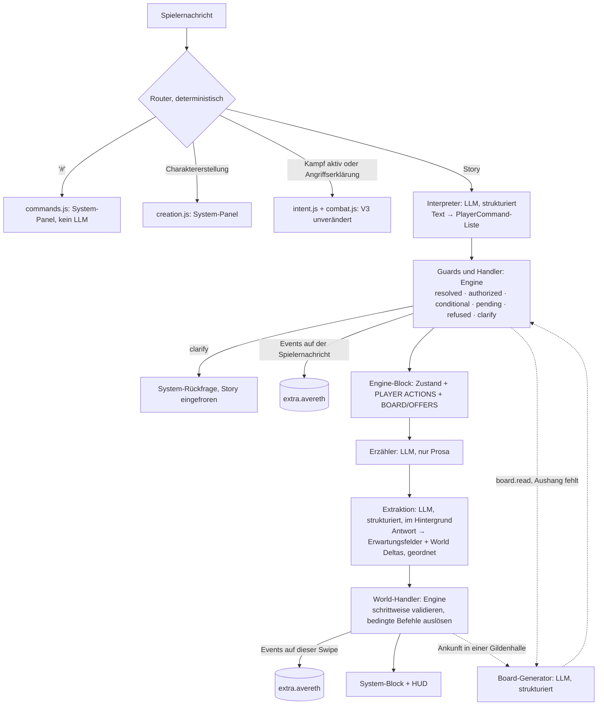

# Runtime V4 / Engine 4.0: Plan zur gemeinsamen Review

**Status:** Plan, kein Code.

**Grundlage:**
- der Live-Lauf vom 27.09.2026, 07:10, auf 3.1.7 byte-gleich reproduziert ([TESTRUN_V12.md](TESTRUN_V12.md));
- ein Audit aller Quellen auf dem Stand `main` 13d88d0:
  - Content (`content/*.json`, Erzählervertrag v3), `schemas/*.schema.json`, Lorebook v0.12 (alle 67 Einträge);
  - alle `src/*.js`, `index.js`;
  - die Doku ARCHITEKTUR, DATENMODELL, RUNTIME_V3, MIGRATION, LOREBOOK und REVIEW_V3.

**Leitsatz:** *LLM interprets and narrates. Engine validates and commits.*

## Inhalt

0. [Kurzfassung](#0-kurzfassung)
1. [Root Causes](#1-root-causes)
2. [Leitsätze und Kriterien](#2-leitsätze-und-kriterien)
3. [Architektur](#3-architektur)
4. [Command-Schicht (A, B)](#4-command-schicht-a-b)
5. [World Deltas und Extraktion (B, G, L)](#5-world-deltas-und-extraktion-b-g-l)
6. [Domänenmodelle (C–K, O)](#6-domänenmodelle-ck-o)
7. [Ownership-Grenzen](#7-ownership-grenzen)
8. [Migration und Versionierung](#8-migration-und-versionierung)
9. [Latenz und Token](#9-latenz-und-token)
10. [Risiken](#10-risiken)
11. [Teststrategie](#11-teststrategie)
12. [Dateien: neu, ersetzt, generiert, entfällt](#12-dateien-neu-ersetzt-generiert-entfällt)
13. [Bewusst nicht umgesetzt](#13-bewusst-nicht-umgesetzt)
14. [Mechanik-Support-Matrix (N)](#14-mechanik-support-matrix-n)
15. [Content- und Lore-Review](#15-content--und-lore-review)
16. [Phasen und Entscheidungspunkte](#16-phasen-und-entscheidungspunkte)

---

## 0. Kurzfassung

**Rechtfertigt der Stand eine Runtime V4? Ja.** Drei Gründe:

1. **Die zehn Befunde haben strukturelle Ursachen.**
   - Sie gehen auf neun Ursachen zurück (§1, RC1–RC9; RC10 betrifft den Check-Würfel, Punkt O).
   - Sechs davon sind strukturell: drei unabhängige Bedeutungsquellen, der Report als End-Snapshot, Existenz gleich Präsenz, fehlende Domänenobjekte, Drift zwischen Prompt, Schema und Validator, ein Zwangs-Bypass.
   - Keine davon lässt sich lokal patchen, ohne die Divergenz zwischen Regex, Erzähler und Validator weiter zu vergrößern.
2. **Die Behebung überschreitet die Versionsgrenzen.** Sie ändert Event-Typen, das Zustandslayout, den Nachrichten-Record, den Ablauf pro Zug (neue LLM-Rollen) und den Erzählervertrag. Das ist Engine 4.0, kein 3.1.8.
3. **Die Patch-Strategie ist ausgereizt.**
   - 3.1.5 bis 3.1.7 waren drei Iterationen allein an der Abgabe-Formulierung.
   - `intent.js` hat 18 Regex-Konstanten.
   - Der Lauf zeigt dieselbe Klasse an vier weiteren Verben: register, whole day, carry back, looking for an inn.

**Kern in einem Satz:**
- Der Spieler entscheidet; ein kleiner, strukturierter LLM-Aufruf übersetzt seine Nachricht in typisierte Befehle.
- Die Engine prüft und bucht.
- Der Erzähler erzählt das Gebuchte, nur Prosa.
- Ein zweiter strukturierter Aufruf liest aus der Antwort die typisierten, geordneten Weltänderungen, die die Engine erneut prüft und bucht.

```
PLAYER TEXT → Interpreter (LLM, JSON) → PlayerCommand[] → Guards (Engine) → resolved/authorized/conditional/pending/refused
  → Engine-Block (PLAYER ACTIONS) → Erzähler (LLM, Prosa) → Extraktion (LLM, JSON) → World Delta[] (geordnet)
  → Validierung (Engine, schrittweise) → Domain Events → fold() → Canonical State
```

**Bleibt:**
- Event Sourcing (Zustand = fold(Events), pro Nachricht, swipe-sicher);
- Kampf V3 byte-gleich, Charaktererstellung, `#`-Befehle, Schleichen, Würfel;
- NPC-Karten, Retrieval, HUD, Lorebook-Aufteilung.

**Neu:**
- Befehlsschicht;
- geordnete, typisierte Weltänderungen;
- Orts-Hierarchie;
- Präsenz getrennt von Existenz;
- Quest-Aggregat;
- Gilde (Aushänge, Mitgliedschaft, abgeleitete Beförderung);
- Objekte und Ressourcen;
- Angebote, Transaktionen, typisierter Zwang;
- Aktivitäten mit Zeitdeckel;
- Pending Check statt vorab sichtbarem CHECK DIE.

**Kosten:**
- ein zusätzlicher, blockierender kleiner Aufruf pro Story-Zug (Interpreter);
- der Report wandert aus der Erzähler-Antwort in einen Hintergrund-Aufruf (Extraktion), jeden Zug statt heute in 37,5 %.
- Geschätzt (§9): blockierende Zeit pro Story-Zug −9 bis +1 s, erstes Wort +4 bis 9 s später, Gesamt-Token +20 bis 50 % (Mitte ≈ +35 %).

**Nicht belegt:** Ob der Provider `json_schema` einhält, ist ungetestet (kein API-Schlüssel in dieser Umgebung). **Spike S0** ist deshalb der erste Schritt und zugleich Go/No-Go.

**Offen für die Review:** 12 Entscheidungspunkte (§16).

---

## 1. Root Causes

| RC | Ursache | Befunde | Warum kein Patch |
|---|---|---|---|
| **RC1** | **Drei Bedeutungsquellen.** Die Spielerabsicht wird per Regex in Kategorien gelesen: `authorization()` liefert Booleans für travel, move, pay, give, accept, conceal, rest und turnIn. Der Erzähler liest dieselbe Nachricht anders; `delta.js` prüft mit eigenen Heuristiken. Die Kategorien sind an kein Ziel, keinen Betrag und keine Quest gebunden. | 4, 7, 9, 10; 3.1.5–3.1.7 | Falsch negativ bei jeder neuen Formulierung („register“, „the whole day“, „carry it back“). Falsch positiv bei jeder Kategorie („I buy bread“ erlaubt jede Zahlung, ARCHITEKTUR §12). Jede neue Formulierung braucht ein neues Muster. |
| **RC2** | **Report = End-Snapshot.** Ein Objekt mit Schlüsseln, validiert gegen den Endzustand der Antwort. | 5 | Reihenfolge lässt sich aus Schlüsseln nicht rekonstruieren. |
| **RC3** | **Existenz ⇒ Präsenz.** `new` erzeugt `entity.created` und immer `scene.entered`; die Wahrnehmung am Zugende gilt für alle Anwesenden. | 3 | Präsenz ist Nebeneffekt der Erschaffung, kein eigener Zustand. |
| **RC4** | **Keine Domänenobjekte für das mechanisch Relevante.** Aushang, Ressourcen, Beweise, Dienste und Absichten landen als `facts`; Items gibt es nur als Bestand eines Charakterbogens. | 1, 8, 10, A2, A3, A7, A9 | Fakten sind Sätze, keine Bestände: nicht zählbar, nicht übertragbar, nicht prüfbar. |
| **RC5** | **Das Format existiert dreimal:** als Prosa in `narrator.json`, als Doku in `report.schema.json` (zur Laufzeit ungenutzt) und handgeschrieben in `delta.js`. Dazu ein großes Schema mit nur optionalen Schlüsseln. | 1, 2, A8 | Drei Quellen driften. „Optional“ kann Vollständigkeit nicht ausdrücken. |
| **RC6** | **Zwangs-Bypass `taken_by`/`forced_by`.** Jeder im selben Report eingeführte NPC ist gültig, und die Report-Instruktion lehrt den Bypass („else name the NPC in taken_by/forced_by“). | 10 | Der Bypass ist die dokumentierte Antwort auf fehlende Autorisierung. |
| **RC7** | **Eine Anfrage erzählt und bucht.** Der Report fehlt in 37,5 % der Antworten (Test 5: 10 von 15). Drei Sonder-Nachforderungen: REPORT, ATTACKERS, PLACE. | A6, mittelbar 1 | Die Prompt-Formulierung änderte nachweislich nichts (Test 5, `host.js`-Kommentar). |
| **RC8** | **Ort = Top-Level-Entity + freier `place`-String**, ohne Eltern. | 6, 9 | Ohne Hierarchie ist „zurück in die Stadt“ eine Reise in eine andere Location. |
| **RC9** | **Zeit über Verbkategorien.** Mehr als 120 min nur mit rest oder travel. | 7, A4 | Tätigkeiten sind offen: sammeln, arbeiten, üben, recherchieren … |
| **RC10** | **CHECK DIE vorab sichtbar.** Das Check-Gate liegt beim Erzähler, der den Würfel schon kennt. | (O) | Der Wert kann beeinflussen, *ob* und *wie* geprüft wird (ARCHITEKTUR §12 nennt Pending Check als nächste Stufe). |

---

## 2. Leitsätze und Kriterien

**Grundsatz:** *Engine owns consequences, not creativity.*

**Die Engine besitzt etwas genau dann, wenn es:**
- persistenten Zustand verändert;
- Zahlen oder Ressourcen verändert;
- Fortschritt, Belohnung oder Eignung bestimmt;
- Spieler-Agency betrifft;
- Besitz verändert;
- Ort, Präsenz oder Identität verändert;
- Wissen verändert;
- bei Swipe und Regenerate reproduzierbar sein muss;
- oder spätere Mechanik davon abhängt.

**Drei Regeln für V4:**
1. **Spielerentscheidungen entstehen nur aus PlayerCommands**, nie aus einer Erzähler-Antwort. Die Extraktion kann eine Spielerentscheidung weder erzeugen noch erweitern. Sie meldet nur, wie weit eine *autorisierte* Handlung in der Welt kam.
2. **Weltänderungen entstehen nur aus typisierten World Deltas.** Wo ein Domänenmodell existiert (Quest, Objekt, Angebot, Ort, Mitgliedschaft), sind freie Fakten dafür gesperrt.
3. **Alles mechanisch Relevante hat genau ein Zuhause und genau eine Schema-Quelle.** Prompt-Text, JSON-Schema und Validator werden daraus erzeugt.

---

## 3. Architektur

### 3.1 Ablauf eines Zuges



### 3.2 Rollen der LLM-Aufrufe

| Rolle | Wann | Eingabe | Ausgabe | Blockiert den Spieler? |
|---|---|---|---|---|
| **Interpreter** | vor der Erzählung, nur bei Story-Zügen | Spielertext, Katalog (§4.2), Befehlsvokabular | `{commands: [...]}` | ja |
| **Erzähler** | wie heute | Engine-Block, Vertrag v4, Lorebook | nur Prosa, kein Report mehr | ja (Streaming) |
| **Extraktion** („Buchhalter“) | nach der Antwort | Spielertext, PLAYER ACTIONS, Antwort, Katalog, Delta-Vokabular | `{expected: {...}, deltas: [...]}` | nein: läuft beim Lesen; der nächste Zug wartet höchstens darauf |
| **Board-Generator** | erster Blick auf ein Brett pro Tag und Rang | Filiale, Rang, fehlende Anzahl, Bestand, Regeln, Quest-Gerüst | `{listings: [...]}` | nur wenn nicht vorab erzeugt (§6.4) |

**Deterministisch bleiben:**
- `#`-Befehle und die Charaktererstellung;
- Kampfhandlungen im aktiven Kampf und Angriffserklärungen außerhalb (Korpus-gesichert);
- Schleichen: Check und Autorisierung von `concealed`.

**Das ist kein Tool-Calling** (Variante D in ARCHITEKTUR §5). Der Interpreter wird *immer* aufgerufen; das LLM entscheidet nicht, *ob* eine Regel greift.

**Technische Voraussetzung, im Quellcode geprüft (ST 1.19):** `generateRaw` ruft keine Generate-Interceptors auf; `runGenerationInterceptors` läuft nur in `Generate()`. Der Interpreter-Aufruf ist damit im Interceptor rekursionsfrei.

### 3.3 Speicherung pro Nachricht (Record v3)

```jsonc
// Spielernachricht
"avereth": {
  "v": 3, "input_hash": "…",
  "interp": { "version": "cmd-1", "source": "json_schema|json|failed", "ms": 5400, "retries": 0,
              "commands": [ /* Interpreter-Antwort, validiert */ ] },
  "events": [ "turn.begun", "cmd.interpreted", "cmd.resolved …", "Domain-Events …", "outcome.recorded" ],
  "command": null            // '#'-Befehle wie bisher
}
// Erzählerantwort (pro Swipe)
"avereth": {
  "v": 3, "text_hash": "…",
  "extract": { "version": "delta-1", "source": "…", "ms": 11800, "retries": 0, "answer": { /* roh, für Audit und Replay */ } },
  "events": [ "World-Events in Delta-Reihenfolge …", "cmd.completed …", "extraction.applied" ],
  "rejected": [], "corrections": [], "panel": "…", "hud": "…"
}
```

**Swipe und Regenerate:**
- Die Interpretation hängt an der Spielernachricht (Schlüssel `input_hash` + Interpreter-Version).
- Jeder Swipe der Antwort sieht deshalb dieselben Befehle, dieselben Auflösungen und dieselben Würfe.
- Die Extraktion gehört zur jeweiligen Swipe.
- Eine bearbeitete Spielernachricht wird neu interpretiert.

### 3.4 Fehlerverhalten

| Aufruf | Retry | Wenn er endgültig scheitert |
|---|---|---|
| Interpreter | einmal: mit Fehlerliste; im Modus `json_schema` beim zweiten Mal ohne Schema | `cmd.interpreted {failed}`: keine Spielerhandlung gebucht. Der Erzähler bekommt „nothing Alaric decided could be read; narrate only what changes nothing about him“. Der System-Block sagt „INTERPRETER FAILED — Regenerate versucht es erneut“. Ein Fehlschlag wird nicht gecacht. |
| Extraktion | einmal | `extraction.failed`: keine Weltänderung gebucht. Der System-Block meldet es; der nächste Zug bekommt eine Korrektur (wie heute bei fehlendem Report). |
| Board-Generator | einmal | Rückfall D3-b: Der Erzähler beschreibt das Brett, die Extraktion kanonisiert die Listings (§6.4). |

**Kein Regex-Rückfall für Spielerentscheidungen (D1):**
- Eine zweite Bedeutungsquelle „nur für Notfälle“ wäre genau RC1.
- Sichtbarer Fehler plus Regenerate ist ehrlicher.

---

## 4. Command-Schicht (A, B)

### 4.1 Vokabular

Kleine, generische Menge. Jede Quest-, Handels- oder Tätigkeitsart ist ein *Argument*, keine eigene Klasse.

| Befehl | Argumente | Guard (Engine) | Ergebnis |
|---|---|---|---|
| `go` | `to`: Orts-Ref oder `{new: Name}` | nicht im Kampf; Ziel ≠ hier | `authorized` (die Ankunft meldet die Extraktion) |
| `activity` | `kind` ∈ rest, sleep, wait, work, train, study, craft, search, gather, errand; `what?`; `minutes?`; `until?` ∈ done, noon, evening, end_of_day, night, dawn, morning | nicht im Kampf | `authorized` mit Zeitdeckel (§6.7) |
| `take` | `object`: Objekt-Ref oder `{new: Text}`; `qty?`; `from?` | Objekt liegt hier oder wird angeboten; ein NPC-Besitz ist kein `take` | `resolved` (bekanntes Objekt) oder `authorized` (die Extraktion legt es an) |
| `give` | `object`, `qty?`, `to` | Alaric hält es; Empfänger anwesend | `resolved` |
| `pay` | `to`, `amount_cp?`, `for?` | Empfänger anwesend; Betrag aus dem Befehl oder einem offenen Angebot; Coin reicht | `resolved` oder `pending` (Betrag unbekannt) |
| `buy` | `what`, `from?`, `qty?`, `max_cp?`, `any_price?` | offenes Angebot mit Preis → Kauf; sonst Deckel oder `any_price` speichern | `resolved`, `conditional` (Deckel) oder `pending` |
| `sell` | `object`, `qty?`, `to?`, `min_cp?` | Alaric hält es | `resolved` (Angebot vorhanden) oder `pending` |
| `offer.accept` / `offer.decline` | `offer`, `lines?` | Angebot offen; Anbieter anwesend; Coin reicht | `resolved` |
| `quest.accept` | `quest` | Listing: Filiale mit diesem Brett, Mitglied, Listing-Rang ≤ eigener Gildenrang, Listing frei. Privat: Geber erreichbar, Status `offered` | `resolved` |
| `quest.turn_in` | `quest` | Gildenvertrag aktiv; Beweise (§6.3). Ort: in der Siedlung einer Filiale, sonst `conditional` auf Ankunft dort | `resolved`, `conditional` oder `refused` mit Grund |
| `quest.abandon` | `quest` | aktiv | `resolved` |
| `guild.register` | – | an einer Filiale; nicht Mitglied | `pending` (Gebühr als Angebot) |
| `guild.promote` | – | Mitglied; Eignung abgeleitet (§6.4) | `resolved` oder `refused` |
| `board.read` | `rank?` | an einer Filiale | `resolved`: Listings im Block; fehlt der Aushang, Generator |
| `equip` / `unequip` | `object`, `slot?` | Alaric hält es; Slot passt | `resolved` |
| `attempt` | `action`, `stat`, `against?`, `against_stat?`, `difficulty?`, `mods?` | Check-Gate plausibel; Werte vorhanden | `resolved`: die Engine würfelt (§6.8) |

**Pflichtfelder jedes Befehls:**
- `seq`: Reihenfolge in der Nachricht;
- `quote`: die Textstelle, auf die er sich stützt. Der System-Block zeigt sie („verstanden: *register the Herb Run Quest* → Annahme Herb Run“).

**Nichts erzeugen:**
- Fragen („Could I take the escort?“);
- Gedanken und Überlegungen („*maybe I should register*“);
- Hypothesen („if I paid, would …“);
- Pläne für später („tomorrow I'll go to the mill“);
- Rückblicke auf Früheres („I paid him yesterday“). Die eigene Handlung, im Präteritum erzählt, *ist* dagegen eine Handlung;
- vom Spieler geschriebene NPC-Handlungen, zitierte Rede Dritter;
- Verneinungen („I don't pay“).

**Bedingte Sätze werden Argumente:** „I take the room if it's under 5 copper“ → `buy {max_cp: 5}`.

### 4.2 Interpreter-Aufruf

**Prompt:**
- **Kopf:** „Übersetze die Nachricht des Spielers in Engine-Befehle; du entscheidest keine Ergebnisse.“
- **Vokabular:** aus `content/commands.json` generiert.
- **Regeln:** Modus (Handlung oder Festlegung vs. Frage oder Gedanke), Reihenfolge, Referenzen nur aus dem Katalog oder als `{new: …}`.
- **Katalog.**
- **Spielernachricht.**

**Katalog** (von der Engine gebaut, Budget ≈ 600 Token; bei großen Kampagnen nach Relevanz gepackt wie RELEVANT heute):

| Teil | Inhalt |
|---|---|
| HERE | Ortspfad (Veyrhold › Redmarch › Gildenhalle); Anwesende mit ID, Label und Rolle |
| PLACES | Elternort, bekannte Kinder, Geschwister, bekannte Siedlungen im Realm |
| QUESTS | aktive und angebotene Quests (ID, Titel, Geber); am Brett die sichtbaren Listings (ID, Titel, Rang, Payout) |
| OFFERS | offene Angebote (ID, Anbieter, Posten mit Preis) |
| OBJECTS | was Alaric hält (ID, Name, Menge, Einheit); quest-relevante Objekte hier |
| OPEN DECISIONS | `pending`-Befehle aus dem letzten Zug |

**Beispiel** (Lauf 07:10, Nachricht 13: „since i have time untill tomorrow i register the Herb Run Quest too and travel to the reedbeds east of the mill leat“):

```json
{"commands": [
  {"seq": 1, "type": "quest.accept", "quest": "quest.herb_run_marshmint", "quote": "register the Herb Run Quest too"},
  {"seq": 2, "type": "go", "to": {"new": "reedbeds east of the mill leat"}, "quote": "travel to the reedbeds east of the mill leat"}
]}
```

**Cache:**
- Das Ergebnis wird an der Spielernachricht gespeichert, Schlüssel `input_hash` + Interpreter-Version (wie `playerTurn` heute).
- Swipes kosten keinen neuen Aufruf.
- Läuft noch die Extraktion der vorigen Antwort, wartet der Interpreter darauf, wie die Report-Nachforderung heute (`REPORT_WAIT_MS`). Der Katalog enthält so die aktuelle Welt.

### 4.3 Strukturierter Output und Rückfall

| Modus | Weg | Wann |
|---|---|---|
| **A: `json_schema`** | `generateRaw({systemPrompt, prompt, jsonSchema: {name, value}})`; ST reicht es bei der Quelle Custom als `response_format` weiter | nur wenn S0 zeigt, dass GLM es einhält |
| **B: eigenes Profil** | `ConnectionManagerRequestService.sendRequest(profileId, messages, maxTokens, {…}, overridePayload)`: anderes (schnelleres) Modell, Reasoning aus, `response_format` im Override | Option in den Einstellungen (D5) |
| **C: Rückfall** | kleines JSON per Anweisung → `tolerantJson` → lokaler Validator (`validate.js`) → bei Fehlern ein Retry mit der Fehlerliste | immer verfügbar |

**Schema-Dialekt:** nur, was `validate.js` prüft *und* strikte `json_schema`-Provider akzeptieren:
- `type`, `properties`, `required`, `additionalProperties: false`, `enum`, `const`, `anyOf`, `items`, `$ref`;
- kein `oneOf`, kein `if/then`.

### 4.4 Auflösungs-Stati

| Status | Bedeutung | Anweisung an den Erzähler |
|---|---|---|
| `resolved` | Die Engine hat die Folgen jetzt gebucht (Coin, Quest-Status, Objekt, Wissen der Zeugen) | genau so erzählen |
| `authorized` | Erlaubnis für Weltänderungen eines Typs in dieser Antwort, mit Ziel und Deckel (Ankunft, Zeit, neues Objekt aus Sammeln) | den Versuch erzählen; wo er endet, entscheidet die Geschichte |
| `conditional` | Die Engine hat das Ergebnis vorab berechnet; gebucht wird es, wenn die Bedingung in dieser Antwort eintritt (Ankunft an einem Gildenschalter → Abgabe) | „wenn er den Schalter erreicht: …“ |
| `pending` | Braucht erst Weltinformation (Preis, Gebühr). Der Befehl wird als OPEN DECISION in den nächsten Zug getragen und verfällt beim Szenenwechsel | anbieten, Preis nennen, **anhalten** |
| `refused` | Guard verletzt | das Scheitern in der Welt erzählen (Grund steht dabei) |
| `clarify` | Referenz mehrdeutig (zwei aktive Verträge, „the quest“) | kein Erzähleraufruf: System-Rückfrage wie die Zielfrage im Kampf (`targetQuestion`) |

**Übernahme der 3.1.6/3.1.7-Regeln:**
- Die Gildenregel bleibt inhaltlich erhalten: Abgabe nur durch den Spieler an einer Filiale; die Engine zahlt.
- „Unbenannt nur bei genau einem aktiven Vertrag“ wird zu Referenzauflösung plus `clarify`, statt stiller Ablehnung.

### 4.5 Engine-Block: PLAYER ACTIONS

Er ersetzt die Report-Anweisung und steht am Ende des Blocks, also am bindenden Platz (Lost in the Middle). Beispiel für Nachricht 13:

```
PLAYER ACTIONS (the engine resolved Alaric's message; narrate exactly these, in this order; he decides nothing else):
1. ACCEPTED — "Herb Run — Marshmint" (Guild contract, Novice): the clerk logs it. Turn-in at any Guild front desk
   with 1 basket of marshmint; the Guild pays 4 silver.
2. GOES — to the reedbeds east of the mill leat, outside Redmarch. Where the reply ends is up to the story.
```

Beispiel für Nachricht 19 (Gasthaus):

```
PLAYER ACTIONS (…):
1. NOTHING TO DO — "Herb Run — Marshmint" is already turned in.
2. GOES — through Redmarch, looking for an inn.
OPEN DECISION — Alaric wants a room, a bath and laundry; no price is known. Let the innkeeper name the prices,
then stop: he has not agreed to pay.
```

---

## 5. World Deltas und Extraktion (B, G, L)

### 5.1 Vokabular

Die Extraktion meldet nur **äußere** Weltänderungen, in der Reihenfolge der Erzählung. Kein Delta kann eine Entscheidung Alarics ausdrücken.

| Gruppe | Delta | Kernfelder | Guard |
|---|---|---|---|
| Zeit, Ort | `time` | `minutes` | pro Zug ≤ 120 min ohne Aktivität, sonst im Deckel der autorisierten Aktivität oder Reise (§6.7) |
| | `arrive` | `at`: Orts-Ref oder `{new: {name, kind, parent}}` | nur mit `go`-Autorisierung oder nach `forced` |
| | `location.new` | `name`, `kind`, `parent` | Elternort existiert; ein Name unter demselben Eltern wird wiederverwendet |
| Personen, Szene | `person.new` | `ref`, `name\|null` (nur Eigenname), `role`, `desc[]`, `traits?`, `present` (Pflicht), `at?`, `band?` | `present: false` → keine Szene, keine Wahrnehmung |
| | `creature.new` | wie oben + `species` | Körperbau-Anker (wie heute) |
| | `enter`, `leave`, `position`, `aware`, `concealed` | wie heute | gegen den Zustand *zu diesem Schritt* |
| Epistemik | `fact` | `s`, `p`, `o`, `because?`, `secret?` | **gesperrt** für Prädikate mit Domäne: takes, carries, has, holds, lacks, price, guild_rank, located, intent … |
| | `learn`, `believe`, `attitude`, `memory` | wie heute | Anwesenheit, Zeugen und Wahrnehmung zum Schritt |
| Objekte | `object.new` | `name`, `kind` (resource, item, document, trophy), `qty`, `unit?`, `holder` (Ort oder Person), `for_quest?` | Halter Alaric nur mit `take`- oder `gather`-Autorisierung, sonst liegt es am Ort |
| | `object.move` | `object`, `qty?`, `to` | von Alaric **nie**; zu Alaric nur als Gabe eines NPC oder mit `take`; vom Ort zu Alaric nur mit `take` |
| | `object.mark` | `object`, `mark` (z. B. „signed by the waystation master“) | Objekt existiert; der Zeichnende ist anwesend |
| Handel, Zwang | `offer` | `seller`, `lines[{what, kind: goods\|service, service?, qty, unit?, price_cp}]` | Anbieter anwesend; Preise ganzzahlig in Kupfer |
| | `coin.gift` | `from`, `cp`, `why` | nie die Gilden-Auszahlung eines Vertrags (die zahlt die Engine) |
| | `coerce` | `kind` ∈ theft, robbery, confiscation, fine; `by`; `coin_cp?` oder `object?`; `because` | §6.6: nie vom Gegenüber eines Handels dieses Zuges |
| | `forced` | `by`, `kind` ∈ arrest, abduction, carried_off; `to?`; `because` | Täter anwesend; Grund Pflicht |
| Quests | `quest.offer` | `title`, `giver`, `level`, `type`, `reward?`, `objectives[]`, `proof[]`, `desired_end_state?`, `schedule?` | nur private Arbeit; Gildenverträge kommen vom Brett |
| | `quest.detail` | `quest`, `add_objective?`, `add_proof?`, `schedule?` | vom Geber oder Schalter; Bestehendes wird nie geändert |
| | `quest.progress` | `quest`, `objective`, `status` | Information; bei Gildenverträgen entscheidet der Beweis |
| | `quest.close` | `quest`, `status` ∈ completed, failed; `by` | privat: der Geber. Gildenverträge nur `failed` (unmöglich geworden) |
| | `listing.gone` | `listing`, `why` ∈ taken_by_other, withdrawn | Welt-Ereignis am Brett (UID 66) |
| Kampf | `hostile` | `by[]` | wie `combat` heute (Core #23) |
| | `intent` | `who`, `intent` | wie heute |
| Sonst | `recover` | `who`, `hp?`, `mp?`, `sta?` | Alaric nur mit rest/sleep oder einem Dienst lodging/healing |
| | `thread` | `text`, `kind`, `status` | wie heute |
| | `check.request` | `what`, `actor`, `stat`, `against\|difficulty` | Pending Check für den nächsten Zug (§6.8) |
| Audit | `overreach` | `kind` (payment, purchase, travel, accept, take …), `what` | kein Zustand: Korrektur und System-Zeile (§5.4) |

**`seq` ist Pflicht:** Die Extraktion nummeriert in Erzählreihenfolge.

**Referenzen:**
- Bekannte Dinge nur per ID aus dem Katalog: im Modus `json_schema` als Enum, sonst vom Validator geprüft.
- Neues nur als `{new: …}`, bei Orten mit einer Ebene verschachtelter Eltern.

### 5.2 Schrittweise Anwendung (G)

```
work = clone(state after player turn)
for d in deltas (nach seq):
    r = handler[d.type](d, work, turnAuth, content)   // prüft gegen den Zustand zu diesem Schritt
    events += r.events; work = apply(work, r.events)
    fire conditional commands whose condition d erfüllt hat (z. B. arrive → quest.turn_in)
perception/episode per Schritt (nicht am Zugende)
```

**Befund 5 im neuen Ablauf:**
- Die Annahme (Befehl 1) wird *vor* der Erzählung gebucht.
- Zeugen, also Anwesende, die Alaric wahrnehmen, erhalten das Wissen zu diesem Zeitpunkt aus der Engine selbst. Ein `learn` des Erzählers ist nicht nötig.
- Die Reise (Befehl 2) folgt danach.

### 5.3 Erwartungsfelder (Vollständigkeit)

**Das Prinzip:**
- „Report syntaktisch vorhanden“ reicht nicht (Befund 1).
- Für jeden Befehl mit Status `authorized`, `conditional` oder `pending` erzeugt die Engine ein **Pflichtfeld** in `expected`, geschlüsselt nach `seq`.
- Die Extraktion muss es beantworten. Fehlt die Antwort, gibt es einen Retry; danach gilt die Handlung als „nicht verwirklicht“.

| Befehl | Pflichtfeld |
|---|---|
| `go` | `{arrived: bool, at: ref\|new\|null}` |
| `activity` | `{minutes: int, done: bool}` |
| `take` (neues Objekt) | `{taken: bool, qty?}` |
| `buy` / `pay` / `guild.register` (pending) | `{offer: {…}\|null}`: hat jemand einen Preis genannt? |
| `quest.turn_in` (conditional) | beantwortet über `go.arrived`, sonst `{reached_desk: bool}` |

**Aushänge:** Befund 1 kann nicht mehr auftreten, weil die Listings vor der Erzählung kanonisch sind (§6.4).

### 5.4 Overreach

- Erzählt die Antwort eine Entscheidung Alarics, die nicht unter PLAYER ACTIONS steht („he pays the innkeeper seven copper“), meldet die Extraktion `overreach`.
- Der Zustand bleibt unverändert.
- Der System-Block zeigt „NOT APPLIED — the reply had Alaric pay 7 cp; he had not agreed“.
- Der nächste Engine-Block bekommt eine Korrektur. Der Spieler kann swipen.

### 5.5 Eine Quelle für Prompt, Schema und Validator (L, M)

| Quelle | Erzeugt |
|---|---|
| `content/commands.json` (Befehle: Beschreibung, Argumente, Beispiele ±) | Interpreter-Vokabeltext, JSON-Schema (mit Katalog-Enums), Validator |
| `content/deltas.json` (Deltas: Beschreibung, Felder, Beispiele) | Extraktions-Vokabeltext, JSON-Schema, Validator, **situative Teilmenge pro Zug** (aus Befehlen und Zustand, nicht aus Regex über Prosa: `ITEM_RE`, `QUEST_RE` und `REST_RE` in `context.js` entfallen) |
| `schemas/event.schema.json` v2 (diskriminierte Payloads: `anyOf` über `{t: const X, d: $ref X}`) | Event-Prüfung in Tests und optional zur Laufzeit (Debug-Modus) |

**Test:** Jeder Eintrag hat Beschreibung, Schema, Handler und Beispiele. Ein Delta ohne Handler oder ein Handler ohne Eintrag lässt den Test scheitern. Damit ist Befund 2 konstruktiv ausgeschlossen.

---

## 6. Domänenmodelle (C–K, O)

### 6.1 Orte (H)

```jsonc
"locations": {
  "realm.veyrhold":            { "kind": "realm" },
  "loc.redmarch":              { "name": "Redmarch", "kind": "settlement", "sub": "city", "parent": "realm.veyrhold" },
  "loc.redmarch.guild_hall":   { "name": "Adventurers' Guild hall", "kind": "site", "parent": "loc.redmarch", "tags": ["guild_hall"] },
  "loc.redmarch.mill_leat":    { "name": "eastern mill leat", "kind": "site", "parent": "loc.redmarch" },
  "loc.redmarch.reedbeds":     { "name": "reedbeds", "kind": "site", "parent": "loc.redmarch.mill_leat" },
  "loc.redmarch.coopers_lane": { "name": "lane behind the cooper's yard", "kind": "site", "parent": "loc.redmarch" },
  "loc.redmarch.marsh_bell":   { "name": "Marsh Bell", "kind": "interior", "parent": "loc.redmarch.coopers_lane", "tags": ["inn"] }
}
"scene": { "at": "loc.redmarch.marsh_bell", /* Siedlung und Realm werden über die Eltern abgeleitet */ }
```

**Arten und erlaubte Eltern:**

| Art | Erlaubte Eltern |
|---|---|
| realm | – |
| region, wilderness | realm, region |
| settlement | realm, region |
| district | settlement |
| site | settlement, district, region, wilderness, site |
| interior | site, district, settlement |

**Regeln:**
- keine Koordinaten, kein Pathfinding;
- ein neuer Ort braucht einen existierenden Elternort;
- ein gleicher Name unter demselben Elternort ist derselbe Ort.

**Reise oder lokal:**
- Liegt der tiefste gemeinsame Vorfahr in derselben Siedlung, ist der Weg lokal.
- Sonst ist es eine Reise (Zeitplausibilität §6.7).

**Gildenfiliale:**
- Jede Siedlung mit `sub` ∈ `rules.guild.branch_kinds` (city, capital) hat eine Filiale.
- Ihre Halle ist ein Knoten mit Tag `guild_hall`, angelegt beim ersten Erwähnen oder Betreten.

**Content:** `lore.json` bekommt `parent` und die normalisierte Art. Realms werden Knoten; die 14 Städte, Hauptstädte und Sitze werden Siedlungen mit `sub`.

### 6.2 Entität ≠ Präsenz (F)

| Begriff | Speicher | Entsteht durch |
|---|---|---|
| Existenz | `entities[id]` | `person.new`, `creature.new`, Content |
| Aufenthalt | `entities[id].at` (Ortsknoten oder unbekannt) | `person.new.at`, Bewegungen |
| Präsenz | `scene.present` | `person.new {present: true}`, `enter`, Ankunft an einem Ort mit dort Anwesenden |
| Begegnung | Erinnerung „first saw“ und `knowledge f.pc.appearance` | erste **Ko-Präsenz mit Wahrnehmung zu diesem Schritt** |

**Beispiele aus dem Lauf:**
- Ossler: `person.new {present: false, at: "Harrow's mill yard"}` → existiert, nicht da, nicht getroffen.
- Identität: `name` ist nur ein Eigenname oder `null`, `role` ist die Funktion. „Guild Clerk“ wird `role: "Guild clerk", name: null` (A1).

### 6.3 Quest-Aggregat (C)

```jsonc
"quest.herb_run_marshmint": {
  "title": "Herb Run — Marshmint", "kind": "guild_contract",               // guild_contract | private
  "source": { "board": "loc.redmarch", "listed": { "turn": 5, "minute": 570 } },   // private: { "giver": "npc.…" }
  "client": "Redmarch apothecaries", "rank": "Novice",
  "level": 1, "qtype": "minor",                                             // versteckte XP-Basis (Core #25), nie in der Prosa
  "payout": { "cp": 40, "by": "guild" }, "bonus": null,                     // eine feste Auszahlung; Client-Bonus separat (UID 34 Punkt 5)
  "desired_end_state": "a full basket of marshmint at the Guild",
  "objectives": [ { "id": "o1", "verb": "GATHER", "what": "marshmint", "qty": 1, "unit": "basket", "where": "loc.redmarch.reedbeds", "status": "open" } ],
  "proof": [ { "id": "p1", "kind": "object", "what": "marshmint", "qty": 1, "unit": "basket", "consume": true } ],
  "schedule": { "starts_at": null, "deadline": null },                      // Miller's Run: starts_at = Tag 2, erstes Licht
  "status": "active", "taker": "pc",
  "history": [ { "turn": 5, "status": "listed" }, { "turn": 7, "status": "active", "at": "loc.redmarch.guild_hall", "witnesses": ["npc.guild_clerk"] } ],
  "narrative": { "cause": "…", "motive": "…" }                              // Metadaten, nicht validiert
}
```

**Statusmaschinen:**
- **Gildenvertrag:** `listed` → `active` (am Schalter angenommen) → `completed` (Abgabe mit Beweis) | `failed` | `abandoned` | `expired`.
- **Vom Brett verschwunden:** `listed` → `taken_by_other` | `withdrawn`.
- **Privat:** `offered` → `active` → `completed` | `failed` | `abandoned` (Abschluss durch den Geber).

**Aktionsgrammatik aus UID 28** als Verben der Ziele: GO, FIND, TALK, GET/GATHER, GIVE/DELIVER, USE/REPAIR, DEFEND/ESCORT, ATTACK/DEFEAT.
- Keine vorgeschriebenen Zweige.
- Ursache und Motiv bleiben Metadaten.
- Die Ziele sind informativ; bei Gildenverträgen entscheidet der Beweis.

**Beweisprüfung bei der Abgabe (Engine):**

| Art | Prüfung | Folge |
|---|---|---|
| `object` | Alaric hält ≥ Menge in derselben Einheit | wird bei `consume` an die Gilde abgegeben |
| `mark` | ein Dokument in Alarics Besitz trägt die Marke (Miller's Run: „signed by the waystation master“ auf der Gildenplakette) | bleibt bei ihm, erhält „stamped“ |

**Folgen der Abgabe:**
- Erfüllt: Abgabe, Auszahlung, Quest-XP, Vertragszähler.
- Nicht erfüllt: `refused` mit Grund („the basket isn't full“); die Quest bleibt aktiv.
- Altquests ohne Beweisliste (Migration) nimmt der Schalter wie in 3.1.7 an.

**Feld-Hoheit:**

| Feld | Wer setzt es |
|---|---|
| Rang, Level, Typ, Payout, Ziele, Beweise, Termine | Generator (Listing) oder Extraktion (`quest.offer`, privat); danach gesperrt, nur ergänzbar durch `quest.detail` |
| Status, Taker, Historie, XP | Engine |

### 6.4 Gilde: Aushänge, Mitgliedschaft, Beförderung (D, E)

```jsonc
"guild": {
  "membership": { "rank": "Novice", "since": { "turn": 5 }, "branch": "loc.redmarch" },   // nur Alaric
  "boards": { "loc.redmarch": { "day": 1, "ranks": { "Novice": ["quest.millers_run_escort", "…"] } } }
}
```

**Aushang (UID 66):**
- **Pro Filiale und unterstütztem Rang mindestens 5 Verträge.** Erzeugt wird nur für die Ränge, auf die Alaric schaut: sein Rang, dazu höchstens ein Blick auf den nächsten.
- Welche Ränge eine Filiale unterstützt, ist PROPOSED (D10): Stadt Novice bis Veteran, Hauptstadt Novice bis Elite, höhere Ränge übers Netz.
- **Ablauf:**
  - Bei `board.read` (oder vorab bei Ankunft in einer Gildenhalle) sieht die Engine die fehlenden Plätze.
  - Der **Board-Generator** erzeugt nur diese Listings (Schema: Quest-Aggregat ohne Status).
  - Die Engine validiert und bucht sie: Rang-Enum, Level im Rangband, Payout ganzzahlig und im Plausibilitätsband (PROPOSED, D11), 1–4 Ziele, ≥ 1 Beweis.
  - Danach `quest.created` (`listed`) und `board.refreshed`.
- **Der Erzähler rendert nur kanonische Listings** (BOARD im Engine-Block, ≈ 40 Token je Listing). Er erfindet an einer Filiale keine Verträge.
- **Stabilität:** Gesehene Listings bleiben, bis sie genommen, erledigt, abgelaufen oder zurückgezogen sind. Der Tageswechsel ist kein Neuwurf.
  - Beim ersten Blick eines neuen Tages entfernt die Engine Erledigtes.
  - Andere Abenteurer nehmen Arbeit: zufällig per Engine-Würfel (PROPOSED 20 % je Listing und Tag ab Tag 2) und erzählt per `listing.gone` (Weasel-Auftrag im Lauf).
  - Danach füllt der Generator nur die Lücken.
- **Latenz:** Der erste Blick kostet einen Generator-Aufruf (§9). Er läuft im Hintergrund, sobald die Extraktion eine Ankunft in einer Gildenhalle meldet (im Lauf: Nachricht 6, das Brett erst in Nachricht 9). Nur wenn Ankunft und Blick in derselben Nachricht stehen, blockiert er.
- **Stehende Arbeit** („a dozen slips … standing sort“) ist Kulisse, kein kanonischer Vertrag.

**Mitgliedschaft:**
- **Registrierung:** `guild.register` → `pending`, die Gebühr wird ein Angebot (D7). Nach dem Bezahlen folgt `guild.registered`:
  - Rang Novice;
  - der Kristall liest den Power Rank aus Level und Rangband (Engine; F bei Level 1–14);
  - die Plakette wird ein Dokument-Objekt.
- Die Registrierung ist ein Verfahren, keine Quest (Canon UID 34 Punkt 6). Der Fakt `guild_rank` wird Mitgliedschaft; für Altchats liest ein Upcaster ihn ein.

**Beförderung (UID 65), abgeleitet, nie gespeichert:**

```
eligible(ziel) = PowerRank(pc) ≥ Mindest-PowerRank(ziel)
                 AND count(quests: kind = guild_contract, status = completed, rank = membership.rank) ≥ 5
```

- Anzeige in `#quests`/`#guild`: „Guild Rank Novice · 1/5 Novice contracts · Power Rank F (Proven needs E) → not eligible“.
- Die Beförderung bleibt ein Verfahren: `guild.promote` am Schalter. Die Engine prüft die Eignung und bucht `guild.promoted`; der Erzähler erzählt die Prüfung.
- Einstufungsprüfung für Späteinsteiger und Ausnahmebeförderung: nicht in 4.0 (§13).

### 6.5 Objekte und Ressourcen (I)

```jsonc
"objects": {
  "obj.t8.marshmint":   { "name": "marshmint", "kind": "resource", "stack": true, "qty": 1, "unit": "basket",
                          "holder": { "loc": "loc.redmarch.reedbeds" }, "for_quests": ["quest.herb_run_marshmint"],
                          "source": { "turn": 8, "how": "gathered" } },
  "obj.t5.guild_plate": { "name": "Guild registration plate", "kind": "document", "stack": false,
                          "holder": { "entity": "pc" }, "marks": [ { "text": "Novice stamp", "by": "npc.guild_clerk" } ] }
}
```

**Stapel und Instanzen:**
- **Stapel** (Ressourcen, Munition, Verbrauchsgüter): Identität = Name bzw. Template + Einheit + Halter. Gleiche Stapel verschmelzen beim Übertragen.
- **Instanzen** (Gear, Dokumente, Schlüssel, benannte Trophäen): eigene ID, Marken, Zustand. Erbeutetes Gear ist dieselbe Instanz mit denselben Werten (Core #20).
- **Halter:** eine Entität *oder* ein Ort. Beute liegt am Körper oder Ort, bis jemand sie nimmt (Core #20, UID 44: keine Auto-Aufnahme).

**Getrackt wird nur, was:**
- Ziel oder Beweis einer Quest ist;
- mit Wert den Besitzer wechselt (Kauf, Verkauf, Beute, Gabe);
- Gear oder Verbrauchsgut Alarics ist;
- oder was Alaric ausdrücklich aufnimmt.

Kulisse wie das Brett oder der Kristall wird nicht getrackt.

**Einheiten:**
- Eine Ressource, die eine aktive Quest verlangt, wird in der Einheit der Quest gezählt (D8). Die Extraktion bekommt die Einheit im Katalog.
- Die Engine rechnet keine Einheiten um.
- Traglast und Behälter gibt es nicht (§13).

**Kampf-Kompatibilität:**
- `sheet.inventory` (Template-ID → Menge) bleibt als **abgeleitete Sicht**, gepflegt vom Reducer.
- `combat.js` liest Munition weiter daraus.
- Seine `item.changed`-Events bleiben unverändert. Das ist die Voraussetzung dafür, dass Kampf-Replays byte-gleich bleiben.

### 6.6 Angebote, Dienste, Transaktionen, Zwang (J)

```jsonc
"offers": { "offer.t10.1": { "seller": "npc.marsh_bell_innkeeper", "at": "loc.redmarch.marsh_bell", "status": "open",
  "lines": [ { "id": "l1", "what": "room for the night", "kind": "service", "service": "lodging", "price_cp": 4 },
             { "id": "l2", "what": "hot bath", "kind": "service", "service": "bath", "price_cp": 2 },
             { "id": "l3", "what": "laundry", "kind": "service", "service": "laundry", "price_cp": 1 } ] } }
```

**Handel:**
- Das Angebot entsteht aus der Welt (`offer`-Delta), die Annahme aus einem Befehl (`offer.accept`, `buy`, `pay`).
- Die Engine prüft das Coin und bucht `transaction.completed` + `coin.changed` sowie Ware (`object.*`) oder Dienst (`service.granted`).
- Ein einmal genannter Preis bleibt (Core #22: „preserve the exact price already established“). Ein neuer Preis braucht ein neues Angebot mit Grund.

**Dienste:**
- `lodging` erlaubt `sleep` an diesem Ort und `recover`.
- `healing` erlaubt `recover`.
- `bath`, `laundry` und `meal` sind reine Erzählung, ohne Zustand.
- `training` ist ein Haken für Fortschritt später.
- `guild_registration` löst die Registrierung aus.

**Zwang als eigener, typisierter Weltfall** (ersetzt `taken_by`/`forced_by`). `coerce` wird nur angenommen, wenn gilt:
1. Der Täter ist *zu diesem Schritt* anwesend.
2. Der Täter ist **nicht** Gegenüber eines Handels dieses Zuges oder eines offenen Angebots. Ein Verkauf ist nie eine Beschlagnahme.
3. Die Art passt:
   - `confiscation` und `fine` nur durch eine Autoritätsrolle (Wache, Beamter; Template oder `occupation`);
   - `robbery` nur durch einen feindseligen NPC oder im Kontext einer Kapitulation;
   - `theft` durch einen Taschendieb. Den Wahrnehmungswurf (Core #8) würfelt ab P5 die Engine.
4. Ein `because` ist angegeben.
5. Die Änderung erscheint als eigene Zeile im System-Block.

**Aus dem Prompt verschwindet** „else name the NPC in taken_by/forced_by“ (Befund 10).

### 6.7 Aktivitäten und Zeit (K)

| Autorisierung | Zeitdeckel für `time` in dieser Antwort |
|---|---|
| keine | 120 min (heute im Code, künftig `rules.json`) |
| `activity` mit `minutes` | `minutes` × 1,25 |
| `activity` mit `until` | bis zur Uhrzeit: noon 12:00, evening 18:00, end_of_day 20:00, night 22:00, dawn 06:00, morning 08:00 (PROPOSED); `done`: 12 h |
| `go`, lokal (dieselbe Siedlung) | wie ohne Aktivität: 120 min |
| `go`, Reise (andere Siedlung oder Wildnis) | wie heute höchstens 7 Tage; die Dauer schätzt der Erzähler |
| `sleep` mit lodging | bis `until`, Standard morning |

**Beispiel aus dem Lauf:** Nachricht 15 „the whole day“ → `activity {kind: gather, what: marshmint, until: end_of_day}` bei 10:40 → Deckel 560 min → `time: 300` wird angenommen.

**Weitere Regeln:**
- `recover` für Alaric ist an rest, sleep, lodging oder healing gebunden.
- Das Aktivitäten-Log (kind, what, Minuten) ist der Haken für Übung und Lernen später (§6.9).

### 6.8 Checks: Pending Check (O)

**Vom Spieler ausgelöst:**
- Aus `attempt` prüft die Engine das Check-Gate:
  - Stat gültig;
  - Gegenwert vom Gegner (Menschen: Stat; Kreaturen: `rules.checks.creature_detection`, PROPOSED) oder benannte Schwierigkeit (`rules.checks.difficulty_scores`, PROPOSED);
  - Modifikatoren nur in den Stufen ±10/20/35 %.
- Die Engine würfelt **vor** der Erzählung (Core #7 Chance%, Core #9 ein Wurf).
- Das Ergebnis steht in PLAYER ACTIONS.

**Von der Welt ausgelöst:**
- Ein NPC belügt Alaric, ein Taschendieb greift zu: Der Erzähler hält am unsicheren Moment an (Vertrag v4).
- Die Extraktion meldet `check.request`.
- Die Engine würfelt zu Beginn des nächsten Zuges; der Erzähler erzählt das Ergebnis dann.

**Folgen:**
- Der CHECK DIE im Block entfällt, ebenso der Report-Schlüssel `check`. Der Erzähler sieht keinen W100 mehr, bevor feststeht, dass geprüft wird.
- Schleichen bleibt deterministisch wie heute (`checks.js`).

### 6.9 Vorbereitet, nicht aktiv (N)

Damit spätere Mechanik keinen zweiten Umbau braucht, bekommen diese Strukturen in 4.0 Zustandsfelder, Event-Namen und Reducer mit Tests, aber **keinen Emitter**:

| Struktur | Zustand | Reservierte Events | Aktiv ab |
|---|---|---|---|
| persistente Statuseffekte (Core #13) | `entities[x].effects[]` {name, source, magnitude, duration (bis Minute oder Züge), periodic, stacking} | `effect.applied`, `effect.expired` | später |
| Verletzungen (Core #14) | `entities[x].injuries[]` | `injury.added`, `injury.treated` | später |
| Skill-Fortschritt (Core #5, Content #6) | `sheet.skills[id] = {prof, pp}` + `learning[id]` | `skill.progress`, `skill.promoted`; `skill.learned` existiert | nach der Content-Lücke (§15: 30/35 Skills ohne Complexity und Tags) |
| Klassen-Evolution (Core #4, Content #10) | `sheet.class_history[]` | `class.evolved` | später |
| Domain (Core #19) | `sheet.domain` | `domain.unlocked`, `domain.toggled` | später |
| Elemente und Umwelt-Tags (Core #16) | `tags[]` an Orten und Objekten | über `fact`/`object.mark` | später |
| Beute-Materialien (Core #20) | Objekte mit `source.how = looted` | `object.new` | 4.0 (Grundform); Material-Profile fehlen im Content |

---

## 7. Ownership-Grenzen

**E** = entscheidet/bucht · **V** = schlägt vor (validiert) · **R** = rendert/erzählt · **—** = nie

| Gegenstand | Spieler | Interpreter | Engine | Erzähler | Extraktion | Generator | Content/Lore |
|---|---|---|---|---|---|---|---|
| Alarics Entscheidungen (gehen, nehmen, zahlen, kaufen, annehmen, abgeben, tätig sein, ausrüsten) | **E** | V (übersetzt) | prüft, bucht | R | — | — | Regeln |
| Ergebnisse dieser Entscheidungen (Coin, Status, Zeugen) | — | — | **E** | R | — | — | Regeln |
| Weltreaktionen (NPC-Handlungen, Ankünfte, Wetter, Feindseligkeit) | — | — | prüft | erfindet | V | — | Gerüste |
| Preise und Angebote | — | — | prüft, hält fest | erfindet | V | — | – |
| neue Orte, Personen | — | — | prüft (Eltern, Duplikate) | erfindet | V | — | Index |
| Präsenz, Begegnung, Wissen aus Beobachtung | — | — | **E** (schrittweise) | R | V (enter/leave/learn) | — | – |
| Aushang-Listings | — | — | prüft, bucht, erneuert | R (nur kanonische) | V (`listing.gone`) | erfindet (V) | UID 25–31, 66 |
| Quest-Felder (Rang, Level, Typ, Payout, Ziele, Beweise) | — | — | prüft, sperrt | R | V (privat) | V (Gilde) | Regeln |
| Quest-Status, XP, Auszahlung, Vertragszähler | — | — | **E** | R | V (nur private Abschlüsse, Fehlschlag) | — | Core #25, UID 34 |
| Beförderungs-Eignung | — | — | **E** (abgeleitet) | R | — | — | UID 65 |
| Objekte (Bestand, Halter, Marken) | über Befehle | V | **E** | R | V (Welt) | — | Templates |
| Coin | über Befehle | V | **E** | R | V (Gaben, Zwang) | — | Core #22 |
| Zeit | über Aktivität | V | **E** (Deckel) | schlägt vor | V (`time`) | — | – |
| Würfe, Checks, Kampf | Kampfbefehle | V (`attempt`) | **E** | R | V (`check.request`, `hostile`) | — | Core |
| Prosa, Dialog, Kultur, lokale Details | — | — | — | **E** | — | — | Lorebook |

---

## 8. Migration und Versionierung

**Versionen:**

| Element | 3.1.7 | 4.0 |
|---|---|---|
| Engine | 3.1.7 | **4.0.0** (Runtime V4) |
| Event-Schema | 1 (implizit) | **2**: Umschlag `{t, d, v?}`; fehlt `v`, gilt 1 |
| Zustand (`STATE_VERSION`) | 2 | **3** (Felder aus §6) |
| Nachrichten-Record (`RECORD_VERSION`) | 2 | **3** (`interp`, `extract`) |
| Content-Pack | 3.0.0 | **4.0.0** (neue Dateien, `lore.json`-Eltern) |
| Erzählervertrag | v3 (3.3) | **v4** |
| Lorebook | v0.12 | **v0.13** (§15) |

**Grundsätze:**
- Alte Events werden nie umgeschrieben. Neue Events kommen additiv hinzu.
- Jeder 3.x-Event-Typ faltet weiter. Dafür sorgen **Upcaster** in `applyEvent`: Sie bilden alte Formen beim Falten auf den neuen Zustand ab, ohne die gespeicherten Events zu ändern.

| Altes Event | Faltung in 4.0 |
|---|---|
| `quest.set` | Quest-Aggregat: `kind` aus `rank` (Rang → Gildenvertrag); Payout aus `reward` (`postedCoin`); Ziele und Beweise leer (Abgabe ohne Beweisprüfung, markiert „legacy“); `held` wird ignoriert |
| `scene.moved {location, place}` | `scene.at` = Location; `place` bleibt Anzeigename (ohne Knoten) |
| `entity.created` mit kind `location` | Ortsknoten, Eltern = Realm (aus `realm`), Art `site` |
| `item.changed` | Stapel beim Halter + Inventar-Sicht |
| `fact.asserted pc guild_rank` | Mitgliedschaft, falls keine existiert |
| `coin.changed`, Kampf-Events, `check.recorded`, `report.*` | unverändert |

**Weiterspielen:**
- Laufende 3.x-Chats spielen weiter. Der nächste Zug läuft mit V4 auf dem migrierten Zustand; Unbekanntes bleibt unbekannt.
- **Kein Downgrade:** Ein 4.0-Chat enthält Events, die 3.x-Reducer ablehnen (`applyEvent` wirft bei unbekannten Typen).
- Vor der Freigabe von 4.0 wird 3.1.7 als Tag `v3.1.7` festgehalten. Vor dem Umstieg empfiehlt die Doku den Event-Export.

---

## 9. Latenz und Token

**Basis 3.1.7** (Lauf 07:10, [TESTRUN_V12 §6](TESTRUN_V12.md#6-latenz-und-token-anfrage-log-und-chat-zeitstempel)):
- Erzählerzug: Ø 7.636 Prompt- und Ø 573 Output-Token, Ø 35,4 s.
- Nachforderung: 1,6–2,2k Prompt-Token, 223–270 Output-Token, 12–14 s (≈ 18–19 Output-Token/s).
- Der Provider cached nicht (`cached_tokens: 0`).

**Schätzung V4 pro Story-Zug.** Annahme wie bei den Nachforderungen: ≈ 0,054 s je Output-Token inklusive Prefill. Messen in S0.

| Aufruf | Prompt | Output | Dauer | blockierend |
|---|---|---|---|---|
| Interpreter | 1,2–2,0k | 60–160 | 4–9 s (Reasoning low); 2–5 s mit schnellem Profil ohne Reasoning | ja |
| Erzähler | ≈ 7,1k (−0,4 bis −0,6k Report-Anweisung, +0,1 bis +0,2k PLAYER ACTIONS) | ≈ 350–750 (−150 bis −250 Report) | ≈ 8–13 s **kürzer** als heute | ja |
| Extraktion | 2,0–3,0k | 150–350 | 9–19 s | nein (Lesezeit) |
| Board-Generator | 1,5–2,5k | 400–700 | 22–38 s | nur ohne Vorab-Erzeugung; ≤ 1× je Filiale, Tag und Rang |

**Netto:**
- blockierende Zeit ≈ −9 bis +1 s pro Story-Zug;
- das erste Wort erscheint 4–9 s später, weil der Interpreter vor dem Erzähler läuft;
- die Nachforderungen (heute 37,5 % der Züge, je 12–14 s) entfallen;
- Gesamt-Token ≈ 9,0k → 11–13,5k (+20 bis 50 %, Mitte ≈ +35 %); ohne Provider-Caching steigen die Kosten proportional.
  - heute: Erzähler 8,2k + anteilige Nachforderung 0,8k;
  - V4: Interpreter 1,3–2,2k + Erzähler 7,5–7,9k + Extraktion 2,2–3,4k.

**Hebel:**
1. eigenes Verbindungsprofil für Interpreter und Extraktion (D5);
2. Reasoning aus für diese Aufrufe (`overridePayload`);
3. situative Schemas und Katalogbudget;
4. `#`, Erstellung und Kampf ohne Interpreter;
5. Extraktion beim Lesen;
6. Aushänge vorab erzeugen;
7. Cache pro Nachricht, Swipes ohne neuen Interpreter-Aufruf.

**ARCHITEKTUR R12** („keine Pflicht-Zusatzaufrufe“) war faktisch schon gebrochen (Nachforderung in 37,5–67 % der Züge). V4 macht es explizit: ein kleiner Pflichtaufruf vor der Erzählung, das Buchen im Hintergrund.

---

## 10. Risiken

| Risiko | Wirkung | Gegenmaßnahme |
|---|---|---|
| Interpreter erfindet Agency (Frage als Annahme) | Engine bucht Ungewolltes | Negativ-Korpus; Gate ≥ 98 % Präzision auf Negativen; `quote` im System-Block; Edit und Swipe; `clarify` |
| Interpreter übersieht Handlungen | Frust („ich habe doch bezahlt“) | Recall-Gate ≥ 90 %; System-Block zeigt, was verstanden wurde, auch „nichts“ |
| Provider hält `json_schema` nicht ein | ungültiges JSON | Modus C + ein Retry; S0 misst die Quote |
| Latenz vor dem ersten Wort | spürbar längeres Warten | Profil, Reasoning aus; S0-Abbruchkriterium p50 ≤ 6 s |
| Extraktion verpasst oder erfindet Deltas | Weltzustand lückenhaft oder falsch | Erwartungsfelder; ID-Enums; Validator; Korrekturen; Eval auf aufgezeichneten Antworten (V9–V12) |
| Erzähler ignoriert PLAYER ACTIONS oder OPEN DECISIONS | Prosa ≠ Zustand | Vertrag v4; Overreach + Korrektur; Anzeige |
| Migration alter Chats | Fold-Fehler, Zustandsverlust | Upcaster; Fold-Kompatibilitätstests über alle Fixtures; nie umschreiben |
| Kampf-Regression | ungewollte Mechanikänderung | Kampfpfad unangetastet; byte-gleiche Kampf-Replays als Gate |
| Qualität oder Kosten des Board-Generators | unplausible oder teure Listings | Schema + Plausibilitätsbänder (PROPOSED) + Retry; Vorab-Erzeugung |
| Umfang | Verzögerung, Instabilität | Phasen P0–P6 mit eigenen Gates; P0 als Go/No-Go |
| zwei neue Prompts | Drift | generiert aus Vokabeldateien; Version im Cache-Schlüssel |
| Parallelität, Rate-Limits | Fehler bei schnellem Tippen | Interpreter wartet auf die laufende Extraktion; Aufrufe serialisiert |
| Lorebook widerspricht der Engine | Erzähler folgt dem Lorebook | Lorebook v0.13 (UID 29/31/65/66); Lorebook-Test prüft Schlüsselsätze |
| Überanpassung an GLM | anderes Modell bricht | modellunabhängiger Korpus; Schema-first; Modus C |

---

## 11. Teststrategie

**Ziel:** Byte-Gleichheit mit 3.1.7 ist ausdrücklich *nicht* das Ziel der Story-Pfade. Gewollt sind bewusste semantische Änderungen. **Gleich** bleiben müssen:
- die Kampf-Replays, mit byte-gleichen Kampf-Events;
- die Alt-Projektion des Folds aller Alt-Fixtures (§11.5).

### 11.1 Golden-V4-Test (Lauf 07:10)

**Eingaben:**
- die 8 Spielernachrichten und die 8 **unveränderten** 3.1.7-Antworten;
- Gold-Antworten für Interpreter, Extraktion und Generator: von Hand aus Nachricht und Prosa geschrieben, als Review-Artefakt mit dir abzustimmen.

Die Engine läuft deterministisch. Geprüft wird:

| # | Erwartung | Prüfung |
|---|---|---|
| 1 | fünf sichtbare Verträge sind kanonisch | nach Nachricht 9: 5 Listings `listed`, Rang Novice, Payouts 80/150/40/20/50 cp; nach Antwort 10: Weasel `taken_by_other` |
| 2 | Miller's Run verschwindet nicht an „Novice 1-14“ | nach Nachricht 11: Quest `active`, Rang Novice (aus dem Listing); kein `delta.rejected` |
| 3 | Ossler existiert, ist nicht da, nicht getroffen | `entities[npc.ossler]` existiert, nicht in `scene.present`, kein `f.pc.appearance`-Wissen, keine „first saw“-Erinnerung |
| 4 | „register Herb Run“ ist Annahme | Nachricht 13: `quest.accept` → `resolved`, Status `active` |
| 5 | der Clerk hat die Annahme vor der Reise bezeugt | `knowledge[npc.guild_clerk]` enthält die Annahme (Quelle `witnessed`, Schritt 1) |
| 6 | Reedbeds haben den richtigen Elternort | Knoten Reedbeds: Pfad reedbeds → eastern mill leat → Redmarch → Veyrhold; `scene.at` = Reedbeds |
| 7 | langes Sammeln ist autorisiert | Nachricht 15: `activity` (Deckel 560 min); `time: 300` angenommen |
| 8 | Marshmint existiert physisch und wird getragen | nach Antwort 16: Objekt marshmint, 1 basket; nach Nachricht 17: Halter pc (`take`) |
| 9 | „carry it back to the Guild“ = Rückweg + Abgabe | Nachricht 17: `take` resolved, `go` authorized, `quest.turn_in` conditional |
| 10 | die Abgabe prüft den Beweis | Antwort 18 (Ankunft): Marshmint abgegeben, +40 cp, +15 XP, Herb Run `completed`, 1/5 Novice-Verträge |
| 11 | die Gasthaussuche nimmt keinen späteren Preis an | Nachricht 19: `buy` pending; Antwort 20: Angebot mit 3 Posten (4/2/1 cp), Coin unverändert, `overreach` → Korrektur |
| 12 | `taken_by` erzwingt keinen Kauf | `coerce` durch den Anbieter eines offenen Angebots → abgelehnt; ein alter `taken_by`-Schlüssel scheitert am Schema |

**Endzustand zusätzlich:**
- Uhr Tag 1, 18:45 statt 13:45;
- Coin 70 cp (50 − 20 + 40);
- XP 15;
- `scene.at` = Marsh Bell unter Redmarch;
- Miller's Run aktiv, Beweis „signed by the waystation master“ offen.

### 11.2 Semantik-Korpus Befehle

**Ablage:** `tests/eval/commands.jsonl`, Einträge `{id, catalog, text, expect: [commands] | []}`.

**Umfang:**
- pro Befehlstyp ≥ 12 positive und ≥ 8 negative Fälle;
- negativ: Frage, Gedanke, Hypothese, Plan für später, Rückblick, vom Spieler geschriebene NPC-Handlung, zitierte Rede, Verneinung;
- positiv auch: die eigene Handlung im Präteritum erzählt.

**Typen:**
- `quest.accept` (take, register, sign up for, „I'll do it“, „Deal.“);
- `quest.turn_in` (hand in, report back, „turn it in“, Rückweg + Abgabe);
- `go` (travel, head back, carry it back to, look for an inn);
- `give`, `pay`, `buy`/Dienst, `gather`;
- `rest`/`wait`/`work`/`train`, `equip`, `take`, `offer.accept`.

**Sonderfälle:**
- Tippfehler aus echten Läufen („i not and pay“, „mess my Rank“);
- Mehrfachhandlungen mit Reihenfolge;
- Referenzen (unbenannt bei einem und bei zwei aktiven Verträgen; „the Quest“ nach bereits erfolgter Abgabe).

**Prüfung:**
- CI prüft Schema und Engine-Verarbeitung der Gold-Antworten.
- `tools/eval_interpreter.mjs` misst live Präzision und Recall pro Typ (Schlüssel über `AVERETH_AB_API_BASE` und `AVERETH_AB_API_KEY`, nie im Repo).

### 11.3 Extraktions-Korpus

- `tests/eval/deltas.jsonl` aus aufgezeichneten Antworten von Testrun V9–V12 (Prosa + PLAYER ACTIONS → Gold-Deltas).
- `tools/eval_extract.mjs` misst live gegen den Provider.

### 11.4 Einheiten

Handler- und Guard-Tests je Befehl und Delta:
- Ortsbaum (Eltern, Duplikate, lokal oder Reise);
- Präsenz schrittweise;
- Beweisprüfung (Einheit, Marke, Altquest);
- Angebot und Transaktion (Preis fest, Coin, Dienst);
- Zwang (alle 5 Regeln);
- Aktivitätsdeckel;
- Beförderung abgeleitet;
- Aushang (Refresh, andere Abenteurer, Stabilität);
- Pending Check;
- Upcaster.

### 11.5 Kompatibilität

- **Alt-Fixtures:** Alle Fixtures Testrun V1–V12 falten unter 4.0 ohne Fehler. Die Alt-Projektion (HP, MP, STA, XP, Level, Coin, Inventarmengen, Quest-Titel und -Status, Entitäten, Fakten) gleicht dem 3.1.7-Fold.
- **Kampf:** Die bestehenden Kampf-Replays (u. a. Testrun V2–V11, `combat_start`, `combat_targets`) bleiben mit byte-gleichen Kampf-Events grün.

### 11.6 Smokes

- `tools/st_live/run.mjs` auf die neue Aufruffolge (Interpreter → Erzähler → Extraktion):
  - deterministisch mit einem Mock-Provider, der nach Anfragetyp antwortet;
  - dazu ein Smoke gegen den echten Provider.
- `tools/browser_smoke.mjs` angepasst.

### 11.7 Freigabe-Gates 4.0

- Alle Tests grün; Golden-V4-Test erfüllt alle 12 Erwartungen.
- Interpreter live: Präzision auf Negativen ≥ 98 %, Recall ≥ 90 %.
- Extraktion live: ≥ 95 % gültig nach höchstens einem Retry.
- p50 Interpreter ≤ 6 s.
- Kampf byte-gleich.

---

## 12. Dateien: neu, ersetzt, generiert, entfällt

**Neu:**

| Datei | Zweck |
|---|---|
| `content/commands.json`, `content/deltas.json` | Vokabulare (§5.5), einzige Quelle für Prompt, Schema und Validator |
| `content/generators.json` | Anweisung des Board-Generators, verdichtet aus UID 25–31 und 66 (Test: Schlüsselsätze stimmen mit dem Lorebook überein) |
| `schemas/commands.schema.json`, `schemas/deltas.schema.json` | Meta-Schemas der Vokabulardateien |
| `src/interpret.js`, `src/extract.js`, `src/catalog.js`, `src/schema.js`, `src/upcast.js` | Aufrufe, Katalog, Schema-Generator, Upcaster |
| `src/commands/*.js` | Befehls-Handler |
| `src/world/*.js` | Delta-Handler, schrittweise Anwendung |
| `src/domain/*.js` | locations, presence, quests, guild, objects, offers, activities, checks |
| `content/narrator/Avereth_Narrator_Contract_v4.txt` | Vertrag ohne Report (§15) |
| `lorebook/Avereth_World_Lore_v0.13.json` | angepasste UIDs (§15) |
| `tests/testrun_v12/` | Fixture und Golden-V4-Test |
| `tests/eval/*.jsonl` | Korpora (§11.2, §11.3) |
| `tests/unit/v4_*.test.js` | Handler-, Guard- und Upcaster-Tests |
| `tools/spike_structured.mjs`, `tools/eval_interpreter.mjs`, `tools/eval_extract.mjs` | Messwerkzeuge |
| `docs/RUNTIME_V4.md` | endgültiges Design nach der Umsetzung |

**Ersetzt:**

| Datei | Änderung |
|---|---|
| `src/delta.js` (1.014 Zeilen) | → `src/world/*` + `src/extract.js`. `extractReport` und `tolerantJson` wandern nach `src/json.js`. Die Guild-Heuristiken `isGuildBranch` und `postedCoin` werden Domänenlogik; `questId`, `plain` und `namesQuest` werden durch ID-Referenzen ersetzt |
| `src/intent.js` | behält nur Kampf- und Schleich-Erkennung. Entfernt: `authorization`, `takesQuest`, `turnsInQuest`, `namesQuest`, TAKE/TURN_IN/QUEST_NOUN/TRAVEL/REST/PAY/GIVE-Muster |
| `src/context.js` | entfernt: `reportKeys`, `reportInstruction`, `ITEM_RE`, `QUEST_RE`, `REST_RE`, CHECK-DIE-Zeile. Neu: PLAYER ACTIONS, BOARD, OFFERS, OPEN DECISIONS |
| `src/host.js` | REPORT-, ATTACKERS- und PLACE-Nachforderung → eine Extraktion; `prepareGeneration` → interpretieren, auflösen, Block |
| `src/engine.js` | Story-Zweig von `playerTurn` → Befehle; `narratorReply` → Prosa-Nachbearbeitung + Deltas; CHECK DIE entfällt (P5) |
| `index.js` | Interceptor ruft den Interpreter; Einstellungen: Profile, Schema-Modus, Timeouts |
| `content/narrator.json` | `report` entfällt; `situational_rules` loot und trade neu für Objekte und Angebote; Texte der neuen Blocksektionen |
| `schemas/event.schema.json` | v2, diskriminierte Payloads |
| `content/rules.json` | neue Abschnitte (§15) |
| `content/rules_text.json` | Feld `support` je Eintrag |
| `content/lore.json` | Eltern und Arten der Orte |
| `content/gear.json` | `kind`, `stackable`, `unit` an Templates |
| `content/npc_templates.json` | Status je Feld |

**Generiert (nicht handgepflegt):**
- Interpreter- und Extraktions-Vokabeltext;
- deren JSON-Schemas (mit Katalog-Enums) und Validatoren;
- die situative Delta-Teilmenge;
- optional die Support-Matrix-Tabelle aus `rules_text.json`.

**Entfällt:**
- Report-Schlüssel `taken_by` und `forced_by`;
- der generische Report mit `items`, `coin`, `quests` und `check` (ersetzt durch typisierte Deltas);
- CHECK DIE;
- `state.last.carry` und `state.inputs` (Nachtrag beim Namen genommener Quests) → ersetzt durch OPEN DECISIONS;
- `withPlace` und `withAttackers`;
- `schemas/report.schema.json`;
- die Report-Abschnitte im Vertrag;
- `report.test.js`, `report_request.test.js`, die Autorisierungsfälle in `intent.test.js` und die Nicht-Kampf-Fälle in `intent_corpus.test.js` → ersetzt durch Handler-Tests und den Eval-Korpus.

**Unverändert:**
- `combat.js`, `checks.js` (Schleichen), `rng.js`, `progression.js`, `economy.js`, `creation.js`, `npcgen.js`, `retrieval.js`, `validate.js`;
- `derived.js` bis auf Instanzwerte;
- `commands.js`, `hud.js` und `display.js` nur erweitert (`#guild`, Quest-Details, Befehlszeilen).

---

## 13. Bewusst nicht umgesetzt

**Nicht in der Engine**, wie im Auftrag. Das bleibt beim Erzähler, im Lorebook oder in der Kulisse:
- Prosa, Dialogstil;
- Kultur, Religion, lokale Alltagsdetails;
- NPC-Biografien ohne Relevanz;
- Gerüchte als Wahrheit (Claims bleiben);
- Politik als Zahlenmodell;
- Dungeon-Layouts;
- jede Straße, jede Ware, jedes Handwerk;
- jede Quest-Art als eigene Klasse.

**Zusätzlich nicht in 4.0:**
- Koordinaten, Pathfinding, Reisezeit-Modell (der Erzähler schätzt im Deckel);
- Traglast, Gewicht, Behälter;
- Preis- und Wirtschaftsmodell (Preise kommen aus Angeboten; die Engine prüft nur Arithmetik und Bestand);
- Crafting und Rezepte;
- persistente Statuseffekte, Verletzungen, Elemente und Resistenzen, Domains, Skill-Lernen, PP-Fortschritt, Skill- und Klassen-Evolution (nur vorbereitet, §6.9);
- Einstufungsprüfung für Späteinsteiger, Ausnahmebeförderung;
- NPC-Tagesabläufe und Off-Screen-Simulation (außer der Tageswahrscheinlichkeit, dass andere Abenteurer Listings nehmen);
- Organisationen außer der Gilde als Domäne;
- Kampf über den Interpreter (bleibt deterministisch);
- NPC↔NPC-Geometrie.

---

## 14. Mechanik-Support-Matrix (N)

**Status:** IMPLEMENTED · PARTIAL · SCAFFOLDED (Struktur ohne Wirkung) · NOT ACTIVE. Grundlage: Code auf dem Stand 3.1.7.

**Zum heutigen Feld `engine` in `rules_text.json`:** Der Boolean ist zu grob und teils irreführend:
- `core.22` hat `true`, obwohl Preise nicht gehalten werden.
- `core.13`, `core.14` und `core.20` haben `false`, sind aber teilweise umgesetzt.

→ Er wird durch `support` ersetzt.

### Core

| # | Mechanik | 3.1.7 | Beleg | V4.0 |
|---|---|---|---|---|
| 0 | Mechanik-Autorität | IMPLEMENTED | `ENGINE_OWNED`-Schlüssel abgelehnt; Block „binding“ | + Befehlsschicht |
| 1 | Persistenz, Delta-Semantik | PARTIAL | Bögen, Coin, XP, Quests persistent; liegende, angebotene oder fallengelassene Objekte fehlen | Objekte mit Halter → IMPLEMENTED |
| 2 | Stats, abgeleitete Werte | IMPLEMENTED | `derived.js`, `rules.derived` | – |
| 3 | Level, XP, Statpunkte | IMPLEMENTED | `progression.awardXp` (Schleife, Übertrag), `#assign` | – |
| 4 | Klasse, Evolution | PARTIAL (Basisklasse, Wachstum); Evolution NOT ACTIVE | `#class`: „Evolution history: none“ | vorbereitet (§6.9) |
| 5 | Skills: Struktur, Lernen, Proficiency, Evolution | PARTIAL: Struktur und P1–P5-Faktoren bei Kosten und Schaden wirksam. PP-Fortschritt NOT ACTIVE (`pp` bleibt 0). Lernen SCAFFOLDED (Reducer `skill.learned`, kein Emitter). Evolution NOT ACTIVE | `commands.js` `#skills`; `state.js`; `classes.json`: 30 von 35 Skills ohne `complexity` und `tags` | vorbereitet; zuerst die Content-Lücke |
| 6 | Gear-Werte | PARTIAL: Werte und Starter-Kits wirksam. Ausrüsten SCAFFOLDED (`item.equipped` nie emittiert). Instanzen NOT ACTIVE | `derived.js`, `state.js` | `equip` + Instanzen → IMPLEMENTED (Grundform) |
| 7 | Check-Gate, Auflösung | PARTIAL: Formel, Engine-W100, Nachrechnung; Gate beim Erzähler mit vorab sichtbarem Würfel | `engine.js` `check_die`; `delta.js` `check` | Pending Check → IMPLEMENTED (P5) |
| 8 | Modifikatoren, Schleichen, Wahrnehmung | IMPLEMENTED (Schleichen deterministisch; Stufen ±10/20/35) | `checks.js` | unverändert |
| 9 | Wurfintegrität | IMPLEMENTED | `rng.js`, `rng_to`, Swipe ohne Neuwurf | – |
| 10 | Angriffslegalität | IMPLEMENTED | `combat.js` | – |
| 11 | Schaden | PARTIAL: Schritte 1–4, 7 und 9–14 wirksam. Schritt 5 (Domain), 6 (Penetration) und 8 (Resistenz, Schwäche, Immunität) NOT ACTIVE mangels Content-Daten (`resistance_factor` nur Konstante) | `combat.js` `resolveStrike`, `rules.damage` | unverändert (Kampf-Identität) |
| 12 | Mehrfachtreffer, Bänder, Deckung | IMPLEMENTED; erzwungene Bewegung NOT ACTIVE (kein Content-Skill) | `combat.js` | – |
| 13 | Statuseffekte | PARTIAL: encounter-lokale Skill-Effekte (DEF/MDEF, Minderung, Barriere, nächster Angriff), nicht stapelnd; persistente Status NOT ACTIVE; `#effects` zeigt nur Kampf | `combat.js` `effects` | `effects[]` vorbereitet |
| 14 | Verletzung, Heilung, Erholung | PARTIAL: 0 HP = tot, keine Regeneration im Kampf, Erholung über `recover` (Mengen vom Erzähler); Verletzungen NOT ACTIVE | `delta.js` `recover` | `recover` an Aktivität oder Dienst gebunden; `injuries[]` vorbereitet |
| 15 | Barrieren, Konter, Bannen | PARTIAL: Barrieren wirksam; Konter, Bannen, Unterbrechen, Griff NOT ACTIVE | Arcane Ward | – |
| 16 | Elemente, Umwelt | NOT ACTIVE | nur Text | Tags vorbereitet |
| 17 | Erkennung, Taxierung | NOT ACTIVE (allgemeine Wissensgrenzen wirksam) | `knowledge.js` | – |
| 18 | Bewusste Nicht-Definitionen | eingehalten | – | Gildenfortschritt kommt aus Lore UID 65 (Canon), nicht aus Core |
| 19 | Domains | NOT ACTIVE | `#domain` statisch | vorbereitet |
| 20 | Beute, physische Persistenz | PARTIAL: Situationsregel; Items per Report; keine Instanzen, kein Körper- oder Ortsbesitz; Aufnahme ohne Zustimmung möglich (A7) | `delta.js` `items` | Objekte + `take` → IMPLEMENTED (Grundform); Material-Profile fehlen im Content |
| 21 | Munition | IMPLEMENTED | `combat.js` | – |
| 22 | Coin-Transaktionen | PARTIAL: ganzzahlig, nie negativ, Normalisierung; Preiserhalt nicht erzwungen; Zustimmung nur pro Kategorie | `economy.js`, `delta.js` `coin` | Angebote und Transaktionen → IMPLEMENTED |
| 23 | Feindselige Festlegung, Phasen | IMPLEMENTED | `pending_combat`, `encounter.*` | `hostile`-Delta statt `combat`-Schlüssel |
| 24 | Runden, Initiative, Hinterhalt | IMPLEMENTED | `combat.js` | – |
| 25 | Kampf- und Quest-XP | IMPLEMENTED | `progression.js` | Quest-XP aus dem Aggregat |
| 26–28 | Kampf Start, Aktiv, Ende | IMPLEMENTED | `combat.js` | – |
| 29 | Audit | IMPLEMENTED (per Konstruktion; `#audit`, `#combat`) | `commands.js` | + Befehle und Deltas im `#audit` |

### System

| # | Befehl, Bereich | 3.1.7 | V4.0 |
|---|---|---|---|
| 0 | Identität, Autorität, Privatsphäre | IMPLEMENTED | – |
| 1 | `#`-Router, Zeitstopp | IMPLEMENTED | – |
| 2 | Wissensumfang, Inspizierbarkeit | PARTIAL (`#system` beantwortet das LLM mit Regel-Retrieval) | – |
| 3 | `#status` / `#stats` | IMPLEMENTED | – |
| 4 | `#skills` / `#skill` | IMPLEMENTED (PP statisch) | – |
| 5 | `#class` / `#domain` | PARTIAL (Evolution und Domain statisch) | – |
| 6 | `#equipment` / `#bag` / `#item` | IMPLEMENTED (Content-Items vollständig, erzählte Items minimal) | Objekte mit Marken, Einheiten, Halter |
| 7 | `#quests` / `#quest` / `#effects` | PARTIAL: Quests ohne Ziele, Beweise und Fristen; Effekte nur im Kampf | Quest-Details → IMPLEMENTED; `#guild` neu |
| 8 | `#combat` | IMPLEMENTED | – |
| 9 | `#system` | PARTIAL (LLM) | – |
| 10 | `#help` | IMPLEMENTED | + neue Befehle |
| 11 | Automatische Hinweise | IMPLEMENTED | + Befehls-, Overreach- und Zwangszeilen |
| 12 | Neue Kampagne, Charaktererstellung | IMPLEMENTED | – |
| 13 | Kampf-Snapshot | IMPLEMENTED | – |
| 14 | Kampf-Audit | IMPLEMENTED | – |

### Content

| # | Bereich | 3.1.7 | V4.0 |
|---|---|---|---|
| 6 | Skill-Erwerb, Affinität, Skill-Design | NOT ACTIVE (Affinitätstabelle vorhanden: SCAFFOLDED) | vorbereitet |
| 10 | Klassen-Evolution | NOT ACTIVE | vorbereitet |

---

## 15. Content- und Lore-Review

| Datei | Befund | Empfehlung für 4.0 |
|---|---|---|
| `rules.json` | Die Konstanten stehen mit Quellen; weitere Regelkonstanten stecken im Code: 120 min pro Zug, 7 Tage, Haltung ±50 und −100..100, `MEANINGFUL_IMPORTANCE` 6, `carry` 3, `inputs` 12 | Single Source stärken. Neue Abschnitte: `guild` (Aushang ≥ 5, täglicher Wechsel, andere Abenteurer %, Payout-Bänder, Beförderung 5, Rang-Entsprechung), `activities` (Tageszeiten, Deckel), `time`, `attitude`, `memory`. PROPOSED-Werte bleiben markiert |
| `rules_text.json` | Core, System und Content wörtlich; `engine`-Boolean ungenau (§14) | Wörtlich behalten; `support` + `engine_note` je Eintrag |
| `classes.json` | 35 Skills strukturiert. **30 von 35** ohne `complexity` und `tags`, dadurch sind Learning Progress (C1/C2/C3) und Affinität nicht berechenbar | Autorenaufgabe vor Lernen und PP; nicht in 4.0 |
| `gear.json` | Templates mit Werten; Inventar = Template-ID → Menge | Templates bleiben; `kind`, `stackable`, `unit` ergänzen; Instanzen im Zustand (§6.5) |
| `monsters.json` | 15 Anker ohne Material-Profile, Resistenzen und Detection | für den Kampf unverändert; `materials` und `detection` optional später |
| `npc_templates.json` | als Ganzes PROPOSED. `_derivation` nennt noch „Init = AGI + floor(PER/2)“, der Code nutzt ⌊1,5 × AGI⌋ (V3) | Status je Feld: canon-abgeleitet / Laufzeit-Default / PROPOSED; Ableitungstext korrigieren |
| `lore.json` | 14 Orte flach (`id`, `name`, `kind`, `realm`) | strukturierter Ortsindex mit `parent`, Art, `sub`, Tags; Realms als Knoten |
| `narrator.json` | Report-Anweisung ist der größte Posten des Blocks (≈ 560 Token), enthält die Drift „Novice 1-14“ und den Bypass-Satz | `report` entfällt; Blocktexte für PLAYER ACTIONS, BOARD, OFFERS, OPEN DECISIONS; `situational_rules` neu |
| Erzählervertrag v3 | PLAYER OWNERSHIP als Prosa-Regel; FACT-REPORT-Teile | v4: „Alaric tut genau die PLAYER ACTIONS; offene Entscheidungen anbieten und anhalten; Listings und Preise der Engine sind bindend; bei unsicheren NPC-Handlungen gegen Alaric vor dem Ausgang anhalten“; Report-Teile entfernen |
| `campaign_start.json` | passt | Startort als Knoten (Rand vor der Stadt = site unter der Siedlung) |
| `manifest.json` | Pack 3.0.0 | 4.0.0; neue Dateien eintragen |
| Schemas | Content-Schemas gut; `report.schema.json` Doku-only; `event.schema.json` mit freiem `d`, ohne `report.requested` | Content-Schemas bleiben; Event-Schema v2 diskriminiert; Report-Schema entfällt; Meta-Schemas für die Vokabulare |

**Lorebook (UID 21, 25–35, 44, 48, 49, 65, 66):**

| UID | Inhalt | In V4 von der Engine gestützt? | Änderung in v0.13 |
|---|---|---|---|
| 21 | Skills, Training (Canon) | nein (Lernen NOT ACTIVE; `activity train` als Haken) | keine |
| 25 | Kausale Quest-Generierung | ja: Anweisung des Board-Generators | Satz: „Guild listings come from the engine; the narrator renders them“ |
| 26–28 | Motiv, Strategie, Aktionsgrammatik | ja: Generator; die Aktionsgrammatik sind die Zielverben des Aggregats | keine |
| **29** | Quest-Body, 11 Punkte | **ja**: Titel, Geber, Rang, Endzustand, Zielpfad, Beweis, Belohnungsquelle und Termine werden Aggregatfelder; Ursache, Motiv und Konsequenz bleiben Metadaten | ENGINE NOTE ersetzen: Level und Typ setzt der Generator bzw. die Extraktion, nicht der Report |
| 30 | Rang-Kalibrierung | ja: Generator und Validierung (Rangband) | keine |
| 31 | Belohnungen | ja: feste Auszahlung im Aggregat, die Engine zahlt, Client-Bonus separat; „keep physical rewards external“ → Objekte | Hinweis auf Objekte |
| 32–33 | Komplikationen, Zweige | nein (Erzähler); Ergebnisse über Deltas | keine |
| 34 | Gilde (Canon) | ja: Mitgliedschaft, Lebenszyklus, Filialen | keine inhaltliche |
| 35 | Private Arbeit | ja: private Quests (Angebot → Annahme → Abschluss durch den Geber) | keine |
| 44 | Beute, Material | teilweise: physische Objekte; „Do not auto-pick up“ erzwingt jetzt die Engine | Hinweis |
| 48, 49 | Reisen, Wissensherkunft | nein (Gerüste) | keine |
| **65** | Beförderung (Canon) | **ja**: Eignung abgeleitet, Beförderung auf Antrag | Satz: „the engine reports eligibility“ |
| **66** | Aushänge (Canon) | **ja**: Aushang-Zustand, Tageswechsel, andere Abenteurer | „describe only the listings the engine block shows“ |

---

## 16. Phasen und Entscheidungspunkte

### Phasen

Jede Phase endet mit:
- grünen Tests;
- Fold-Kompatibilität;
- byte-gleichem Kampf.

| Phase | Inhalt | Gate |
|---|---|---|
| **P0 Spikes und Gold-Daten** (kein Produktcode) | **S0:** `json_schema` über `generateRaw` und über ein Connection-Manager-Profil in ST 1.19 mit deinem Provider; Reasoning aus; 30 Aufrufe; Gültigkeit und Latenz. **S1:** Interpreter-Prototyp + Korpus v0 (≥ 150 Fälle). **S2:** Extraktions-Prototyp auf ~40 aufgezeichneten Antworten. Gold-Antworten für 07:10; Fixture `tests/testrun_v12/` | **Go/No-Go:** Präzision auf Negativen ≥ 98 %, Recall ≥ 90 %, Extraktion ≥ 95 % gültig, p50 Interpreter ≤ 6 s. Sonst D2 auf Variante b (reduzierter Report in der Antwort) und Neubewertung |
| **P1 Kern** | Versionen, Upcaster, Zustand v3 mit Reducern aller Domänen (Orte, Präsenz, Quests, Gilde mit Mitgliedschaft und Aushang, Objekte, Angebote, Aktivitäten, vorbereitete Felder), Schema-Generator, schrittweise Anwendung | Fold-Kompatibilität aller Fixtures |
| **P2 Befehle** | Interpreter in Host und Index, Katalog, alle Befehls-Handler einschließlich Gilde (Registrierung, Annahme, Abgabe mit Beweis, `board.read` mit Listings aus Gold-Daten), PLAYER ACTIONS, `clarify`; Regex-Autorisierung entfernen | Handler-Tests, Korpus-Gold |
| **P3 Welt** | Extraktion, Delta-Handler, Erwartungsfelder, Overreach, Zwang; Vertrag v4; Report und Nachforderungen entfernen | Extraktions-Gold; **Golden-V4-Test mit Gold-Antworten: alle 12 Erwartungen** |
| **P4 Gilde live** | Board-Generator-Aufruf, Tageswechsel, andere Abenteurer, Beförderung, `#guild`, Quest-Details in `#quests` | Generator-Gold, Aushang-Tests (Stabilität, Refresh) |
| **P5 Checks** | `attempt`, `check.request`, CHECK DIE entfernen | Check-Tests |
| **P6 Freigabe** | Eval live, Smokes, Doku (RUNTIME_V4, DATENMODELL, ARCHITEKTUR, MIGRATION, LOREBOOK, README), Lorebook v0.13, 4.0.0 | Freigabe-Gates §11.7 |

### Entscheidungspunkte für die Review

| # | Frage | Empfehlung |
|---|---|---|
| D1 | Interpreter bei jedem Story-Zug; bei Ausfall kein Regex-Rückfall, nur Retry + Hinweis? | ja |
| D2 | Extraktion ersetzt den Report in der Antwort ganz (a), oder reduzierter Report in der Antwort mit Extraktion nur als Nachforderung (b)? | a, abhängig von S2 |
| D3 | Aushang zuerst vom Generator (a) oder Erzähler zuerst und Extraktion kanonisiert (b)? | a mit Vorab-Erzeugung; b als Rückfall |
| D4 | Kauf mit unbekanntem Preis immer `pending` (mit optionalem Deckel oder „any price“ des Spielers)? | ja |
| D5 | Eigenes Verbindungsprofil für Interpreter und Extraktion als Option? | ja, optional; Standard: Hauptprofil mit Reasoning aus |
| D6 | Pending Check in 4.0 (P5) oder 4.1? | 4.0, aber abtrennbar |
| D7 | Registrierungsgebühr als Angebot (Erzähler) oder als Canon-Wert im Content? | Angebot, außer du legst einen Canon-Wert fest |
| D8 | Ressourcen in der Einheit der Quest zählen, ohne Umrechnung? | ja |
| D9 | Andere Abenteurer: Engine-Tageschance (PROPOSED 20 %) *und* erzählte `listing.gone`? | beides |
| D10 | Ränge je Filialtyp (Stadt Novice–Veteran, Hauptstadt Novice–Elite; erzeugt nur, wohin Alaric schaut)? | PROPOSED, deine Entscheidung |
| D11 | Payout-Plausibilitätsbänder je Rang (Vorschlag Novice 10–200 cp)? | PROPOSED, deine Entscheidung |
| D12 | Sammelerträge bestimmen Erzähler und Extraktion innerhalb der autorisierten Tätigkeit, ohne Engine-Ertragsmodell? | ja |
